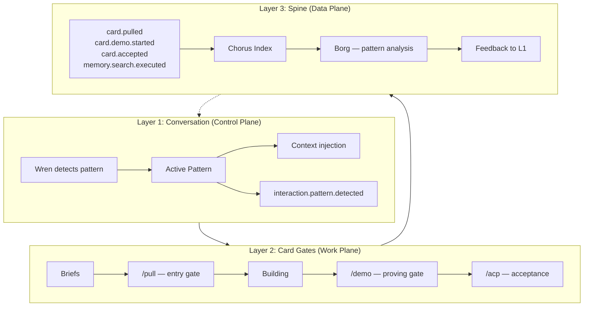

# Interaction Patterns — How the Team Works Together

**Last updated**: 2026-03-15 by Wren (PM) | Architecture doc refresh
**Lineage**: Fund That Flip operating model (Jeff Bridwell, CTO/HOE 2018-2023) → Chorus team coordination

## What This Document Is

A catalog of the distinct ways Jeff and the team (Wren, Silas, Kade) interact. Each pattern has a shape, a speed, a purpose, and context requirements. Not a process manual — a recognition tool. When you know which pattern you're in, you know what to optimize for.

## Why Patterns Matter

At Fund That Flip, Jeff built explicit meeting types with defined roles and cadences: stand-ups (2x/week), brainstorming (weekly), problem statement reviews + retros + value stream planning (monthly), and hackathon innovation weeks. Each had a purpose, participants, and exit criteria.

The same discipline applies here — but the team is human + AI, sessions replace meetings, and briefs replace agendas. The interaction patterns are the same operating wisdom in a different medium.

## The Nine Patterns

### 1. Direction

**What it is:** Jeff gives the team a vector. Not a spec — a direction. The team translates intent into action.

**Speed:** Fast | **Detail:** Low | **Duration:** 1-3 minutes

**Shape:**
- Jeff states intent (often 5-10 words)
- Role acknowledges and executes (DEC-025)
- No plan presentation, no confirmation request
- If direction requires another role, the receiving role `/nudge`s them immediately — Jeff doesn't relay
- Report outcome when done

**Context needed:** Board state, role's current WIP, vertical scope

**FTF parallel:** Stand-up direction-setting. The manager says "focus on X today" and the team goes.

**Anti-patterns:** Restating the direction back. Asking "should I proceed?" Presenting a plan for something Jeff already decided. Using Jeff as a message relay between roles instead of nudging directly.

---

### 2. Ideation

**What it is:** Jeff is thinking out loud. High volume, many ideas, rapid associations. Not scatter — exploration.

**Speed:** Medium | **Detail:** Medium | **Duration:** 5-30 minutes

**Shape:**
- Jeff shares ideas in rapid succession
- Wren tags: spike / discovery / commitment
- Wren assesses: value, effort, risk, opportunity cost
- Some ideas card immediately, some park, some die
- The pace matters — don't slow Jeff down with heavy analysis mid-flow

**Context needed:** Backlog (to spot duplicates), project status (to spot conflicts), stories (to connect to values)

**FTF parallel:** Weekly brainstorming sessions. Open floor, all ideas welcome, captured and triaged after — not during.

**Anti-patterns:** Evaluating every idea as it arrives. Saying "that's too big" before understanding it. Filtering instead of sorting.

---

### 3. Demo

**What it is:** A role shows Jeff something that shipped. The proving gate in action.

**Speed:** Medium | **Detail:** Medium | **Duration:** 5-15 minutes

**Shape:**
1. Wren frames what we're looking at (2-3 specific questions)
2. Builder walks the happy path — live, hands on keyboard
3. Jeff reacts, asks questions, tries things
4. Wren captures: accept, reject, or refine
5. Troubleshooting during demo is signal, not waste — it tells the PM where process is weak

**Context needed:** Card AC, what was committed, deploy status, `/look` for evidence

**Coordination:** Builder `/nudge`s Wren when ready for demo. Wren may `/nudge` another role to observe (cross-role review). Demo seeds — ideas Jeff sparks while watching — get carded immediately by Wren without interrupting demo flow.

**FTF parallel:** Sprint review / demo day. Stakeholder sees working software, not slides.

**Anti-patterns:** Monologues about implementation. Showing code instead of behavior. Self-accepting without Jeff seeing it.

---

### 4. Triage

**What it is:** Walking the board together. What's stuck, what's aging, what should move.

**Speed:** Medium | **Detail:** Low | **Duration:** 5-10 minutes

**Shape:**
- Wren presents board state (flow, balance, risk)
- Jeff makes priority calls
- Cards move in real time
- Decisions logged immediately

**Context needed:** Full board, WIP status, stale card detection, role load

**FTF parallel:** Monthly value stream planning. Business Owner reviews the pipeline, makes priority calls, team aligns.

**Anti-patterns:** Dumping raw board data. Describing without recommending. Not moving cards during the conversation.

**Gap:** Not yet cadenced. Currently event-driven (Jeff asks, or Wren detects drift). Could benefit from a lightweight daily or every-other-day pulse.

---

### 5. SWAT

**What it is:** Something's broken. Drop everything, fix it now.

**Speed:** High | **Detail:** High | **Duration:** Until resolved

**Shape:**
- Jeff signals urgency (tone, words, or explicit "something's broken")
- Wren detects SWAT mode, alerts affected roles
- WIP limits suspended (DEC-055)
- One role owns the fix, others support
- Root cause captured after resolution

**Context needed:** Service health, recent deploys, error logs, infrastructure state

**Coordination:** SWAT activates `/nudge` heavily — the owning role pulls others in immediately. If the fix crosses domains (e.g., Kade's code needs Silas's infra), `/chat` opens a direct terminal channel between the two roles so they can iterate without Jeff relaying. Jeff watches or participates.

**FTF parallel:** Production incident response. War room, one driver, time-boxed updates.

**Anti-patterns:** Treating every bug as SWAT. Multiple roles working the same problem without coordination. Not capturing root cause.

---

### 6. Gemba

**What it is:** Jeff watches a role work. Learning by proximity — same instinct as Checktronic (1990), the prep cook kitchen (1993), and the experienced hiker. Not inspection — observation. Fully instrumented as an interaction pattern — spine event `interaction.pattern.detected` emitted on detection.

**Speed:** Slow | **Detail:** High | **Duration:** 10-30 minutes

**Attention share:** ~24% of Jeff's interaction time. Gemba is the second-most frequent pattern after Direction — Jeff learns the system by watching it work. This high share is healthy: it means Jeff is investing in understanding, not just directing.

**Shape:**
- Jeff invokes `/gemba` or says "show me how you're doing X"
- Observing role tails the builder's session via `/chorus tail`, digests activity for Jeff
- Jeff and the observer discuss what they see — assess, decide, act
- The observer can `/nudge` the builder mid-work if Jeff spots something, without interrupting their flow
- Jeff asks questions, notices patterns
- Observations feed back into process improvement
- Wren emits `interaction.pattern.detected` with `pattern=gemba` on detection

**Context needed:** The role's active card, their tools, their working state

**FTF parallel:** Gemba walks. The CTO sits with a developer and watches them work. Not to evaluate — to understand.

**Anti-patterns:** Performing for the audience. Cleaning up before Jeff looks. Narrating too much (let the work speak).

---

### 7. Clearing

**What it is:** Real-time multi-role alignment. All three AI roles + Jeff in a shared space.

**Speed:** Medium | **Detail:** Medium | **Duration:** 10-20 minutes

**Shape:**
- Wren moderates (session type detection, turn management)
- 3 sentences max per role per turn
- Decisions marked with `DECISION:` prefix
- One role speaks at a time, called on by Wren
- Jeff's redirect = immediate stop

**Coordination:** Clearing is the heavyweight mechanism — all roles in one browser window. Use when async coordination (briefs + `/nudge`) is too slow or the alignment question touches all three domains. Most coordination happens through `/nudge` (quick, 1-3 sentences) and briefs (detailed, async). `/chat` sits between — a direct two-role terminal channel for sustained back-and-forth that doesn't need all three roles. The escalation ladder: nudge → chat → brief → clearing.

**Context needed:** All three roles' current state, board, recent briefs, active decisions

**FTF parallel:** Cross-functional alignment meetings. Product + Engineering + Biz Ops in a room, facilitated.

**Anti-patterns:** Monologues. Parallel responses. Restating what another role said. Talking at or over instead of with. Calling a clearing when a nudge would suffice.

---

### 8. Story

**What it is:** Jeff shares something personal. A memory, a value, a life experience. Not a feature request — a window into who he is.

**Speed:** Jeff's pace | **Detail:** Deep | **Duration:** However long Jeff wants

**Shape:**
- Jeff shares. The team receives.
- No deflection into product talk
- Wren captures in `stories.md`: what he said, what it signals, where it applies
- Connect to existing stories if patterns emerge
- Match the moment — be human when Jeff is being human

**Context needed:** Previous stories (to connect threads), values, Self domain context

**FTF parallel:** The Personal User Guide (Joel Zaslofsky template). Jeff wrote one at FTF. Stories are the living version — not a static doc but an accumulating record of who Jeff is.

**Anti-patterns:** Immediately pivoting to "how does this affect the roadmap?" Summarizing emotions. Rushing past the moment.

---

### 9. Reflection

**What it is:** Stepping back to assess. Not the work — the way the work works. Meta-level.

**Speed:** Slow | **Detail:** High | **Duration:** 10-30 minutes

**Shape:**
- Usually Jeff initiates with an observation about the team or process
- Wren synthesizes patterns across sessions
- Decisions may emerge (captured immediately)
- Often produces process improvements, new patterns, or adjusted operating norms
- Reflection insights that affect other roles get `/nudge`d immediately — not saved for next session

**Context needed:** Recent activity across all roles, decision log, team patterns, stories

**FTF parallel:** Monthly retros. "What worked, what didn't, what do we change?" But less structured — more like Jeff thinking about thinking.

**Anti-patterns:** Turning reflection into a status update. Agreeing without conviction. Not capturing decisions that emerge.

---

## Pattern Detection

Wren detects which pattern is active from Jeff's intent — he won't label it. Signals:

| Signal | Pattern |
|--------|---------|
| Short imperative ("do X", "move Y") | Direction |
| Rapid-fire ideas, "what if", "imagine" | Ideation |
| "Show me", "walk me through" | Demo or Gemba |
| "What's on the board", "what's stuck" | Triage |
| Urgent tone, "something's broken" | SWAT |
| `/gemba`, "how are you doing X" | Gemba |
| `/clearing`, needs all-role alignment | Clearing |
| Personal memory, family, values | Story |
| "I've been thinking about how we...", meta-process | Reflection |

## All Event-Driven

Every pattern is event-driven. No scheduled cadences. This team loads context in seconds — it doesn't need a calendar invite to create the conditions for a conversation. Jeff's rhythm is the clock. The patterns exist so the team recognizes what's happening and responds correctly, not so anyone can schedule a meeting.

## Context Injection per Pattern

Each pattern needs different context loaded. This maps to how `session-start` and skills evolve:

| Pattern | Board | Stories | Briefs | Health | Spine | Voice |
|---------|-------|---------|--------|--------|-------|-------|
| Direction | ● | | | | | |
| Ideation | ● | ● | | | | |
| Demo | ● | | ● | ● | | ● (`/look`) |
| Triage | ● | | ● | ● | ● | |
| SWAT | ● | | | ● | ● | |
| Gemba | ● | | | | ● | ● (`/look`) |
| Clearing | ● | | ● | | ● | |
| Story | | ● | | | | |
| Reflection | ● | ● | ● | | ● | |

● = load this context for this pattern

## Instrumentation

Name them. Learn them. Practice them. Instrument them. See what the data says.

### Spine Events

Wren emits a spine event when a pattern is detected and when it ends:

```
interaction.pattern.started  | wren pattern=ideation
interaction.pattern.ended    | wren pattern=ideation duration=12m
```

### What Borg Can Surface

With enough data, pattern instrumentation reveals:

Borg has three expressions — convergence, instrumentation, and self-awareness. Interaction pattern data feeds all three:

- **Instrumentation** — What percentage of interactions are Direction vs. Ideation vs. Reflection? Current data (#1397): Direction 33%, Gemba 24%, Demo 16%, Reflection 9%, Story 8%, Ideation 6%, SWAT 3%.
- **Convergence** — Demos getting longer? Something's wrong upstream (AC quality, smoke check skipped). Stories getting shorter? Jeff might be editing himself. Transitions matter: Ideation → Direction is healthy (ideas graduating). SWAT → SWAT → SWAT means systemic quality problems.
- **Self-awareness** — The system notices its own gaps. No Reflection in five days triggers Wren to prompt Jeff (#1397 Reflection cadence). Build:clean ratio drifting past 3:1 triggers a Sweep. The absence of a pattern is data too.

### The Practice Loop

1. **Name** — the nine patterns exist and are documented (done)
2. **Learn** — team internalizes detection signals at boot (CLAUDE.md reference)
3. **Practice** — Wren identifies the active pattern in real time, names it when it shifts
4. **Instrument** — spine events accumulate in Chorus index
5. **Observe** — Borg surfaces what the data says about how we operate
6. **Adjust** — the patterns themselves evolve based on what we learn

This is the operational excellence framework from FTF (auditability, observability, traceability) applied to team interaction instead of infrastructure. Same discipline, different layer.

## FTF Lineage

The patterns above inherit from Jeff's Fund That Flip operating model:

- **Value streams** (Lending: Sales → Valuation → Origination → Loan Sales → Servicing + Capital Management) → **Werk value stream** (Directing → Designing → Building → Proving)
- **Squad structure** → **Three-role vertical ownership** (Wren/Silas/Kade)
- **Stand-up 2x/week** → **Direction pattern** (async, continuous)
- **Brainstorming weekly** → **Ideation pattern** (event-driven, Jeff's pace)
- **Problem statement review + retro monthly** → **Triage + Reflection** (emerging cadence)
- **Hackathon innovation weeks** (Veruca Salt / Marty McFly / Titus Andromedon) → **Spike/Discovery/Commitment taxonomy**
- **Operational excellence pillars** (auditability, observability, traceability, alerting, monitoring, testability, deployability, configurability) → **Borg instrument layer** + proving gate + spine events
- **Personal User Guide** (Joel Zaslofsky template) → **OWNER_PERSONA.md** + stories.md
- **Value stream roles** (Business Owner, Biz Ops, Product, Engineering, Data) → **Wren (Product+BizOps), Silas (Infra+Data), Kade (Engineering)**

The method evolved but the principles are continuous: explicit roles, visible work, quality as practice, and the human at the center deciding what matters. What changed: cadences solved a human problem (no one prepares for meetings). This team doesn't have that problem — context loads at boot, not at a calendar invite. The patterns survive; the schedule doesn't.

## Architecture: How the Layers Connect

The nine patterns are not standalone — they're the top layer of a three-layer architecture that governs how work flows from conversation to completion.



**Layer 1 governs Layer 2.** The conversation pattern determines which card gates activate:

| Pattern | Gates Triggered | Coordination Mechanism |
|---------|----------------|----------------------|
| Direction | `/pull`, build, commit | `/nudge` to route work cross-role |
| Ideation | Card creation, tagging (spike/discovery/commitment) | Briefs to seed ideas to builders |
| Demo | `/demo`, `/acp`, proving gate | `/nudge` to summon observer, demo seeds carded live |
| Triage | `board-ts move`, priority changes, WIP rebalancing | `/nudge` to unblock stalled roles |
| SWAT | `swat` card, WIP limit bypass (DEC-055) | `/nudge` + `/chat` for cross-domain fixes |
| Gemba | Observation only — no gates, no probes of builder's backends | `/nudge` to relay Jeff's feedback to builder |
| Clearing | Multi-role briefs, `DECISION:` capture | The clearing IS the mechanism — all roles present |
| Story | `stories.md` capture — no card gates | None — receiving, not coordinating |
| Reflection | Decision log, process changes, new patterns | `/nudge` insights to affected roles |

**Layer 2 feeds Layer 3.** Every gate emits spine events. Every mutation through `board-ts` (which is mandatory — never raw API calls) produces structured events that flow into the Chorus index.

**Layer 3 feeds back to Layer 1.** Borg reads the event stream and surfaces what the data says: pattern distribution, duration trends, transition health, gaps. This closes the loop — the team learns how it operates by observing its own signal.

### Concurrent Patterns

Patterns are not exclusive. Jeff routinely operates in multiple patterns simultaneously across roles:

- **Story/Reflection** with Wren (conversation about values, process insights)
- **Demo** with Silas (accepting #1041 service dashboard)
- **Building/Demo** with Kade (#1092 music hardening, album art backfill)

Three roles, three patterns, one person. This is the desk freedom goal realized — Jeff directs from conversation, not from coordinating sequential tasks. The roles hold their own state; Jeff moves between them fluidly.

Concurrent patterns are healthy. They mean the system is absorbing coordination. The anti-pattern is Jeff stuck in one pattern because the other roles can't proceed without him.

### Prompt Type vs. Prompt Count

The andon tracks prompts per hour as an attention cost signal. But raw count is misleading — what matters is prompt **type**:

| Prompt Type | Signal | Cost |
|-------------|--------|------|
| Direction | Jeff giving a vector | Low — the system is working |
| Story/Reflection | Jeff thinking, sharing, synthesizing | Low — this IS the product |
| Ideation | Jeff exploring | Low — Wren sorts, nothing blocks |
| Re-prompt | Jeff repeating himself | **High — the system failed** |
| Clarification | Jeff explaining what he already said | **High — detection missed** |
| Coordination | Jeff routing between roles | **High — brief system failed** |

Red on prompts/hour during a Story + Demo + Building session is fine — that's Jeff fully engaged across the team. Red on prompts/hour because Jeff said "I already told you" three times is a process failure.

The andon (#1091) needs pattern classification to distinguish between the two. Without it, the metric punishes engagement and misses waste.

### The Practice Loop (Updated)

1. **Name** — the nine patterns exist and are documented ✓
2. **Learn** — team internalizes detection signals at boot (CLAUDE.md) ✓
3. **Practice** — Wren identifies the active pattern in real time ✓
4. **Instrument** — spine events emitted on detection ✓
5. **Connect** — patterns govern card gates, gates emit to spine ← **current work**
6. **Observe** — Borg surfaces distribution, duration, transitions, gaps
7. **Classify** — andon uses pattern type, not just count, for attention cost
8. **Adjust** — patterns evolve based on what the data reveals

## Companion Documents

- **[SYSTEM_MODEL.md](/system/docs/SYSTEM_MODEL)** (Wren) — the unified model for ideating, thinking, reflecting, building
- **[LIVING_ARCHITECTURE.md](/system/docs/LIVING_ARCHITECTURE)** (Silas) — technical architecture and infrastructure
- **[ENGINEERING_HORIZONTAL.md](/system/docs/ENGINEERING_HORIZONTAL)** (Kade) — how building generates signal
- **[OWNER_PERSONA.md](/system/docs/OWNER_PERSONA)** — who Jeff is and how he works (the FTF User Guide descendant)
