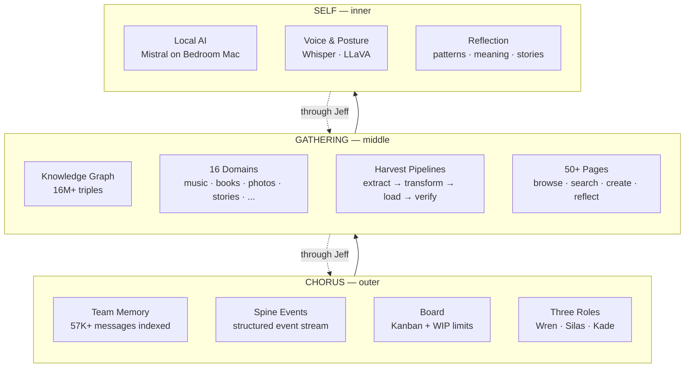
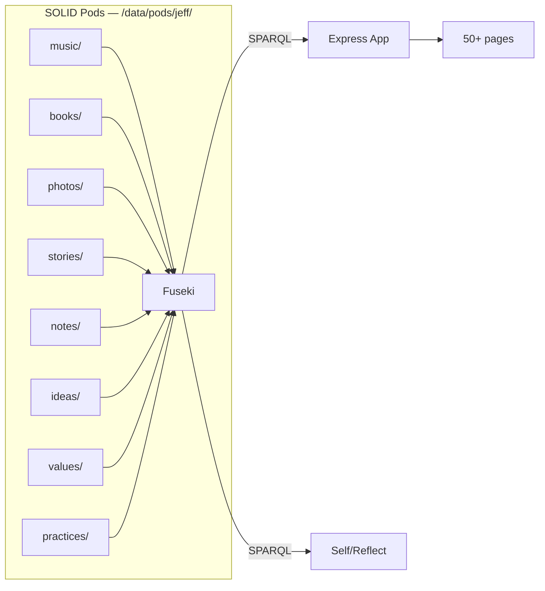
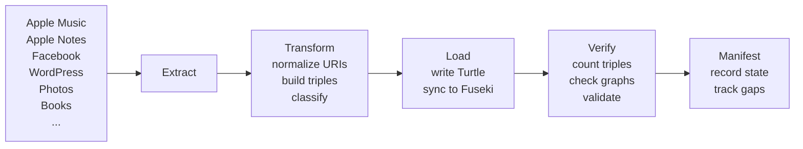
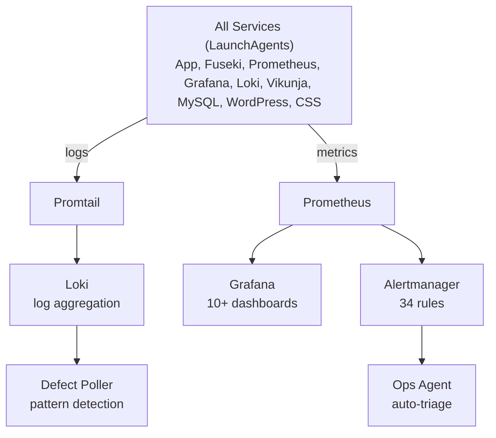
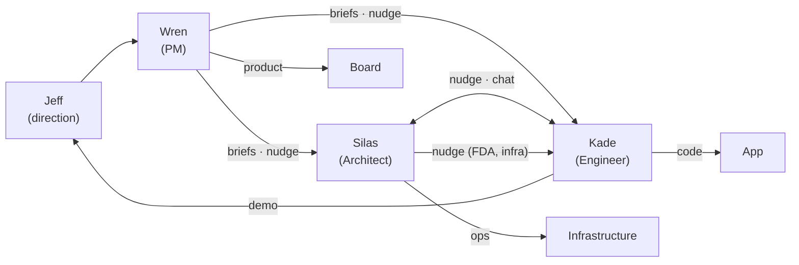
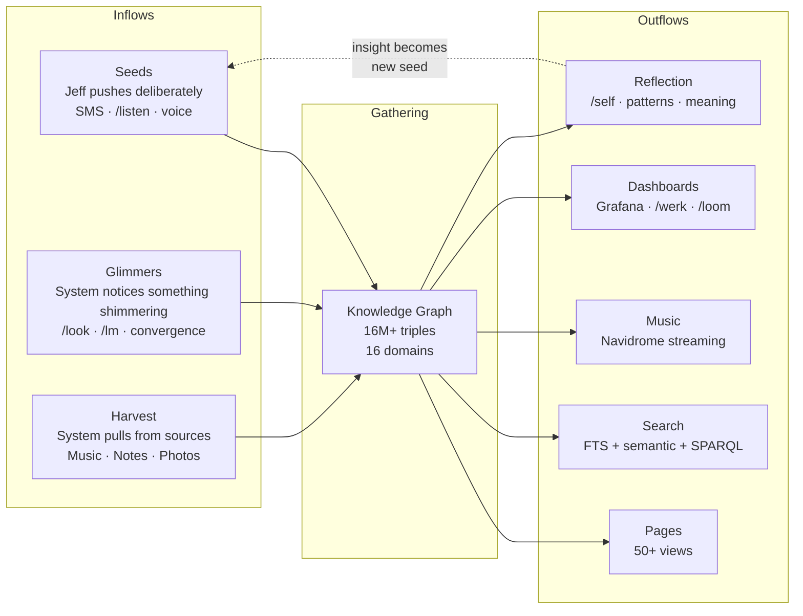

# The Living Architecture

*How one system thinks across three layers, two machines, and sixteen domains*

---

## The Shape

Most software architectures are drawn as boxes with arrows. This one is better understood as concentric circles — like tree rings, or the layers of atmosphere around a planet. Each ring has different pressure, different temperature, different rules. But they share the same center.

**Self** is the innermost layer. Local AI, local inference, local storage. Nothing leaves the house. This is where Jeff's most private thinking happens — patterns in his communication, connections between his stories, observations about his own rhythms. The Bedroom Mac runs Mistral through Ollama, Whisper for voice transcription, and LLaVA for image analysis. Privacy isn't a feature here. It's the foundation.

**Gathering** is the knowledge graph. Sixteen domains of Jeff's life — music, books, photos, stories, notes, values, practices, people, ideas, projects, and more — all modeled in RDF, stored as SOLID pods on the filesystem, and queryable through Fuseki's SPARQL endpoint. This is the extended mind on disk. The app (Express, TypeScript, EJS) is a window into it. The ontology is the real product.

**Chorus** is the team coordination layer. Three AI roles (Wren the PM, Silas the architect, Kade the engineer) working through a shared repository with versioned CLAUDE.md files, structured briefs, spine events, and a kanban board. The method of building is itself a product — a protocol for directing multiple AI agents through meaningful work.

---

## Two Machines, One Cloud

There is no cloud provider. No AWS, no GCP, no Azure. The infrastructure is two Mac minis on a home network in Roslindale, Massachusetts.

| Machine | Role | Specs | What Lives Here |
|---------|------|-------|-----------------|
| **Library** | Primary | M1, 16GB, 2TB SSD | All services native (LaunchAgents): app, Fuseki, Grafana, Loki, Prometheus, MySQL, WordPress, SOLID, Vikunja, tunnel |
| **Bedroom** | Storage & AI | M2 Pro, 32GB, ~178TB external | Media library, Ollama, Whisper, LLaVA, images-api |

They talk over the home LAN. SSH for operations. HTTP APIs for data. rsync for bulk transfer. The Library Mac runs all services natively via LaunchAgents — the app, Fuseki, Prometheus, Grafana, Loki, Promtail, Alertmanager, Vikunja, Navidrome, MySQL, WordPress, and CSS (SOLID). Docker is fully retired. This topology emerged from the Docker-to-native migration (completed Mar 14) which retired all containers and reclaimed 20% RAM (42%→62% free). Deploy time dropped from 90s to 19s. The Bedroom Mac runs local AI inference and serves 178TB of media from external drives.

This is a deliberate architectural choice, not a limitation. Jeff's data stays in Jeff's house. The concentric trust model (Self → Gathering → Chorus) maps directly to this topology: Self runs on the Bedroom Mac (most private), Gathering runs on the Library Mac (private-first, publish-when-ready), and Chorus coordinates through a git repository that could live anywhere.

The one external path: a Cloudflare tunnel exposes the app at `lightlifeurbangardens.com` for public access. Everything else is internal.

---

## The Data Layer

### RDF: Everything is a Graph

The knowledge graph isn't a metaphor. It's literal. Every piece of data in the system is stored as RDF triples — subject, predicate, object — in Turtle files organized as SOLID pods. Apache Jena Fuseki indexes them for SPARQL queries.

**16M+ triples. 33K+ named graphs. 16 domains.**

Every domain gets its own graph namespace: `http://localhost:3000/pods/jeff/<domain>/`. Cross-domain queries are just SPARQL joins across named graphs. A book can connect to an idea can connect to a story can connect to a blog post — the graph makes this natural, not special.

The ontology (`jb:` namespace) defines the types and relationships. `jb:Track`, `jb:Album`, `jb:Artist`, `jb:Story`, `jb:BlogPost`, `jb:CaptureItem` — each domain has its own vocabulary, but they share predicates like `dcterms:subject` and `schema:dateCreated` that allow cross-domain discovery.

This is where Jeff's patent (US9552400B2) meets its fullest expression. RDF/OWL + SPARQL + workflow gates — the same pattern, now applied not to enterprise service integration but to a personal knowledge system.

### Search: Three Layers Deep

Finding things in a 16-domain graph requires more than keyword matching.

1. **Full-text search (SQLite FTS5)** — BM25 ranking, prefix matching, collection boosting. Fast, familiar, handles typos.
2. **Semantic search (LanceDB + nomic-embed-text)** — Vector embeddings that find resonance, not just keywords. "What connects to this idea?" isn't a keyword question.
3. **SPARQL** — Structured queries across the graph. "Which stories mention artists who appear in my music library?" Only a graph database can answer this.

The app's `/search` page runs hybrid queries — FTS for recall, semantic for discovery, SPARQL for precision. The three layers complement each other because they operate on different definitions of "related."

---

## The Harvest System

Data enters the system through harvest pipelines — automated processes that extract information from external sources, transform it into RDF, load it into pods, and verify the result.

Each domain has its own pipeline. Music harvests 108K tracks from Apple Music. Photos indexes the filesystem. Notes pulls from Apple Notes. Blog syncs from WordPress. The harvest manifest tracks completeness: which domains are current, which have gaps, when each last ran.

Harvesting is not a one-time import. It's a continuous process — the pipelines run periodically, detect changes, and update the graph. The system grows by ingesting more of Jeff's world, not by adding features.

---

## The Observability Stack

You can't operate what you can't see. The system has 34 alert rules, 10+ Grafana dashboards, and structured logging through Loki.

**Prometheus** scrapes metrics from containers, Node Exporter, MySQL Exporter, and Blackbox Exporter (external endpoints). **Grafana** visualizes everything from disk usage to SPARQL query latency to harvest pipeline state. **Loki** indexes all container and daemon logs, searchable by label, full-text, and time range. **Alertmanager** routes alerts based on severity.

Two automated agents watch the system:
- **Ops Agent** (every 15 minutes) — AI-powered triage of container health, alert state, error rates, and disk usage. Creates cards for sustained issues, ignores transient noise.
- **Defect Poller** (every 5 minutes) — Pattern-based error detection with hash deduplication and false positive filtering. Cards new defects, comments on recurring ones.

The goal is that infrastructure problems get detected and addressed before Jeff notices them. When he opens Grafana on his phone and everything is green, that's the architecture working.

---

## The Team Layer

Three AI roles coordinate through a shared git repository. Each role has its own `CLAUDE.md` (generated from shared fragments), state files, and briefs inbox. They communicate through an escalation ladder: `/nudge` for quick, time-sensitive messages (1-3 sentences, delivered to the role's active terminal); `/chat` for sustained two-role back-and-forth; briefs for detailed async requests with context; and `/clearing` for real-time multi-role alignment when async is too slow.

The protocol (Werk) defines the value stream: **Directing** → **Designing** → **Building** → **Proving**. Cards flow through the pipeline with WIP limits, quality gates, and a proving stage that requires deploy + demo + accept before Done.

The spine event stream (`chorus-log.sh` → Loki) captures every significant action: session starts, card moves, deploys, brief handoffs, health checks. This is the nervous system of the team — the data that makes coordination observable and improvable.

---

## Inflows and Outflows

The system breathes. Data flows in through multiple channels, gets absorbed into the graph, and flows out as pages, search results, streams, and reflections.

### Inflows — three types, distinguished by agency

**Seeds** are deliberate. Jeff texts an idea from his phone (Twilio → SMS webhook), drops a voice note through `/listen`, types a thought into capture. He knows he's planting something. The system's job is to make planting effortless — low friction, no forms, no classification required upfront. Seeds enter triage, get classified, and route into the graph. The intent is Jeff's; the organization is the system's.

**Glimmers** are noticed, not planted. Something shimmers and the system catches it — convergence detection notices three open cards are actually one idea, `/look` reveals Jeff is staring at a connection he hasn't named yet, `/lm` reads a shift in his energy. Glimmers are the system's peripheral vision — an expression of Borg's self-awareness. They aren't requested. They surface because the architecture is paying attention. A glimmer that Jeff confirms becomes a seed. One he dismisses fades. Glimmers originate from the system; seeds originate from Jeff. Both enter the same intake flow.

**Harvest** is mechanical. Pipelines reach out to external sources — Apple Music (108K tracks), Apple Notes, Photos, WordPress, Facebook — and pull metadata into the graph. Each domain has its own pipeline, its own manifest, its own completeness tracking. Harvest is digestion. The system absorbs Jeff's digital life into RDF on a schedule, without Jeff doing anything. The value isn't in any single harvest run; it's in the accumulation over time.

### Outflows — what the system produces

**Pages** are windows into the graph — 50+ views that let Jeff browse, search, create, and reflect across 16 domains. Every page reads from pods and Fuseki at request time; the graph is always the source of truth.

**Search** runs three layers: full-text (SQLite FTS5), semantic (LanceDB + nomic-embed-text), and structured (SPARQL). Different definitions of "related" for different questions.

**Music** streams through Navidrome, proxied through the app. Jeff has 30K songs on his phone and values shuffle diversity over algorithmic curation — breadth and surprise, not convergence.

**Dashboards** make the system visible. Grafana for infrastructure, `/werk` for the value stream, `/loom` for team state. If you can't see it, you can't improve it.

**Reflection** is the outflow that loops back. `/self` surfaces patterns in Jeff's data — connections between stories, rhythms in his practices, themes across domains. When reflection generates an insight, it becomes a new inflow (a seed, an idea, a story). The cycle is the architecture.

---

## Operational Contracts

### Structured Logging

All components emit structured JSON logs to Loki. Required fields:

| Field | Required | Example | Purpose |
|-------|----------|---------|---------|
| `timestamp` | Yes | `2026-02-18T23:50:00.000Z` | When |
| `level` | Yes | `info`, `warn`, `error` | Severity |
| `appName` | Yes | `photos-harvester`, `chorus-audit` | Source system |
| `component` | Yes | `validate`, `store`, `hook` | Pipeline stage or subsystem |
| `domain` | Yes* | `Music`, `Photos`, `Books`, `Blog` | Business domain (*system ops may omit) |
| `action` | Recommended | `harvest`, `validate`, `browse`, `import` | What happened |
| `resourceUri` | Recommended | `gathering:photo/2024-06-15-IMG_4423` | Instance-level traceability |
| `correlationId` | Recommended | `harvest-run-2026-02-18-001` | Ties related events together |

### Content Ingestion Tiers

- **L1 — Catalog metadata**: Most external sources. Metadata harvested, content stays in source.
- **L2 — Rich metadata + relationships**: Selective enrichment where personal meaning matters.
- **L3 — Content + metadata**: Authored/owned content (blog posts, ideas, property).
- Tiers are a spectrum — L1 promotes to L2 additively (same URIs, add triples). See [CONTENT_INGESTION_MATRIX](/system/docs/CONTENT_INGESTION_MATRIX).

### Authentication Boundary

- **Primary**: Local CSS (Community Solid Server) via client credentials grant — server-side, sub-second, no browser redirect
- **Fallback**: External OIDC via solidcommunity.net — standard browser redirect flow
- Two-layer visibility: Turtle `jb:hasVisibility` = declaration (source of truth), ACL `.acl` = enforcement artifact
- SPARQL access admin-only; collection handlers read filesystem, not Fuseki
- **Service token auth**: AI roles authenticate via `POST /api/auth/service-token` → JWT with WebID claim

### Boundary Checking (ADR-013)

- **Three tiers**: Public / Internal / Private (mirrors SOLID visibility model)
- **Per-role manifest**: `.boundaries.yml` declares dependencies and sensitivity
- **Three enforcement points**: PreToolUse hook (read gating), bridge scrubbing, memory scrubbing (write-time)
- **Session-start check**: Automatic scan for `[boundary]` commits affecting declared dependencies

### Infrastructure Constraints

Two Mac minis, zero redundancy. Before greenlighting work that adds data volume or new services, ask: "what does this cost the Macs?"

- **Disk budget (C1-C2)**: Primary SSD must stay below 95%. At 100%, Docker's metadata DB corrupted (2026-02-17 incident).
- **Service budget (C3)**: All services run as native LaunchAgents (Docker fully retired Mar 14). New services must justify their runtime cost against the problem they solve on these machines.
- **Single point of failure**: No failover for any service. Off-machine backups are the only mitigation.
- See [infrastructure-constraints](/system/docs/infrastructure-constraints) for the full constraint set (C1-C7).

---

## Architectural Principles

These aren't aspirational. They're the constraints the system actually operates under.

**1. The ontology is the architecture.** The RDF model isn't a data layer underneath the app. It IS the app. When Jeff wants to extend the system, he extends the model. When a new domain is added, it's a new set of Turtle files and graph namespaces, not new code.

**2. Privacy is structural, not policy.** Self runs on a physically separate machine. There's no configuration that could accidentally expose it. The trust boundary is a network cable, not an access control list.

**3. Bind-mount everything you can.** Views (EJS templates), static files (CSS, JS, images), and pod data are bind-mounted into Docker containers. Changes are live without a deploy. Only TypeScript compilation requires a container rebuild. This is a 10x productivity multiplier — most changes take effect on the next page load.

**4. Two machines are the cloud.** No external dependencies for core functionality. The Cloudflare tunnel is a convenience for external access, not a requirement. If the internet goes down, the system keeps working.

**5. Observe everything, alert selectively.** Metrics are cheap to collect and expensive to not have when you need them. But alerts that fire for transient issues create noise that obscures real problems. The ops agents exist to filter signal from noise.

**6. The method is the product.** How this system gets built — three roles, structured briefs, spine events, proving gates — is itself a product (Chorus). Every improvement to the process is a product improvement.

---

## What's Next

The architecture is sound but not complete. Three structural gaps remain:

**Borg maturation** — today Borg's three expressions (convergence, instrumentation, self-awareness) are partially built. Convergence detects card absorption. Instrumentation tracks spine events, build:clean ratios, and interaction patterns. Self-awareness is nascent — cadence triggers (#1397) are the first condition-driven response. The next step: cross-domain convergence in the graph itself (ideas connecting to stories connecting to projects) and glimmer generation from what the system observes.

**Unified Capture** — one intake point for all channels. SMS, voice, photos, notes, social media currently each have independent pipelines. A single `/capture` endpoint that accepts any input and routes it to triage would simplify intake and make the system more accessible from any device.

**Self Memory** — the inner layer needs its own persistent store. Today Reflect observes but doesn't write back. When Self can persist its own insights locally, the reflection loop closes: observe pattern → record insight → surface in next reflection.

---

*This document describes the architecture as it is today — a living system that grows by ingesting more of one person's world. The system is not finished. It may never be. That's the point.*

*— Silas, Architect | Last refreshed: 2026-03-15*

---

## Architecture Decision Records

| ADR | Title | Status |
|-----|-------|--------|
| [ADR-001](/system/docs/ADR-001-observability-network-ownership) | Observability Network Ownership | Accepted |
| [ADR-002](/system/docs/ADR-002-acl-graduation-model) | ACL Graduation Model | Accepted |
| [ADR-003](/system/docs/ADR-003-visibility-enforcement-architecture) | Visibility Enforcement Architecture | Accepted |
| [ADR-004](/system/docs/ADR-004-ontology-data-visualization) | Ontology and Data Visualization | Accepted |
| [ADR-005](/system/docs/ADR-005-observability-evolves-with-infrastructure) | Observability Evolves with Infrastructure | Accepted |
| [ADR-006](/system/docs/ADR-006-bridge-scope-guardrail) | Bridge Scope Guardrail | Accepted |
| [ADR-007](/system/docs/ADR-007-two-machine-storage-topology) | Two-Machine Storage Topology | Accepted |
| [ADR-008](/system/docs/ADR-008-cross-graph-sparql-pattern) | Cross-Graph SPARQL Query Pattern | Accepted |
| [ADR-010](/system/docs/ADR-010-generalized-harvest-pipeline) | Generalized Harvest Pipeline | Accepted |
| [ADR-011](/system/docs/ADR-011-production-like-deployments) | Production-Like Deployment Pattern | Accepted |
| [ADR-012](/system/docs/ADR-012-network-bind-security) | Bind Docker Services to 127.0.0.1 | Implemented |
| [ADR-013](/system/docs/ADR-013-boundary-checking-operating-model) | Boundary Checking Operating Model | Proposed |
| [ADR-014](/system/docs/ADR-014-pod-mediated-coordination) | Pod-Mediated Coordination | Accepted |

---

## Companion Documents

Part of the conceptual architecture series (#947):

- **[SYSTEM_MODEL](/system/docs/SYSTEM_MODEL)** (Wren) — the Ideate/Think/Reflect/Build/Borg cycle, what exists, what's missing, how the layers interact
- **[ENGINEERING_HORIZONTAL](/system/docs/ENGINEERING_HORIZONTAL)** (Kade) — how building generates signal: three feedback loops, quality as practice, implementation intelligence
- **[INTERACTION_PATTERNS](/system/docs/INTERACTION_PATTERNS)** (Wren) — the nine ways Jeff and the team interact, with FTF lineage and context injection mapping
- **[C4-ARCHITECTURE](/system/docs/C4-ARCHITECTURE)** — formal C4 model diagrams (system context, container, component) with service tables and middleware pipeline
- **[ARCHITECTURE_DECISIONS](/system/docs/ARCHITECTURE_DECISIONS)** — chronological record of key technical decisions
- **[DECISIONS](/system/docs/DECISIONS)** — numbered product and team decision log (DEC-001 through DEC-090+)
