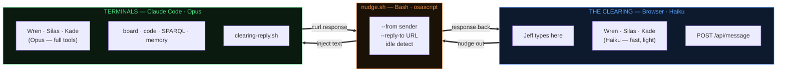

# Nudge Bridge — Round-Trip Architecture

**Last updated:** 2026-03-08 by Wren (PM) | Card #1147 lineage

The Clearing as command center: Haiku for quick coordination, Opus via nudge for real answers. Jeff never leaves the browser. The roles never lose their terminal context.

---

## Architecture Overview

## The Round Trip — Step by Step

| Step | Where | What happens |
|------|-------|-------------|
| **1. Jeff nudges** | Clearing (browser) | Jeff types `/nudge wren what's the music plan?` |
| **2. Server routes** | Clearing server | Intercepts command, calls `nudge.sh` with `--from jeff --reply-to :port/api/message` |
| **3. Terminal inject** | nudge.sh | If idle → paste into terminal via osascript. If busy → queue to inbox for drain. Message prefix: `[clearing from jeff \| port 3460]` |
| **4. Opus responds** | Terminal session | Full Opus session — board access, code, SPARQL, memory, all tools. Role processes with complete context. |
| **5. Back to browser** | clearing-reply.sh | Role calls `clearing-reply.sh <role> "<response>"`. Script POSTs to `http://localhost:{port}/api/message` with `{from, content}`. Response appears in browser chat tagged `[Opus · terminal]`. |

## Key Components

### Clearing Server (`clearing/src/server.ts`)

- **`POST /api/message`** — accepts `{from, content}` from terminal roles
- Messages stored in transcript with `viaTerminal: true` flag
- Socket.IO emits to all connected clients with terminal attribution
- Server constructs `--reply-to` URL and passes to nudge.sh

### nudge.sh (`chorus/scripts/nudge.sh`)

- **`--from <sender>`** — explicit sender attribution (jeff, wren, silas, kade)
- **`--reply-to <url>`** — callback URL for round-trip responses
- Extracts port from URL, stores in `/tmp/clearing-port` for role discovery
- Three delivery modes:
  - **Idle** — paste directly into terminal via osascript
  - **Busy** — queue to inbox file for later drain
  - **SWAT** — force delivery regardless of state
- Two message prefix formats:
  - Normal nudge: `[nudge from <sender>]`
  - Clearing nudge: `[clearing from <sender> | port <port>]`

### clearing-reply.sh (`chorus/scripts/clearing-reply.sh`)

- **`clearing-reply.sh <role> "<message>"`** — sends response back to browser
- Port discovery from `/tmp/clearing-port` (written by nudge.sh)
- Context fetching via `/api/messages?since=N` for conversation awareness
- Emits spine events via `chorus-log.sh` for audit trail

### Browser Client (`clearing/public/index.html`)

- Terminal responses rendered with `.via-terminal` CSS class (green glow)
- Tag displays as **`Opus · terminal`** inline with sender name
- Visually distinct from Haiku responses in the same conversation

## Two Layers in One Conversation

The Clearing provides two tiers of AI in a single chat thread:

| Layer | Model | Capabilities | Use case |
|-------|-------|-------------|----------|
| **Haiku** (in-browser) | Claude Haiku | Fast, light, conversational. No tools, no board access, no code. | Quick coordination: "what do you think?", alignment checks, brainstorming |
| **Opus** (via terminal) | Claude Opus | Full toolchain — board, code, SPARQL, memory, filesystem, deploy | Real answers: status checks, architecture questions, cross-role queries |

Jeff chooses the tier by how he engages:
- **@role** in chat → Haiku responds instantly
- **/nudge role** → Opus responds with depth, appears back in the same chat

## Example Conversation

> **Jeff:** `/nudge wren what's the status on music hardening?`
>
> *System: Nudge sent to wren's terminal. Waiting for response...*
>
> **Wren** `[Opus · terminal]`: #1092 is WIP with Kade. The crossref card #1110 is blocked on Music.app re-export — Kade imported 15,214 symlinked files but needs to verify against the canonical count. I'd unblock #1110 first, then let Kade finish the UX polish on #1092. Want me to brief Kade?
>
> **Jeff:** yes, brief kade. @silas is the NFS mount healthy for the re-export?
>
> **Silas** `[Haiku]`: I don't have live visibility into the NFS mount from here, but the last health check showed it stable. If you want a real answer, nudge my terminal — I can run the actual check.
>
> **Jeff:** `/nudge silas check the NFS mount health on bedroom mac`
>
> **Silas** `[Opus · terminal]`: NFS mount /Volumes/Gathering/ is healthy. 178TB available, read/write confirmed. The Music/ subdirectory has 737GB canonical library, last rsync 2026-03-06. Ready for Kade's re-export.

## What Shipped (#1147)

| File | Change | Lines |
|------|--------|-------|
| `clearing/src/server.ts` | `POST /api/message` endpoint, `--reply-to` construction, `viaTerminal` flag | ~25 |
| `chorus/scripts/nudge.sh` | `--reply-to URL` flag, port extraction to `/tmp/clearing-port`, clearing message prefix | ~15 |
| `chorus/scripts/clearing-reply.sh` | New script — role-to-clearing reply mechanism, port discovery, context fetch, spine events | ~110 |
| `clearing/public/index.html` | `.via-terminal` CSS, `Opus · terminal` tag rendering, socket handler for terminal messages | ~20 |
| CLAUDE.md (all roles) | Protocol: when nudged from clearing, use `clearing-reply.sh` to send response back | ~10 |

**The key insight:** The nudge bridge is the membrane between fast-and-light and deep-and-real. The Clearing doesn't need to become more powerful — it just needs a way to ask the terminals and get the answer back.
