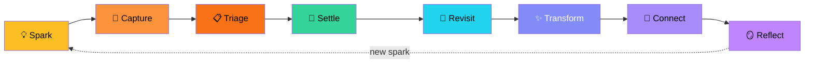
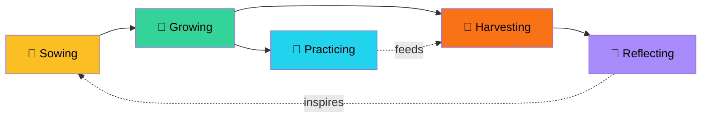
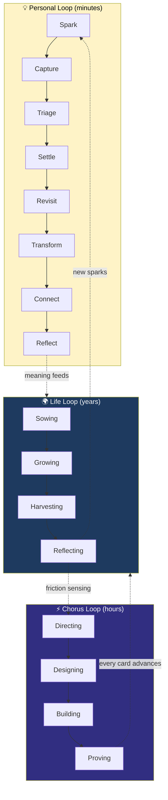
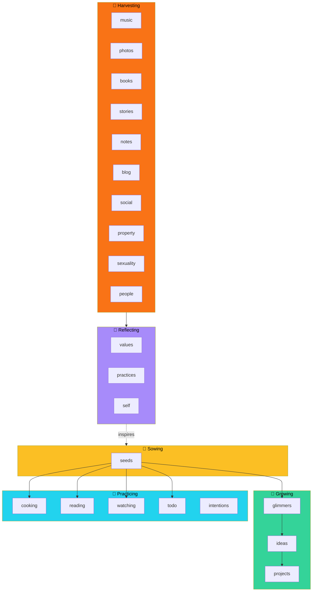
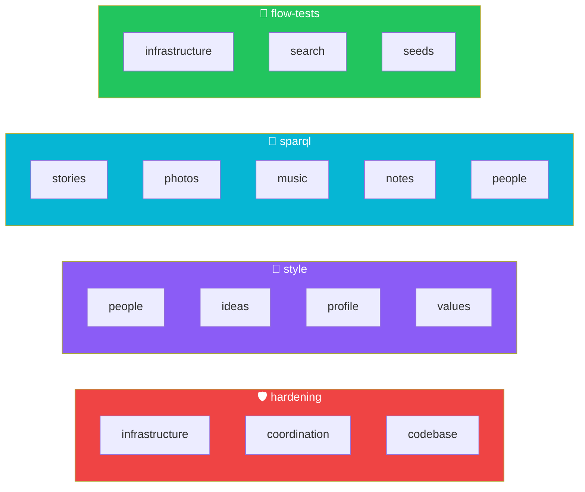

# Product Taxonomy — The Living Map

Gathering is the product. It's a system for turning a life into self-knowledge. Everything else — the team, the tools, the method — serves that purpose.

---

## Three Loops

Gathering runs on three PDCA loops at different speeds. Each loop has its own rhythm, its own domains, and its own value stream. They nest: the fastest loop feeds the middle loop, the middle loop advances the slowest loop, and the slowest loop generates the sparks that restart the fastest.

### The Personal Loop — Minutes to Hours

Jeff's moment-to-moment interaction with the system. A thought arises, gets captured, finds a home, and eventually connects to something larger. This is the PDCA cycle at human speed.

| Stage | The act | PDCA | What happens |
|-------|---------|------|-------------|
| **Spark** | Noticing | Plan | Something catches attention — a thought, a song, a memory, a link at 2am |
| **Capture** | Preserving | Plan | Raw signal enters via SMS, voice, photo. The seed pipeline catches it. |
| **Triage** | Sorting | Do | Hashtag routes the seed to its domain — #reading, #cooking, #idea, #glimmer |
| **Settle** | Placing | Do | The item lands in its domain. A reading item, a recipe, a glimmer. It has a home. |
| **Revisit** | Returning | Check | Coming back to what's accumulated. Browsing the music collection, re-reading stories. |
| **Transform** | Growing | Check | The item deepens. A glimmer becomes an idea. A note becomes a story. A photo joins an album. |
| **Connect** | Relating | Act | Cross-domain synthesis. A story links to a value. A practice connects to a person. |
| **Reflect** | Understanding | Act | Meaning emerges. Patterns reveal themselves. The Self page synthesizes across everything. |

Reflect feeds Spark — new understanding generates new questions. The personal loop runs continuously.

### The Life Loop — Weeks to Years

The coherence and learning cycle. Life domains organized across an agricultural metaphor — sowing, growing, practicing, harvesting, reflecting. This is where planning, pattern recognition, and life architecture happen.

| Stage | Subtitle | The act | What happens |
|-------|----------|---------|-------------|
| **Sowing** | Capture & seeds | Planting | Raw material enters the system |
| **Growing** | Ideas & growth | Tending | Sorting, placing, giving things a home |
| **Practicing** | Daily life | Cultivating | Daily disciplines feed the system — not captured *about*, captured *through* |
| **Harvesting** | Collections | Collecting | Returning to what's matured. 40 years of music, 200K photos, 2,000 contacts, 135 stories. |
| **Reflecting** | Inner world | Understanding | Patterns, meaning, self-knowledge. Stories connect to values. Collections reveal who Jeff is. |

A piece of music might live in Harvesting for a decade before it surfaces in Reflecting as part of a story about who Jeff was at 25.

### The Chorus Loop — Hours to Sessions

The team method that accelerates both other loops. Chorus is how the system gets built — cards flow through the Werk protocol and complete in a session. Every card advances a Gathering domain.

| Stage | Who | What happens |
|-------|-----|-------------|
| **Directing** | Wren | Cards and prioritizes. What matters, why now. |
| **Designing** | Silas | Architects. Blast radius, dependencies, approach. |
| **Building** | Kade | Ships. Code, tests, deploy. |
| **Proving** | Demo to Jeff | Accept or iterate. |

Chorus is also a standalone method. When Jeff does consulting, he brings this protocol — the client's product is their equivalent of Gathering, and Chorus is the engine that builds it.

### How They Nest

The personal loop is the heartbeat. The life loop is the road. The Chorus loop is the engine. Friction in the life loop generates cards in the Chorus loop. Meaning in the life loop generates sparks in the personal loop.

---

## The Territory — Gathering Domains

Domains are bounded contexts — the real product boundaries. Each one has its own handler, data, ontology, and routes. They don't change often. When they do, the product has changed.

### Where Each Domain Lives

### Gathering Domain Details

**Sowing** — where raw signal enters the system

| Domain | What it captures | Ontology | Flow |
|--------|-----------------|----------|------|
| **seeds** | SMS messages, voice captures, quick thoughts | CaptureItem, RoutedFrom | Seeds route to downstream domains via hashtag triage |

**Growing** — where signal becomes intention

| Domain | What it holds | Ontology | Flow |
|--------|--------------|----------|------|
| **glimmers** | Sparks — the first flicker of an idea | Glimmer, GlimmerState | Ignite → fade → reignite cycle |
| **ideas** | Shaped thoughts with enough form to evaluate | Idea | Promote to project or archive |
| **projects** | Committed work with scope and outcome | Project | Ship or kill |

**Practicing** — where daily life feeds the system

| Domain | What it tracks | Ontology | Flow |
|--------|---------------|----------|------|
| **cooking** | Recipes, meals, food experiments | CookingItem, Recipe | Manual capture |
| **reading** | Articles, papers, books-to-read | ReadingItem | Manual + routed from seeds |
| **watching** | Movies, shows, documentaries | WatchingItem | Manual + routed from seeds |
| **todo** | Tasks, checklists, personal ops | TodoItem, Task | Manual + routed from seeds |
| **intentions** | Personal commitments, goals | Intention | Manual |

**Harvesting** — where bulk collections accumulate over decades

| Domain | What it holds | Ontology | Scale | Flow |
|--------|--------------|----------|-------|------|
| **music** | Albums, tracks, artists, play history | Album, Track, Artist, Genre | 40+ years | iTunes/Navidrome harvest |
| **photos** | Albums, locations, faces, memories | Photo, PhotoAlbum, PhotoLocation | 200K+ | Apple/Google Photos harvest |
| **books** | Physical library, room-by-room catalog | Book, BookLocation | 141+ | Manual + OCR upload |
| **stories** | Life narratives, values in context | Story, Narrative | 135+ | Session capture → TTL |
| **notes** | Markdown notes, knowledge fragments | Note, NoteFolder | Ongoing | File harvest |
| **blog** | Published writing (Songs I Love) | BlogPost, WordPressSource | Ongoing | WordPress harvest |
| **social** | Curated social media exports | SocialPost | Archive | GDPR export |
| **property** | Houses, gardens, rooms, land | Property, House, Garden, Room | Current | Manual CRUD |
| **sexuality** | Galleries, models, studios | Model, Studio, MediaVolume | Archive | Volume harvest |
| **people** | Contacts, relationships, network | Person, Contact | 2,259+ | LinkedIn/Facebook export + manual |

**Reflecting** — where meaning emerges from the collection

| Domain | What it synthesizes | Ontology | Flow |
|--------|-------------------|----------|------|
| **values** | Core values distilled from experience | Value | Manual |
| **practices** | Daily disciplines and their purpose | Practice | Manual |
| **self** | AI-assisted reflection across all domains | (all) | Semantic search + reasoning |

---

## The Territory — Chorus Domains

Chorus has its own bounded contexts — the team coordination boundaries.

| Domain | What it does |
|--------|-------------|
| **coordination** | Briefs, decisions, spine events, team state |
| **codebase** | Architecture graph — files, dependencies, blast radius |
| **knowledge-graph** | Union view of all domain graphs in Fuseki |
| **search** | Full-text + semantic search across all domains |
| **infrastructure** | Machines, Docker, monitoring, alerts, deploys |
| **profile** | Identity, auth, access control |

---

## Sequences — The Weather

Sequences cut across domains. They're temporal waves of work — born when the team focuses on a theme, retired when the wave passes. A sequence touches many domains in a single push.

Future sequences: `mobile` (responsive pass), `public` (what's visible without login), `chorus-launch` (Chorus as standalone method).

---

## Three Dimensions, Three Views

The Product Flow page offers three lenses on the same work:

1. **By Domain** — "What part of the system?" Groups cards by bounded context. Stable view.
2. **By Sequence** — "Which wave?" Groups cards by work theme. Fluid view.
3. **By Value Stream Stage** — "Where in the journey?" Groups cards by Sowing/Growing/Practicing/Harvesting/Reflecting.

Every card lives at a domain (where), a sequence (which wave), and a value stream stage (where in the journey).

---

## The Personal Loop Mapped to Domains

Each stage of the personal loop touches specific domains:

| Personal loop stage | Primary domains | Example |
|--------------------|----------------|---------|
| Spark | (pre-domain) | A thought at 2am, a song on the radio |
| Capture | seeds | SMS → seed pipeline |
| Triage | seeds → all | #reading routes to reading domain |
| Settle | target domain | Reading item created in reading pod |
| Revisit | harvesting domains | Browsing the music collection |
| Transform | growing domains | A glimmer becomes an idea, a note becomes a story |
| Connect | self, knowledge-graph | Cross-domain SPARQL, Self page synthesis |
| Reflect | self, values, practices | Meaning emerges from the connected whole |

---

## The Connective Thread

Gathering is fundamentally about connecting — things to things, moments to meaning, people to memory. The entire value stream flows toward connection: seeds connect to domains, domains connect through the knowledge graph, stories connect to values, and everything converges at Self.

The team extends the pattern. Wren, Silas, and Kade aren't abstract roles — they're named members of the system with distinct identities, perspectives, and domains. Jeff sees them as people, not functions. The System branch of the mind map carries their names because that's how the system is experienced: relationally, not organizationally.

| Name | Domain | The act |
|------|--------|---------|
| **Wren** 🪶 | Product — flow, decisions, taxonomy, roadmap | Directing and connecting |
| **Silas** | Architecture — infrastructure, operations, monitoring, hooks | Designing and hardening |
| **Kade** | Engineering — app features, tests, build pipeline | Building and shipping |

The patent (US9552400B2) connected services through ontology. Gathering connects a life through the same pattern. The ESB tracker connected 153 service operations. The mind map connects 28 domains. The Self node connects everything to Jeff.

---

## Domain-First Development (DEC-086)

Define the domain and its value stream position before building. The taxonomy is the governing artifact.

Three work modes against the map:

| Mode | When | What happens |
|------|------|-------------|
| **Build new** | Domain defined, no page exists | Create from the model |
| **Refactor** | Page exists but wrong place or boundaries | Move to conform with the model |
| **Rewrite** | Built ahead of the map, can't be salvaged | Replace from the model |

Chorus designs the model and value stream. Borg assesses conformance and routes to build/refactor/rewrite. Roles execute within their domain.

The nav-tree.json is the canonical model for information architecture. The navbar renders it as a menu. The mind map renders it as a graph. Neither view adds structure the model doesn't contain. One source of truth, multiple renderings.

---

## Chorus Method Territory

Chorus has its own orchestration that needs the same mapping discipline as the product. Skills, hooks, scripts, board commands, spine events, cron loops, briefs, nudges, state files — the method grew organically and surprises us daily.

This is the central problem for all knowledge workers: the process is invisible. In a warehouse you can see the receiving dock backed up. In knowledge work, the orchestration is spread across terminals, scripts, and conventions nobody wrote down. Chorus makes invisible work visible — not through reporting overhead, but by making the work itself emit signal. Spine events, andon state, gemba tails, the board.

Gemba, andon, and jidoka don't assume a static process — they assume a living process that degrades without attention. The discipline isn't "follow the standard." It's "see the gap between the standard and reality, then close it." The standard itself updates as a result.

---

*Gathering is the product. The personal loop is the heartbeat. The life loop is the road. Chorus is the engine. Domains are the territory. Sequences are the weather. Connection is the thread.*
