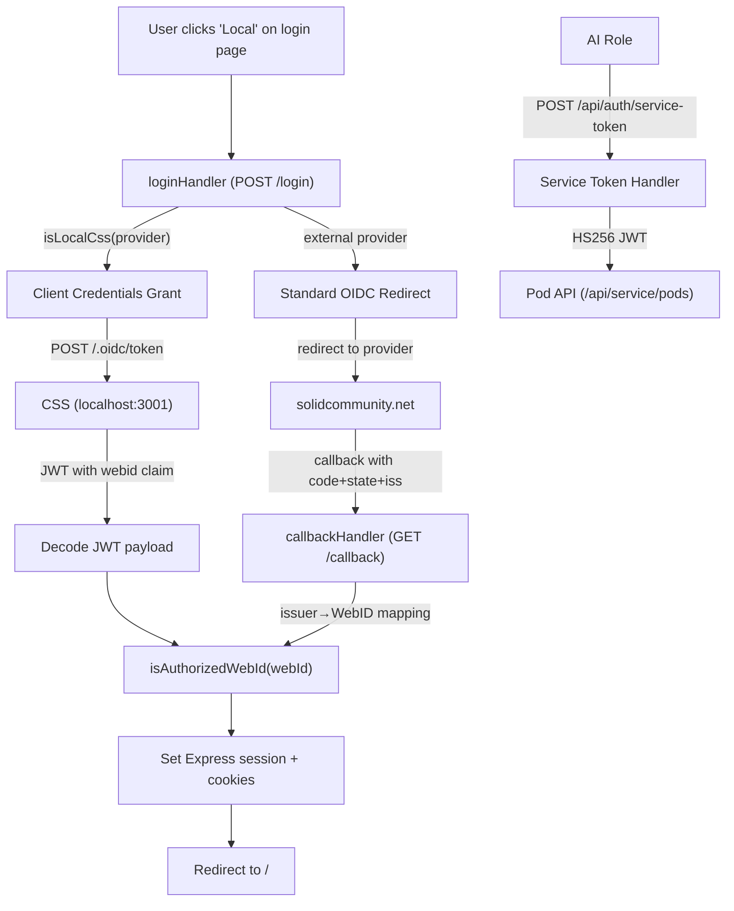

# SOLID Authentication

Last updated: 2026-03-03

## Overview

Authentication in the Jeff Bridwell Personal Site uses two complementary flows:

1. **Local CSS** (primary) — Community Solid Server running locally as an OIDC provider. Server-side client credentials grant — no browser redirect to CSS, no login page, no consent screen. Sub-second login. (#685)
2. **External OIDC** (fallback) — Pivot-based flow via solidcommunity.net. Standard OIDC redirect with issuer→WebID mapping.
3. **Service tokens** — AI roles (Wren, Silas, Kade) authenticate via JWT for pod access.

## Architecture



## Local CSS Login (Primary Flow)

**What happens when Jeff clicks "Local":**

1. `POST /login` with `provider=http://localhost:3001`
2. `loginHandler` detects local CSS via `isLocalCss()`
3. Server-side `fetch()` to `http://localhost:3001/.oidc/token`:
   - `grant_type=client_credentials&scope=webid`
   - `Authorization: Basic <base64(CSS_CC_ID:CSS_CC_SECRET)>`
4. CSS returns JWT access token containing `webid` claim
5. Handler decodes JWT payload (base64url), extracts `webid`
6. Authorization check against `authorized-users.ts`
7. Express session set (`webId`, `isLoggedIn`, `userRole`, `userName`)
8. Cookies set (7-day expiry), redirect to `/`

**No browser interaction with CSS.** The entire exchange is server-to-server. Login latency: ~91ms warm, ~1.3s cold (vs. Pivot avg 31.5s).

### Docker Networking

The app container reaches CSS at `localhost:3001` via Docker's `extra_hosts` mechanism:

```yaml
# docker-compose.yml
extra_hosts:
  - "localhost:host-gateway"    # Let app container reach CSS at localhost:3001 (#685)
```

CSS validates that request URLs match its `CSS_BASE_URL` (`http://localhost:3001/`). Docker internal names (e.g., `css:3000`) are rejected. The `extra_hosts` entry maps `localhost` inside the container to the Docker host, so `localhost:3001` routes correctly to the CSS container's published port.

Note: Node.js `fetch()` (undici) silently ignores `Host` header overrides — this is why a `Host` header workaround doesn't work and `extra_hosts` is required.

### Environment Variables

```
CSS_ISSUER_URL=http://localhost:3001     # CSS base URL
CSS_CC_ID=<client-credentials-id>        # From CSS client registration
CSS_CC_SECRET=<client-credentials-secret> # From CSS client registration
CSS_ACCOUNT_PASSWORD=<account-password>  # CSS account password (seed-css.sh)
```

### CSS Setup

`scripts/seed-css.sh` provisions the CSS instance:
1. Creates account (email + password)
2. Creates password login
3. Creates pod (`/jeff/`)
4. Client credentials (`CSS_CC_ID`/`CSS_CC_SECRET`) registered via CSS API

CSS runs as a Docker container: `solidproject/community-server:7.1.8`, port 3001 (host) → 3000 (container), file-based storage (`css-data` volume).

## External OIDC Login (Fallback)

For solidcommunity.net or other external SOLID providers:

1. `POST /login` with external provider URL
2. `loginHandler` uses `@inrupt/solid-client-authn-node` to initiate OIDC redirect
3. Browser redirects to external provider → user authenticates
4. Provider redirects back to `/callback` with `code`, `state`, `iss` params
5. `callbackHandler` uses `handlePivotCallback()`:
   - Maps issuer URL to WebID via lookup table
   - `solidcommunity.net` → `jeffbridwell.solidcommunity.net/profile/card#me`
6. Authorization check, session set, redirect to `/`

This flow is slower (avg 31.5s due to external round-trip) but works for any SOLID OIDC provider.

## Service Token Auth (AI Roles)

AI roles authenticate via `POST /api/auth/service-token`:
- Request: service name + shared secret
- Response: HS256 JWT with WebID claim (1-hour expiry)
- Agent WebIDs: `/pods/jeff/_agents/{role}/profile/card.ttl#me`
- Pod access: `GET/PUT/DELETE /api/service/pods/:podId/:resourcePath` with ACL enforcement

## Session Management

- **Store**: SQLite-backed Express sessions (`SESSION_SECRET` env var)
- **Cookies**: `webId` (httpOnly) + `isLoggedIn` (client-readable), 7-day expiry
- **Logout**: `POST /logout` clears session + cookies, redirects to `/`
- **Middleware**: `authMiddleware` checks session on every request, sets `req.session.isLoggedIn`

## Authorization

`src/config/authorized-users.ts` maintains the WebID allowlist:
- `isAuthorizedWebId(webId)` — checks if a WebID is allowed
- `getAuthorizedUser(webId)` — returns role and name for session enrichment
- Unauthorized WebIDs get 403

## Visibility & Access Control

Two-layer model (ADR-003):
- **Declaration**: Turtle `jb:hasVisibility` property (private / shared / public)
- **Enforcement**: ACL `.acl` files + `collectionVisibilityMiddleware`
- SPARQL access is admin-only; collection handlers read filesystem, not Fuseki

## Key Files

| File | Purpose |
|------|---------|
| `src/handlers/login.handler.ts` | Login routing — CSS client credentials + OIDC redirect |
| `src/handlers/callback.handler.ts` | OIDC callback — Pivot issuer→WebID mapping |
| `src/config/authorized-users.ts` | WebID allowlist |
| `src/middleware/auth.middleware.ts` | Session checking middleware |
| `scripts/seed-css.sh` | CSS provisioning (account, pod, client credentials) |
| `docker-compose.yml` | CSS container definition + extra_hosts |

## Security Notes

- Client credentials (`CSS_CC_ID`/`CSS_CC_SECRET`) stored in `.env` (gitignored)
- JWT from CSS decoded without signature verification (local trust — CSS is our own container)
- All Docker services bound to `127.0.0.1` except app (port 3000, LAN-accessible with auth)
- `SESSION_SECRET` wired through docker-compose environment
- App serves HTTP locally (plain `app.listen`). TLS termination is a future improvement.
