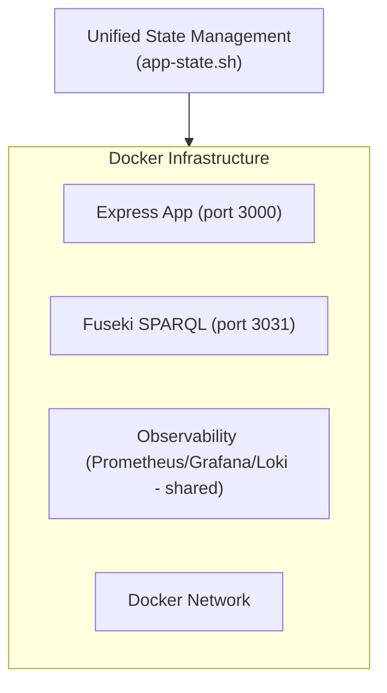

# Application Startup Process

**Last updated**: 2026-02-21 by Kade (Engineer)

This document describes the optimized startup process for the Jeff Bridwell Personal Site application, focusing on the separation of application state and infrastructure state.

## Overview

The application startup process has been optimized to provide:

1. Clear separation between infrastructure state and application state
2. Faster application restarts without affecting infrastructure
3. Comprehensive health checks for all components
4. Structured logging throughout the process

## Architecture

The startup process is divided into two main components:

## Key Components

### 1. Unified State Management (`app-state.sh`)

This script manages both infrastructure and application:

- Managing Docker containers (Express App, Fuseki)
- Setting up Docker networks (app network, observability network)
- Starting/stopping/restarting the application
- Performing health checks on all components
- Managing SOLID pod services

### 2. Development Environment

In development mode:
- nodemon is used for auto-reloading the application when code changes
- This eliminates the need for manual restarts in most cases
- `app-state.sh` is only needed for special cases when nodemon is insufficient

## Workflow

### Normal Development Workflow

1. Start everything: `./scripts/app-state.sh start`
2. Make code changes
3. nodemon automatically detects changes and restarts the application

### Restart Workflow

1. When nodemon is insufficient (major structural changes, etc.):
   - Restart: `./scripts/app-state.sh restart`

### Status Check

1. Check health: `./scripts/app-state.sh status`
2. View logs: `./scripts/app-state.sh logs [-f]`

## Performance Metrics

| Component | Time (seconds) |
|-----------|----------------|
| App Container Restart | ~12 |
| Fuseki Health Check | ~2 |
| Full Infrastructure Start | ~30 |

## Troubleshooting

### Common Issues

1. **Application container fails to start**
   - Check Docker logs: `docker logs jeff-bridwell-personal-site-app`
   - Verify port availability: `lsof -i :3000`

2. **Fuseki issues**
   - Check Fuseki logs: `docker logs jeff-bridwell-personal-site-fuseki`
   - Verify Fuseki is running: `curl -s http://localhost:3031/$/ping`

3. **nodemon not auto-reloading**
   - Check nodemon logs
   - Restart: `./scripts/app-state.sh restart`

## Best Practices

1. **Use app-state.sh for All Operations**
   - `./scripts/app-state.sh start` - Start everything
   - `./scripts/app-state.sh stop` - Stop everything
   - `./scripts/app-state.sh status` - Check health

2. **Rely on nodemon for Development**
   - Let nodemon handle code changes during development
   - Only use `app-state.sh restart` when nodemon is insufficient

3. **Regular Health Checks**
   - Run `./scripts/app-state.sh status` to verify all components are healthy

4. **Structured Logging**
   - All logs are JSON format for Loki ingestion
   - Use Grafana > Explore > Loki for log queries
   - Query: `{appName="jeff-bridwell-personal-site"}`
