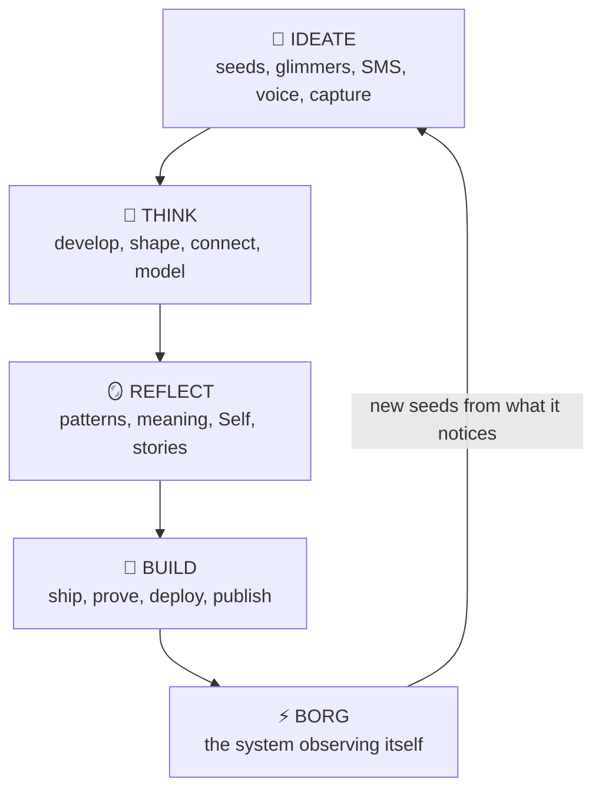
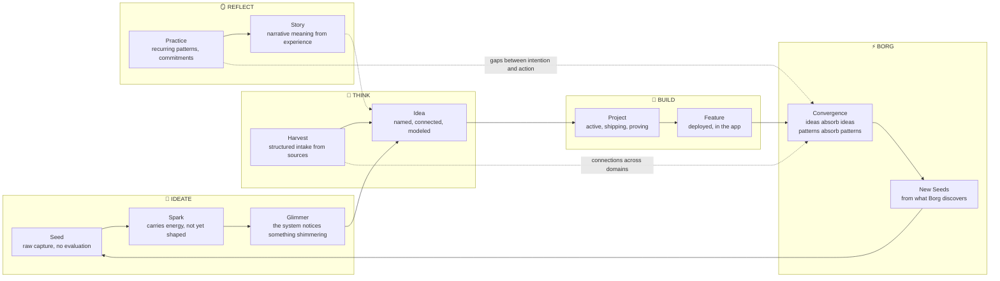

# System Model: Ideate, Think, Reflect, Build

**Last updated**: 2026-03-15 by Wren (PM) | Architecture doc refresh

## What This Document Is

The unified model for how Gathering, Chorus, and Self work as one system. Not three products — one system with three layers that serve a single purpose: helping Jeff ideate, think, reflect, and build.

## The Cycle

Four modes. Not a pipeline — a cycle. You can enter at any point and move in any direction.

### How Artifacts Flow Through the Cycle

Seeds mature into sparks, then ideas. Glimmers are different — they originate from the system itself, not from Jeff. A glimmer is the system noticing something Jeff hasn't named yet: Borg detects convergence, `/lm` reads an energy shift, a harvest surfaces an unexpected connection. A glimmer Jeff confirms becomes a seed. One he dismisses fades. Harvests feed the graph with structured data. Ideas graduate to projects. Practices and stories surface meaning. Borg closes loops — and generates new seeds from what it discovers.

See [IDEA_PROJECT_LIFECYCLE.md](/system/docs/IDEA_PROJECT_LIFECYCLE) for the full idea → project state machine and access control model.

### Ideate

Raw input, low friction, many channels. The system accepts anything — a thought via SMS, a voice note while walking, a photo of a whiteboard, a link pasted into a conversation. Nothing is evaluated at capture. The goal is volume and honesty, not quality.

**What exists today:** SMS capture pipeline (#480), voice input via Whisper, Apple Notes harvest, social media imports (Facebook, LinkedIn), book photo intake. Intentions collection (#946).

**What's missing:** A unified capture channel that feeds everything into one intake point. Currently each channel has its own pipeline. The Capture Channel concept is defined in the glossary but not built — a pre-idea, pre-resource intake that flows to triage.

**Surfaces:** Every collection's "add" interface. SMS. Voice. The future `/capture` page.

### Think

Develop raw inputs into shape. Connect ideas across domains. Model relationships. This is where the graph earns its keep — a book influences an idea, which connects to a story, which informs a project. Thinking is linking.

**What exists today:** Notes, ideas, projects in the ontology. Clearing sessions (multi-role real-time alignment). Briefs between roles. SPARQL queries that surface cross-domain connections. Semantic search (LanceDB + nomic-embed-text) that finds resonance, not just keywords.

**What's missing:** Visible cross-domain connection tracking. The "cross-domain connection ratio" is defined as a quality metric but not instrumented. No UI shows how ideas connect to other collections. The Idea → Project → Published Artifact pipeline is designed (IDEA_PROJECT_LIFECYCLE.md) but not visible in the app.

**Surfaces:** `/search` (hybrid FTS + semantic). Clearing sessions. Notes. The future idea-to-project flow.

### Reflect

Step back and ask what it means. This is the Self domain — local AI on the Bedroom Mac, private by design. Reflection surfaces patterns that thinking alone doesn't catch. You've been committing at 2am more often. Your intentions mention yoga every day but the practice log shows gaps. The stories you tell about your father and your son share a theme you haven't named yet.

**What exists today:** Reflect page with local Mistral. Voice analytics pipeline. Stories collection (40+ narratives). Values and practices collections. Posture timelapse (#899). Intentions collection (#946).

**What's missing:** Reflect doesn't write back to pods yet — it observes but doesn't persist insights. Self reads Chorus (filtered: memory, stories, decisions) but can't surface observations to the team (DEC-068). The metacognitive layer is running but mute.

**Surfaces:** `/reflect`. Voice analytics page (#618). Intentions. The future Self memory store (Bedroom-local, #939).

### Build

Ship concrete things. The Werk value stream: Directing → Designing → Building → Proving. Cards flow through the pipeline. Code gets written, tested, deployed. Features ship. The proving gate (DEC-048) ensures quality: deploy, demo to Jeff, accept.

**What exists today:** Full Werk pipeline. Vikunja board with WIP limits. Spine events. Three roles with vertical ownership. 3320+ tests. Docker deployment via app-state.sh. Harvest pipelines for 16+ domains. Cadence data (#1397): condition-driven rhythms, not calendar cadences. Three natural patterns: Pulse (every session — boot, work, capture), Sweep (condition-triggered clean work when cruft accumulates past threshold), Reflection (Jeff-initiated, ~weekly, never formalized). Tracked via build:clean ratios per role.

**What's missing:** Instrument layer on /werk (#621) — WIP enforcement visualization, proving gate tracking, brief latency, fitness functions. The pipeline works but its own health isn't visible.

**Surfaces:** `/werk`. Board. Terminal sessions. Commits. Deploys.

### Borg

The system observing itself. Named for what Jeff described: "instrumenting normalized into a system can really reveal a great deal about how it works — including the Jeff system."

Borg is one principle with three expressions:

**1. Convergence** — the system notices when separate things are actually the same thing. You shipped semantic search (#782, #890) and it absorbed three separate cards. A story about Christmas 2014 surfaces during a Facebook harvest demo. Domains that were independent start connecting. The graph becomes a mind, not a filing cabinet.

**2. Instrumentation** — the system measures its own operation. Spine events track card flow. Harvest manifests track pipeline state. Build:clean ratios track work cadence. Interaction pattern detection tracks how Jeff and the team engage. The data isn't for a dashboard — it's for the system to learn how it works.

**3. Self-awareness** — the system generates new questions from what it observes. When convergence and instrumentation mature together, Borg generates seeds: "these three things are actually one thing," "your build:clean ratio has drifted," "you haven't reflected in five days." The output of observation becomes the input of ideation.

All three expressions serve the same purpose: making the cycle conscious of itself. Without Borg, the cycle runs but doesn't learn. With Borg, each pass through Ideate→Think→Reflect→Build leaves the system slightly more aware of its own patterns.

**What exists today:** Board card absorption (semantic similarity matching in `werk-init.sh`). Spine events for card flow and interaction patterns. Harvest manifests for pipeline state. Build:clean ratio tracking (#1397). Cadence analysis — condition-driven sweep triggers, not calendar rhythms.

**What's next:** Cross-domain convergence detection in the graph itself — not just cards absorbing cards, but ideas absorbing ideas, patterns absorbing patterns. The `/borg` surface that makes all three expressions visible.

**Surfaces:** Board Borg output. Spine event instrumentation. The future convergence dashboard.

## Three Layers

The system has three concentric layers. Each maps to a trust boundary and a product.

```mermaid
graph TD
    subgraph Chorus["CHORUS — outer"]
        direction TB
        C1["Team coordination · Cloud AI"]
        C2["Protocols · briefs · decisions"]
        C3["Public method"]
        subgraph Gathering["GATHERING — middle"]
            direction TB
            G1["Personal knowledge graph"]
            G2["Hybrid · private-first · publish-when-ready"]
            G3["16 domains · 16M+ triples"]
            subgraph Self["SELF — inner"]
                direction TB
                S1["Local AI · Private"]
                S2["Never leaves home"]
                S3["Reflection · meaning · stories"]
            end
        end
    end
    Chorus -->|"data flows inward"| Gathering
    Gathering -->|"data flows inward"| Self
    Self -.->|"insights flow outward through Jeff"| Gathering
    Gathering -.->|"insights flow outward through Jeff"| Chorus
```

**Data flows inward.** Team context (Chorus) informs the app (Gathering) which feeds reflection (Self). Decisions made in Chorus become collections in Gathering become prompts for Self.

**Insights flow outward — but filtered.** Self's observations stay local (DEC-068). But the *consequences* of reflection flow out — Jeff changes a priority because Self surfaced a pattern. Jeff writes a story because Reflect connected two memories. The insight moves through Jeff, not through a pipe.

**Borg operates across all three layers.** It observes Chorus (spine events, card flow, interaction patterns), Gathering (harvest state, cross-domain connections, build:clean ratios), and Self (reflection patterns, intention tracking). Borg is the system observing itself — convergence, instrumentation, and self-awareness working together to make the cycle conscious.

## The Cycle Across Layers

| Mode | Self | Gathering | Chorus |
|------|------|-----------|--------|
| **Ideate** | Voice notes, intentions | SMS capture, photo intake | Seeds from team discussion |
| **Think** | Reflect conversations | Cross-domain linking, search | Clearing sessions, briefs |
| **Reflect** | Local AI, stories, patterns | Values, practices, Self pages | Stories shared with team |
| **Build** | — (Self observes, doesn't build) | App features, harvest pipelines | Protocols, tooling, method |
| **Borg** | Pattern detection across personal data | Cross-domain convergence, harvest state, build:clean ratios | Card absorption, spine events, interaction pattern instrumentation, cadence tracking |

## What Jeff Is Doing

Jeff is building a system where everything he cares about — music, books, family, ideas, work, garden, health, values — lives in one place, connected by meaning, observable by him, and progressively shareable with the world. The team (Wren, Silas, Kade) isn't building *for* him — they're building *with* him, and the method of building is itself a product (Chorus).

The cycle — ideate, think, reflect, build — is how Jeff naturally operates. He's told us this through stories: the basketball metaphor (constant motion, read-and-react), desiring-production (desire as productive, not lack), the PDCA loop (plan-do-check-act through high-volume ideation). The system should match his rhythm, not impose one.

Borg is the system observing itself — not AI consciousness, but system consciousness. Convergence (noticing when separate things are the same), instrumentation (measuring how the system operates), and self-awareness (generating new questions from what it observes). Jeff instrumenting himself the way he instruments infrastructure. The same discipline, applied inward.

## Companion Documents

Four perspectives on the same system:

- **[LIVING_ARCHITECTURE.md](/system/docs/LIVING_ARCHITECTURE)** (Silas) — the technical architecture: concentric layers, two-machine topology, data layer, observability stack, team protocol
- **[ENGINEERING_HORIZONTAL.md](/system/docs/ENGINEERING_HORIZONTAL)** (Kade) — how building generates signal: three feedback loops (product, architecture, story), quality as practice
- **[INTERACTION_PATTERNS.md](/system/docs/INTERACTION_PATTERNS)** (Wren) — the nine ways Jeff and the team interact, with FTF lineage and context injection mapping
- **[system-model-thinking.html](/gathering-docs/system-model-thinking.html)** — creative visual rendering of the cycle

## References

- Patent US9552400B2 (Bridwell — RDF/OWL + SPARQL + workflow gates)
- DEC-043: Three surfaces (/werk, /loom, /chorus)
- DEC-048: Proving gate (deploy, demo, accept)
- DEC-068: Self memory partition (read Chorus filtered, write local only)
- PRODUCT_VISION.md: Personal knowledge graph with agency
- IDEA_PROJECT_LIFECYCLE.md: Idea → Project → Published artifact
- OWNER_PERSONA.md: "Instrumenting normalized into a system" — the Borg principle
- #451: Model Seeds, Glimmers, Ideas, Projects in ontology
