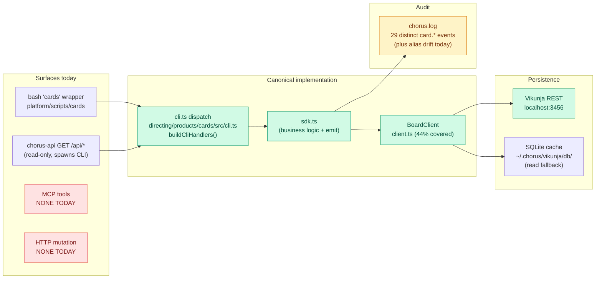
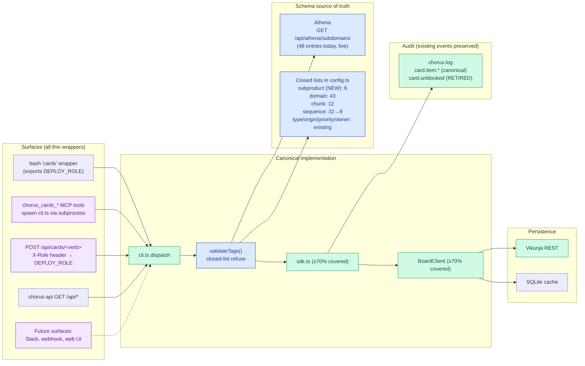

# Cards Service Design

**Wren, 2026-05-01 (initial). Reviewed by subagent 2026-05-01; counts verified against `directing/products/cards/src/config.ts` and emit calls in `src/sdk.ts`.**

**Owner:** Wren (interaction layer — semantic ownership of board+tag schema, Athena coupling, single-implementation invariant).
**Implementer:** Kade (canonical CLI is TypeScript under `directing/products/cards/`; code-domain is Kade's Athena subdomain).
**Cards:** #2643 (this design), #2642 (Wren morning-state validator — consumes this contract for AC5 owner-subdomain alignment).

## Structural invariant (Jeff, 2026-04-30, applied to cards 2026-05-01)

> "Flows like this must have exactly and only one addressable implementation — not MCP + CLI + API + whatever."

Cards has the same shape as nudge: every external surface (bash CLI, MCP tool, HTTP mutation endpoint, future Slack/webhook/web UI) MUST be a thin wrapper around one canonical implementation. Today the canonical implementation is `directing/products/cards/src/cli.ts` (TypeScript, 991 lines, dispatch via the `buildCliHandlers()` handler-map). All surfaces converge there or violate the invariant.

This is structural, not advisory. The drift class it prevents: tag-validation in CLI but not in MCP; spine emit in `done` but not in `tag`; role attribution in one path but not another. Each is a competing-implementation failure that produces silent state drift.

## Structural invariant (Jeff, 2026-05-01, applied to taxonomy)

> "Invariant execution — if these tags get all messed up, it's recurring rework for us."

Card metadata schema is closed-list and validated at the writing surface. Source of truth is **Athena** for `subdomain:` (live query); internal closed list (in `config.ts`) for the other axes. No silent-accept-then-drift. If a value isn't in the schema, the mutation refuses before the card is created/updated.

## Problem

Cards-CLI is one of the most-used substrates in Chorus — every WIP move, every tag change, every audit, every brief routes through it — and has no canonical service design. Concrete consequences observed 2026-04-30 / 2026-05-01:

- A two-hour manual audit was needed to re-tag ~50 cards across `sequence:harness`, `sequence:pulse`, `sequence:chorus`, `sequence:werk` because no validation refuses unknown sequence values, and the existing closed list in `config.ts` (32 sequence values) is heavily polluted with legacy / dead values (`v1`, `hardening`, `style`, `sparql`, `flow-tests`, `visibility`, `gates`, `spine`, `ops`, `strategy`, `icd`, `infrastructure`, `content`, `framework`, `awareness`, `coordination`, `surfaces`, `quality`, `harness`, `cards`, `context`, `protocol`, `pulse`) co-existing with live values (`werk`, `clearing`, `loom`, `athena`, `convergence`, `borg`, `seeds`, `chorus`, `gathering`).
- Role attribution drift ("cards-CLI by wren" bug observed by Kade today): `detectRole()` at `config.ts:155` infers role from `cwd` and silently defaults to `wren` when cwd doesn't match `engineer/`, `architect/`, `product-manager/`. Spine events emit wrong role; brief-notifications go to wrong person; audit accountability is misattributed.
- Mutation surfaces are not unified: bash CLI is canonical, Chorus API exposes only read-only GETs, MCP exposes 0 cards tools today (`platform/api/src/mcp/server.ts` has 9 tools — none cards-related). Future surfaces (Slack → card, webhook → card, web UI) have no contract to follow; each will reinvent.
- Existing event-name drift inside cards itself: `card.unblocked` AND `card.item.unblocked` both emit today (one from the `unblock` command, one from the `item.unblocked` historical pattern). This design retires the inconsistency.
- Several existing mutations (`set` for non-tag fields) emit `card.item.set` but without `old_value` / `new_value` detail required for audit reconstruction. Subscribers can't diff.
- `client.ts` (Vikunja persistence layer, 645 lines) has 44% coverage per the latest jest summary — the most consequential surface, the least-tested.

## As-Is (verified against code 2026-05-01)

Single canonical implementation exists; surfaces are uneven; validation is inconsistent; role identity is fragile. See "Caller trace" below.

### Caller trace (2026-05-01, empirical probe)

| Surface | Path:line | Type | Status |
|---|---|---|---|
| `cards` bash wrapper | `platform/scripts/cards` (19 lines) | Thin dispatcher | Spawns compiled JS or `ts-node src/cli.ts` fallback |
| `cards` CLI | `directing/products/cards/src/cli.ts` (991 lines) | **Canonical implementation** | All subcommands dispatch through `buildCliHandlers()` handler-map |
| `BoardClient` | `directing/products/cards/src/client.ts` (645 lines) | **Canonical persistence wrapper** | Wraps Vikunja REST API; coverage 44% per latest jest summary |
| Vikunja REST | `localhost:3456/api/v1/*` | **Canonical store** | External SaaS; tasks + labels + buckets |
| SQLite cache | `~/.chorus/vikunja/db/vikunja.db` | Optional read fallback | Bucket-state lookup; degrades to API if absent |
| `GET /api/chorus/card-story/:id` | `platform/api/src/server.ts` | Read endpoint | Card timeline; spawns `cards view <id> --json` |
| `GET /api/athena/card/:id` | `platform/api/src/server.ts` | Read endpoint | Card+AC parse; spawns `cards view` |
| `GET /api/athena/subdomains/:id/cards` | `platform/api/src/server.ts` | Read endpoint | Filter by `domain:` or `sequence:` matching subdomain |
| `GET /api/chorus/context/board/{wip,next,swat}` | `platform/api/src/server.ts` | Read endpoint | Bucket snapshot, cached |
| MCP cards tools | `platform/api/src/mcp/server.ts` | **Missing** | 0 cards-related MCP tools today |
| HTTP mutation endpoints | — | **Missing** | No `POST/PUT/DELETE /api/cards` |
| Slack/webhook ingress | — | **Missing** | No external trigger surface |
| `detectRole()` | `directing/products/cards/src/config.ts:149-156` | Role identity | **Buggy** — cwd-based, defaults to `wren` |
| Spine emission | Inline calls in `directing/products/cards/src/sdk.ts` (40+ sites) | Audit surface | 29 distinct `card.*` event types; alias drift today (`card.unblocked` ↔ `card.item.unblocked`) |

**Key observation:** The canonical implementation exists and works. The gaps are at the *edges* — surfaces that don't yet defer to it (MCP, HTTP mutation), validation that doesn't fire, role identity that lies, and one already-shipped event-name alias. The single-implementation invariant is **structurally honored** (one CLI, one BoardClient, one Vikunja) but **operationally violated** (validation skipped at flag-parse time; role mis-attributed; one event has two names today).



Green = canonical. Red = missing surfaces (must converge through canon when added). Yellow = audit surface with one known alias to retire.

## To-Be

Three additions, no replacements:

1. **MCP cards tool** added as thin wrapper to `cards` CLI (spawns subprocess with `DEPLOY_ROLE` injected, passes args, parses `--json` output). One MCP tool per mutation verb (`chorus_cards_add`, `chorus_cards_move`, `chorus_cards_done`, `chorus_cards_tag`, `chorus_cards_set`, `chorus_cards_view`).
2. **HTTP mutation API** added as another thin wrapper to `cards` CLI (`POST /api/cards/<verb>` Express route → spawns CLI with `DEPLOY_ROLE` from `X-Role` header → returns CLI's JSON output verbatim). Enables Slack webhook + future web UI without reimplementation.
3. **Validation hardened** at flag-parse time inside `cli.ts`: `subdomain:` (new), `subproduct:` (new), and existing `domain:` / `chunk:` / `sequence:` get refuse-at-source against closed lists. Existing tags get a deprecation-warn window before refuse-mode flips on.

Plus four corrections:

4. **Role identity:** `detectRole()` switches to "DEPLOY_ROLE-required-with-automation-fallback" — recognized roles are `wren|silas|kade|jeff|automation`. Bash wrapper exports DEPLOY_ROLE (see "Role Identity Surface" below). Default-to-`wren` removed.
5. **Spine alias retirement:** `card.unblocked` retired in favor of `card.item.unblocked` (Phase 1 of migration; subscribers updated atomically).
6. **`card.item.set` payload extended** to include `field`, `old_value`, `new_value` so audit subscribers can reconstruct field history.
7. **Test coverage:** raise `client.ts` from 44% to ≥70% as part of implementation work.



Green = canonical / complete. Blue = validation gateway. Purple = new or future surfaces, all routing through canon.

## Single Contract

One path. No variants.

```
cards <subcommand> [args] [flags]
  │
  ├── 1. detectRole() → DEPLOY_ROLE env (canonical)
  │                     refuse-at-source if unset (no silent default)
  │                     'automation' is a valid value for non-role callers
  │
  ├── 2. validateTags() → refuse-at-source if subdomain ∉ Athena
  │                       refuse-at-source if subproduct ∉ closed list
  │                       refuse-at-source if domain/chunk/sequence/type/origin ∉ closed list
  │                       (deprecated values warn-then-refuse during deprecation window)
  │
  ├── 3. dispatch → cli.ts buildCliHandlers()[subcommand] → sdk.ts (business logic)
  │                  cli.ts is the verb-router (thin); sdk.ts is where mutations happen and spine events fire.
  │                  sdk.ts is the contract surface subscribers conceptually depend on.
  │
  ├── 4. mutate → BoardClient (transport) → Vikunja HTTP REST + sqlite-via-execSync
  │                BoardClient is two surfaces: HTTP API (canonical) AND local sqlite read (`VIKUNJA_DB`,
  │                accessed via `execSync` per `client.ts:7,11`). The sqlite read is a substrate property —
  │                not part of the canonical write chain, but real for read-fast-paths.
  │
  └── 5. emit → chorus.log card.item.<verb> spine event (via sdk.ts emit sites, ~40 of them)
              (typed, with role attribution, card id, mutation details, old/new values where applicable)
```

**MCP path:** `chorus_cards_<verb>` MCP tool → spawns `cards <subcommand> --json` subprocess with `DEPLOY_ROLE` injected → returns parsed JSON output. Same canonical chain.

**HTTP path:** `POST /api/cards/<verb>` Express route → reads `X-Role` header → spawns `cards <subcommand> --json` subprocess with that DEPLOY_ROLE → returns CLI's JSON verbatim. Same canonical chain.

**Read path:** `GET /api/chorus/card-story/:id`, `GET /api/athena/card/:id`, etc. — read-only handlers spawn `cards view <id> --json` for the canonical render. Stays as-is.

## Tag Schema (locked, 2026-05-01, verified counts)

Closed lists with explicit source of truth:

| Tag | Source of Truth | Count | Validation | Notes |
|---|---|---|---|---|
| `product:` | Hardcoded closed list in `config.ts` | 2 (gathering, chorus) | At flag-parse, refuse unknown | Existing. Portfolio level. |
| `subproduct:` | Hardcoded closed list in `config.ts` | 6 initially (Athena, Loom, Werk, Borg, Convergence, Clearing) | At flag-parse, refuse unknown | **New axis.** Applies to `product:chorus` cards. Replaces what `sequence:` carries today inside Chorus. Gathering has no subproducts (the entire surface IS the product). |
| `subdomain:` | Live query to `GET /api/athena/subdomains` | 48 today (Athena governs) | At flag-parse, refuse unknown | **New axis.** Adding a subdomain in Athena makes it valid for cards without code change. |
| `domain:` | Hardcoded closed list in `config.ts` (43 values) | 43 (audit candidate, see open question) | At flag-parse, refuse unknown | Existing. Top-level area pointer. |
| `chunk:` | Hardcoded closed list in `config.ts` (12 values) | 12 (audit candidate) | At flag-parse, refuse unknown | Existing. Abstract category. |
| `sequence:` | **Deprecated** — translates to `subproduct:` after migration | 32 today → 9 live → 0 | Warn during deprecation window, refuse after | Migration: existing cards keep `sequence:` until backfilled; new cards use `subproduct:`; mass-rename in a separate migration card. |
| `type:` | Hardcoded {new, enhance, fix, chore, swat} | 5 | At flag-parse, refuse unknown | Existing. |
| `origin:` | Hardcoded {reflective, reactive} | 2 | At flag-parse, refuse unknown | Existing. |
| `priority:` | Hardcoded {P1, P2, P3} | 3 | At flag-parse, refuse unknown | Existing. |
| `owner:` | Hardcoded {wren, silas, kade, jeff} | 4 | At flag-parse, refuse unknown | Existing. |
| `stream:` | Hardcoded {sowing, growing, practicing, harvesting, reflecting, connecting} | 6 | At flag-parse, refuse unknown | Existing. |

**Multi-pick discipline:** Every tag axis is single-pick per card by convention. Vikunja allows multi-label per task; `config.ts` does not enforce single-pick. Audit query (filed as follow-on card): identify any card violating single-pick on `chunk`, `sequence`, `subproduct`, `subdomain` axes; reconcile to single-pick.

**Free-text:** Title, description, AC body, comments — unstructured, not validated. The structured metadata is what validates.

## Spine Event Contract (existing names preserved)

Every mutation emits exactly one typed event. **The contract preserves existing event names — no renames in this design except retiring `card.unblocked` in favor of `card.item.unblocked`.**

### Existing events emitted by cards (29 `card.*` + 8 cross-prefix = 37 total, verified 2026-05-01 from `src/sdk.ts` + `src/cli.ts`)

The 29 `card.*` events listed below preserve verbatim. The other 8 — `ac.ticked`, `board.snapshot.taken`, `board.audit.started`, `board.audit.closed`, `board.limit.set`, `workflow.manifest.created`, `workflow.manifest.archived`, `deploy.verification.completed` — are cards-emitted but use non-`card.*` prefixes; they show up in the table near the bottom.

**Anomaly to resolve (Kade audit, 2026-05-01):** Two emit functions exist today — `emitSpineEvent` (36 call sites) and `emitChorusEvent` (1 call site, `deploy.verification.completed` at `sdk.ts:889`). The "one canonical chain" invariant is structurally violated by two emit functions. Either retire `emitChorusEvent` and migrate the one event, or document why the dual path is intentional. **Recommendation:** retire and migrate. File as follow-on if not done in this card's implementation.

| Event | Trigger | Status |
|---|---|---|
| `card.item.created` | `add` | Kept |
| `card.quick.created` | quick-capture path | Kept |
| `card.item.moved` | `move` | Kept |
| `card.bulk.moved` | `bulk-move` | Kept (one event per bulk op, with `ids` array) |
| `card.item.completed` | `done` | Kept |
| `card.accepted` | `done --proven` | Kept |
| `card.accepted.proven` | back-link side of `done --proven` | Kept |
| `card.demo.started` | `demo` | Kept |
| `card.rejected` | `reject` | Kept |
| `card.item.reassigned` | `reassign` | Kept |
| `card.item.updated` | `update` | Kept |
| `card.item.commented` | `comment` | Kept |
| `card.item.blocked` | `block` | Kept |
| `card.item.unblocked` | `unblock` | **Canonical** (retire alias) |
| `card.unblocked` | `unblock` legacy path | **Retired** in Phase 1 — subscribers migrate to `card.item.unblocked` |
| `card.item.tagged` | `tag`, `untag`, `set <tag>` | Kept; payload to include `category`, `value`, `op` (`add`/`remove`) |
| `card.item.set` | `set <field>` non-tag fields | Kept; payload extended with `field`, `old_value`, `new_value` |
| `card.sequence.bulk_tagged` | `sequence-tag` | Kept (one event per bulk op) |
| `card.swat.created` | `swat` | Kept |
| `card.pulled` | `move <id> Now` triggered by role-state | Kept |
| `card.owner.notified` | brief-write side-effect of reassign/done | Kept |
| `card.pm.briefed` | brief-write side-effect of completion | Kept |
| `card.quality.warned` | AC/completeness signal at gate-time | Kept |
| `card.quality.blocked` | quality gate failure | Kept |
| `card.stale.detected` | card unchanged > N days | Kept |
| `card.wip_overlap.detected` | card in WIP + another status | Kept |
| `card.blast_radius.generated` | code-impact analysis complete | Kept |
| `card.blast_radius.zero_code` | no code files match domain | Kept |
| `card.blast_radius.failed` | analysis error | Kept |
| `ac.ticked` | AC checkbox toggled in description | Kept (not `card.*` but cards-emitted) |
| `board.snapshot.taken` | `snapshot` | Kept |
| `board.audit.started` | `audit-start` | Kept |
| `board.audit.closed` | `audit-close` | Kept |
| `board.limit.set` | `set-limit` | Kept |
| `workflow.manifest.created` | workflow side-effect | Kept |
| `workflow.manifest.archived` | workflow side-effect | Kept |
| `deploy.verification.completed` | deploy-gate side-effect | Kept |

### Standard envelope

```json
{
  "type": "card.item.<verb>",
  "role": "<wren|silas|kade|jeff|automation>",
  "ts": "<ISO 8601>",
  "card_id": <int>,
  "board": "<gathering|self>",
  "...verb-specific fields"
}
```

### Idempotency rule

If a mutation would not change state (re-tag with same tag, re-set with same value), CLI exits 0 with `{"status":"no-op"}`, emits **no spine event**, and makes **no Vikunja API call**. The no-op detection happens in `sdk.ts` BEFORE `BoardClient` is invoked — not just at the spine layer. Audit logs don't fill with phantom changes; Vikunja's API doesn't see redundant writes (Kade audit, 2026-05-01: idempotency at API level, not just spine).

### Subscribers

`wren-morning-validator` (#2642) consumes `card.item.tagged`, `card.item.set`, `card.item.created`, `card.item.moved`, `card.item.unblocked`. Borg observability consumes the full set. Loom-rcas reconstructs incidents from the spine fold. Spine is the audit log.

## Sender Detection

Switch from cwd-based to env-required:

```
detectRole():
  1. DEPLOY_ROLE env var (canonical) — must be one of:
       wren | silas | kade | jeff | automation
  2. If unset: refuse with explicit error message naming the env var
  3. cwd parsing REMOVED (was the source of "by wren" bug)
```

This mirrors nudge's resolution.

**Automation role:** `automation` is a valid `DEPLOY_ROLE` for cron jobs, post-commit hooks, LaunchAgents, CI runners — callers without a human role identity. Spine events emitted with `role=automation` are audit-trackable but never get owner-of-the-card notifications. Mass-renames, nightly drift queries, and morning-validators all use this role.

The `wren` default-fallback is removed. Phase 2 of migration ensures every active caller sets DEPLOY_ROLE before this becomes refuse-mode (see Migration Discipline).

## Role Identity Surface for HTTP/MCP

External surfaces inject role identity at the wrapper layer, not in the canonical CLI:

- **MCP tool:** invokes `cards` with `DEPLOY_ROLE=<calling role>` set in the spawned subprocess env. Role determined by the calling Claude session's role identity.
- **HTTP route:** requires `X-Role` header; refuses request without it (HTTP 400). Spawns CLI with `DEPLOY_ROLE=<X-Role>`. Authorized roles per route enforced at the route layer (see Authz below), not in the CLI.
- **Bash wrapper:** `platform/scripts/cards` exports `DEPLOY_ROLE` only if it's already set in the calling environment AND not already exported. The wrapper does NOT infer role; it is a no-op if the parent didn't set it. Refusing-on-unset is the CLI's job.

CLI itself does not honor `X-Role` (it's HTTP-specific). The contract is: external surfaces translate their identity mechanism to `DEPLOY_ROLE`, then defer.

## Subprocess Contract (MCP & HTTP wrappers)

Spawning the TS CLI from a Node service is the chosen pattern. Trade-offs and contract:

- **Cold-start cost:** ~300-800ms per invocation including ts-node fallback path. Acceptable for human-paced operations (an MCP tool call is typically one-per-keystroke). Unacceptable for high-frequency calls; if a future surface needs > 10 calls/sec, the contract revisits.
- **Spawn env:** `DEPLOY_ROLE` must be in env. `cwd` is irrelevant (cwd-parsing removed from `detectRole()`); pass any working directory.
- **`--json` mandatory:** wrappers spawn with `--json` flag; CLI emits structured output to stdout, human messages to stderr. Wrappers parse stdout JSON and forward stderr unchanged.
- **Exit codes:**
  - `0` = success
  - `2` = validation failure (unknown tag value, missing required arg, refused state)
  - `3` = persistence failure (Vikunja unreachable, label not found, conflict)
  - `4` = network failure (timeout, DNS)
  - `1` = unhandled / unknown
- **Wrapper translation:** MCP returns `is_error: true` with the stderr message on non-zero exit. HTTP returns 400 (exit 2), 502 (exit 3), 503 (exit 4), 500 (exit 1).
- **Timeout:** wrappers enforce 10s per invocation; longer = exit 4.
- **Signal propagation:** parent kill propagates SIGTERM to subprocess.

## Authorization

Per-role Vikunja tokens already exist (env var per role, see `config.ts:loadEnv`). The CLI loads the token matching `DEPLOY_ROLE`. Authorization beyond token-existence is **not** enforced at the CLI layer — any role that can spawn the CLI with their token can mutate any card. The control is observation/audit (every mutation emits a typed spine event with role attribution). HTTP route layer MAY enforce additional authz (e.g., refuse Slack webhook from posting as `silas`); this design names the surface but leaves the policy to a follow-on card.

## Concurrency / Ordering

Two roles `cards move 100 wip` simultaneously: Vikunja accepts both (last-write-wins on Vikunja's side); spine emits two `card.item.moved` events with distinct timestamps. Subscribers fold by `ts`; UI debounces. No additional locking at the CLI layer. If conflict detection becomes needed (e.g., two roles updating description), a separate card adds an `If-Match` header pattern.

## Idempotency on `cards add`

Re-running `cards add "same title" ...` creates a duplicate card today. This design preserves that behavior (no implicit dedup); a separate card may add `--idempotency-key <key>` if Slack-webhook or other automation needs it.

## Future-proofing the invariant

Future cards surfaces (Slack `/card` slash-command, web UI button, iOS app, webhook trigger) MUST be thin wrappers around `cards` CLI. Acceptable patterns:

- Spawn the CLI as a subprocess, pass args + read `--json` result (MCP / HTTP route pattern)
- Call a thin HTTP endpoint that forwards to the CLI with no logic of its own (NOT a new endpoint that writes to Vikunja directly)

Unacceptable patterns:

- Reimplementing tag validation, persistence, or spine emit in another language
- Writing to Vikunja from a service other than `BoardClient`
- Adding flags or paths that diverge from the CLI's contract
- Introducing a separate "cards-lite" or "cards-fast" implementation

PM check: any new cards surface proposal goes through Wren before merge. The question is "does this delegate to the canonical CLI, or reimplement the flow?" If the latter, reject.

## What Gets Removed

| Path | Verdict | Reason |
|------|---------|--------|
| cwd-based default-to-`wren` in `detectRole()` (`config.ts:149-156`) | **Removed Phase 2** | Source of role-attribution drift; switch to DEPLOY_ROLE-required with `automation` as the catch-all for non-role callers |
| Stale sequence values: `v1, hardening, style, sparql, flow-tests, visibility, gates, spine, ops, strategy, icd, infrastructure, content, framework, awareness, coordination, surfaces, quality, harness, cards, context, protocol, pulse` | **Removed Phase 3** | Closed list reduces to live values: `werk, clearing, loom, athena, convergence, borg, seeds, chorus, gathering` (9). Backfill cards before Vikunja-label deletion. |
| `card.unblocked` event name | **Removed Phase 1** | Alias drift — `card.item.unblocked` is canonical; subscribers migrate atomically before retire |

## What Gets Kept

| Path | Verdict | Reason |
|------|---------|--------|
| Vikunja as canonical store | **Kept** | External SaaS already serves UI + API; not a violation; replacement would be optimization |
| `BoardClient` as persistence wrapper | **Kept** | One client, all writes through it |
| `cards` CLI as canonical implementation | **Kept** | All surfaces converge here |
| Read-only Chorus API GET endpoints | **Kept** | They spawn the CLI for canonical render; consistent with single-implementation invariant |
| SQLite cache fallback | **Kept** | Read-only optimization; degrades cleanly |
| `directing/products/cards/src/` location | **Kept** | Canonical address; don't move during this design |
| All `card.item.*`, `card.accepted*`, `card.quick.*`, `card.swat.*`, `card.pulled`, `card.owner.notified`, `card.pm.briefed`, `card.quality.*`, `card.stale.detected`, `card.wip_overlap.detected`, `card.blast_radius.*`, `card.bulk.moved`, `card.demo.started`, `card.rejected`, `card.sequence.bulk_tagged`, `ac.ticked`, `board.*`, `workflow.*`, `deploy.*` events | **Kept** | Existing names preserved; no rename storm. |

## Backwards Compatibility

Cards in Vikunja today carry stale `sequence:` values. Two choices for those cards during the deprecation window:

1. **Phase 1 (validation in warn mode):** `cards view <id>` on a card with `sequence:hardening` succeeds with a stderr warning; `cards update <id> ...` succeeds; new cards can't add the stale value.
2. **Phase 3 (mass-rename followed by refuse mode):** Backfill cards (assign `subproduct:` based on a translation table; remove `sequence:` label after backfill); flip validation to refuse mode; delete stale Vikunja labels last.

No card breaks. The morning-validator (#2642) flags any card still carrying a stale `sequence:` value during the deprecation window as drift, then the Phase 3 backfill clears it.

**Vikunja label rename mechanism:** Vikunja's `PUT /api/v1/labels/{id}` updates label title in place, preserving card associations. Phase 3 uses `add-new-and-remove-old` for labels that change identity (e.g., `sequence:foo` → `subproduct:bar`), since the semantic mapping isn't 1:1.

## Migration Discipline

**Phase 0 (this design + #2643):** Document the contract. Don't migrate data. Don't break wrappers.

**Phase 1 (separate card, follow-on):**
- Add `subdomain:` flag with Athena validation (refuse-at-source).
- Add `subproduct:` flag with closed-list validation (refuse-at-source).
- Add MCP tools that spawn CLI (with subprocess contract above).
- Add HTTP mutation routes that spawn CLI.
- Validation for existing tags ships in **warn mode** (refuse only for new tag values; existing values pass with warning).
- Retire `card.unblocked` in favor of `card.item.unblocked`; subscribers migrate first.
- Backfill spine emit gaps: `card.item.set` payload extended with `field`, `old_value`, `new_value`; `card.item.tagged` payload extended with `op` (`add`/`remove`).

**Phase 2 (separate card, follow-on):**
- Switch `detectRole()` to DEPLOY_ROLE-required (refuse on unset).
- Bash `cards` wrapper exports DEPLOY_ROLE only if parent set it; CLI refuses if missing.
- Audit role-attribution events for last 90 days; flag mis-attributed events to surface impact.
- All cron jobs / LaunchAgents / hooks updated to set `DEPLOY_ROLE=automation` if no human role applies.

**Phase 3 (separate card, follow-on):**
- Mass-backfill `subproduct:` tag on existing cards from translation table (`sequence:werk` → `subproduct:werk`, etc.).
- Remove stale `sequence:` labels from cards (after backfill).
- Flip validation to refuse mode for `sequence:` values.
- Delete unused Vikunja labels (`hardening`, `style`, `sparql`, etc.).
- Wren morning-validator (#2642) starts firing AC5 owner-subdomain alignment query.

**Phase 4 (separate card, follow-on):**
- Raise `client.ts` test coverage to ≥70%.
- Audit and tighten `domain:` (43 → smaller closed list) and `chunk:` (12 → audited closed list).
- Single-pick discipline audit for multi-valued axes.

**Ordering dependencies:**
- Phase 1's warn-mode is a precondition for Phase 3; refuse-mode in Phase 1 would make Phase 3 unable to operate on existing cards.
- Phase 2's `automation` role is a precondition for any cron / LaunchAgent updating cards (including Phase 3 backfill — must run as `automation`).
- Phase 4 is gated on Phase 3 (no point auditing closed lists while migration is in flight).

Each phase ships independently; later phases gate on earlier ones. No big-bang migration.

## Files in Scope (this design landing only)

- `designing/docs/cards-service-design.md` — this doc
- `designing/docs/cards-service-design.html` — HTML render via doc-catalog
- `roles/wren/CLAUDE.md` (or shared fragment) — one-line pointer to this design
- `directing/products/cards/README.md` — one-line pointer to this design

## Cards-CLI surface map (verified 2026-05-01 from `directing/products/cards/src/`)

The canonical implementation is layered, not flat. Subscribers and observers depend on different layers:

| File | Role | Notes |
|---|---|---|
| `cli.ts` (991 lines) | Verb-router | Thin dispatch via `buildCliHandlers()`; no business logic |
| `sdk.ts` (~40 emit sites) | **Business logic + spine emit** | Where mutations happen; the contract surface for subscribers |
| `client.ts` aka `BoardClient` (645 lines, 44% covered) | Transport | Wraps Vikunja HTTP REST; ALSO reads sqlite via `execSync` (line 7) using `VIKUNJA_DB` (line 11). Object-injection lint suppressed at file head. |
| `events.ts` | Spine emit helpers | Hosts both `emitSpineEvent` AND `emitChorusEvent` — the dual-emit-path anomaly noted above |
| `config.ts` | LABELS registry, `detectRole`, `resolveBucket` | Schema source for all hardcoded closed lists |
| `blast-radius.ts` | Auto-generated blast-radius comments | Side-effect on `add` / `swat` |
| `ac-tick-detection.ts` | AC checkbox parsing | Side-effect on `update` for AC progress |
| `cli-add-helpers.ts` | Verb-specific helpers | `add` flag parsing |
| `cli-view-helpers.ts` | Verb-specific helpers | `view` rendering |

**Implication for the canonical chain:** future role-state-validators, borg-observers, and morning-validator should depend on `sdk.ts` events (the contract layer), not `BoardClient` (the transport). The Single Contract section above names this explicitly.

## Open Questions

1. **Domain count**: 43 entries today, many legacy (`health`, `save`, `make`, `house-garden`, `gathering`, etc.). Audit candidate — file Phase 4 card.
2. **Chunk count**: 12 entries today. Some abstract (`spine`, `senses`), some concrete (`ci`, `tests`). Audit whether chunk should align to subdomain instead — separate design conversation.
3. **`subproduct:Chorus` and `product:chorus` collision**: by current design, a Chorus app card carries `product:chorus subproduct:chorus` if the work is on Chorus-the-app at layer 6 of the reference model (vs Chorus-the-portfolio at layer 1). This is awkward. Open question: is "Chorus-the-app" a valid subproduct value, or do those cards just carry `product:chorus` without subproduct? Defer to Jeff.
4. **Authorization policy**: per-route HTTP authz (Slack webhook can/can't post as `silas`) is named but not specified. Phase 1 ships permissive; tightening is a follow-on.

## Decisions

The following should be filed as DECs:

- **DEC-NNN: Canonical implementation = `directing/products/cards/src/cli.ts`**. All wrappers spawn it. No reimplementations.
- **DEC-NNN: Persistence = Vikunja REST API.** SQLite is read-only cache, not a competing store.
- **DEC-NNN: Schema source of truth = Athena (subdomain) + closed lists (everything else).**
- **DEC-NNN: Role identity = DEPLOY_ROLE env, refuse on unset, `automation` is a valid value.**
- **DEC-NNN: Validation = at flag-parse, refuse-at-source.** No silent-accept-then-drift.
- **DEC-NNN: Spine emit = every state-changing mutation, typed event envelope.** No-ops emit no event.
- **DEC-NNN: MCP + HTTP-mutation = thin wrappers spawning CLI.** Subprocess contract specified.

## References

- `designing/docs/nudge-service-design.md` (Wren, refreshed 2026-04-30 in #2631) — precedent + structural invariant
- `designing/docs/commits-service-design.md` (Kade, in-flight 2026-05-01) — sibling redesign in same shape
- `directing/products/cards/src/cli.ts` (991 lines) — canonical implementation address
- `directing/products/cards/src/client.ts` (645 lines, 44% covered) — persistence wrapper
- `directing/products/cards/src/sdk.ts` — spine emit call sites (40+)
- `directing/products/cards/src/config.ts:149-156` — `detectRole()` cwd fallback (bug source)
- `directing/products/cards/src/config.ts:LABELS` — label registry (43 domain, 12 chunk, 32 sequence, 6 stream, 5 type, 2 origin, 4 owner, 3 priority, 2 product)
- `platform/api/src/mcp/server.ts` — MCP host (no cards tools today)
- DEC (pending): card-tag schema is closed-list, validated at writing surface
- Memory: `feedback_writing_surface_over_review_surface` — quality lives where the artifact is written
- Memory: `feedback_no_competing_implementations` — single-implementation invariant
- Memory: `feedback_eliminate_runtime_dep_dont_manage_it` — eliminate runtime deps over manage
- Memory: persist-vs-deliver corollary (DEC-107) — applies to nudge; cards has no parallel persist
- Cards: #2642 (Wren morning-state validator — consumes this contract for AC5 owner-subdomain alignment); #2643 (this design)

## Review trail

- Initial draft: Wren, 2026-05-01
- Subagent review (general-purpose, 2026-05-01): caught new-event-name conflict with existing `card.item.*` names (would have introduced the drift this design exists to prevent), wrong file citation (`events.ts` → `sdk.ts`), miscounted tags (34 domain → 43, 13 chunk → 12), product/subproduct collision, undefined backward compat for cards with stale labels, missing automation role for Phase 2, hand-waved bash wrapper, missing subprocess contract, missing authz/concurrency/idempotency/error-contract sections.
- Revisions applied: all blockers resolved before this version. Yellow-bar items (Phase 4 audits, authz policy, chunk-alignment-to-subdomain) deferred to follow-on cards.
