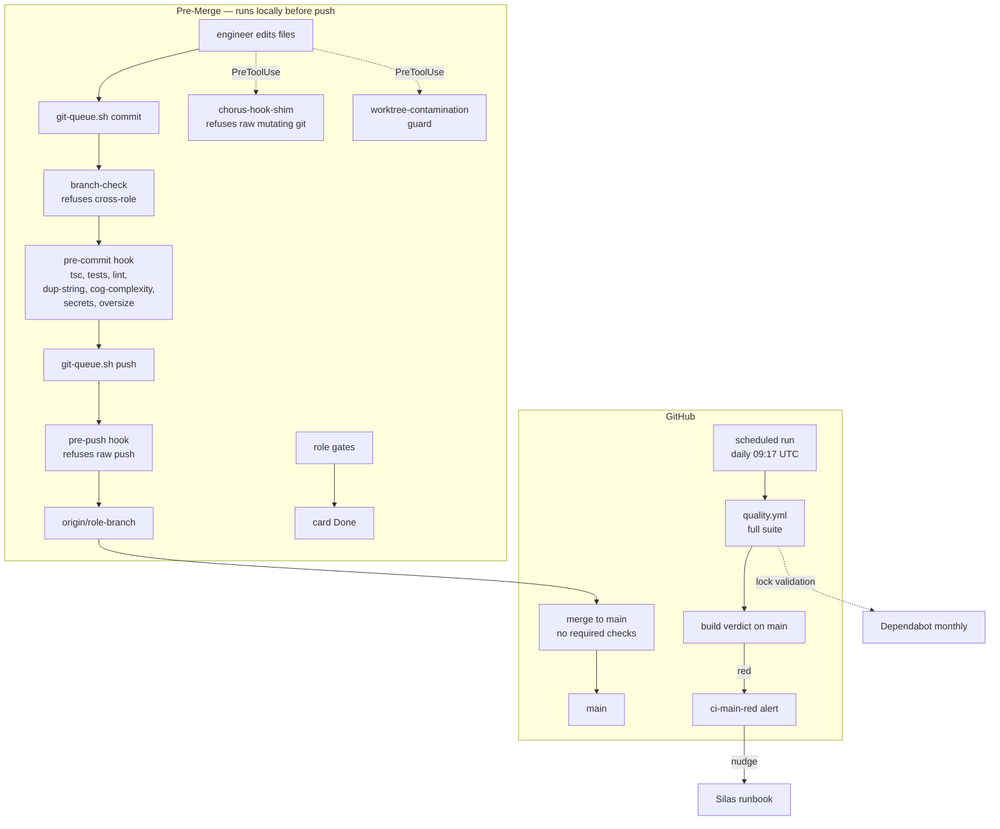
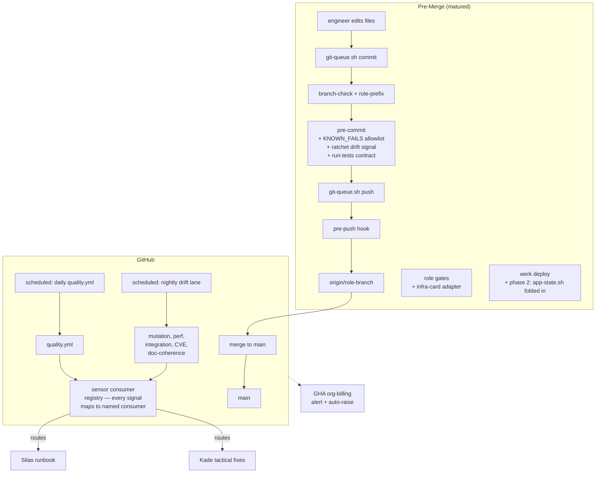

# CI/CD Pipeline — Service Design

**Kade, 2026-04-25 / refreshed 2026-04-30 (vocabulary cleanup, five-surface pre-merge layer, retirement gates, affordance-layer refusal — folded subagent review corrections).**

## Promise

Every change that reaches `main` is measured by the same gates regardless of who pushed it. Five hooks fire pre-merge. Five named code-review checks record card-level acceptance. One scheduled GitHub Actions run on `main` (~daily) is the post-merge witness. One reactive alert wakes the on-call when CI goes red.

**Honest scope:** four of the five pre-merge hooks block unconditionally; the fifth (pre-commit) is `--no-verify`-skippable for the carded `KNOWN_FAILS` pattern, and the allowlist enforcing that convention is still a planned card (#2497). With required-status-checks empty (post-#2600 cost-stop), an accidental main-push lands red and stays red until the next nightly run — up to 24h. The schedule-only retreat is a deliberate cost trade ($15/mo vs $225 projected); the gap is mitigated by pre-merge maturity, not by CI itself.

## Vocabulary

The codebase uses internal terms that map to industry-standard CI/CD concepts. Reading this section once lets the rest of the doc parse without translation.

| Internal term | Industry standard | What it actually is |
|---|---|---|
| Pre-merge enforcement layer | Pre-commit + branch protection + lint gates | Five hooks that run before code reaches `main` |
| Role gates (`/gate-*`) | Code review checklists encoded as skills | Five named checks recorded as PR/card comments |
| `werk` | Deploy wrapper script | Shell script bundling cargo build + claudemd-gen + install-hooks under a SHA gate |
| `git-queue.sh` | Serialized commit + push wrapper | Mutex-locked git wrapper enforcing branch-name conventions |
| Spine events / `chorus.log` | Structured audit log | JSONL event stream written by hooks for incident reconstruction |
| Card | Ticket | Vikunja kanban ticket (e.g. #2627) |
| Wren | Product manager (PM) | The role that owns acceptance and scope decisions |
| Kade | Engineer | The role that owns code-quality and engineering execution |
| Silas | Architect / on-call | The role that owns system fit and operational runbooks |
| Loom | Decision/principle/practice graph subdomain | Where ADRs (`loom-decisions`), team principles (`loom-principles`), patterns (`loom-practices`), and policies (`loom-policies`) live |
| Pulse | Local Node service on port 3475 | Persists nudges + chat to SQLite |
| Clearing | Local Node service on port 3470 | Multi-role chat surface |
| `chorus-hook-shim` | Hook executable | Rust binary called by Claude Code's PreToolUse for refusals |

## Pre-Merge Enforcement (Five Surfaces)

Each surface catches a distinct attack vector on the path from "engineer edits code" to "main has the change." The five aren't enumerated by convenience — they're derived from where wrong-shape commits can enter the system.

| # | Attack vector caught | Hook | Refuses | Card |
|---|---|---|---|---|
| 1 | **Wrong-branch commit** (engineer commits to a branch that isn't theirs) | `git-queue.sh` branch-check | Cross-role branch contamination | #2580 |
| 2 | **Raw push** (bypassing the queue) | pre-push hook | `git push` without the `_GIT_QUEUE_PUSH` marker, wrong-role branch | #2598 |
| 3 | **Dangerous git from agent** (Claude Bash tool runs raw git mutations) | `chorus-hook-shim` PreToolUse | Raw `git push`/`rebase`/`cherry-pick`/`reset --hard` | #2598 |
| 4 | **Cross-worktree contamination** (running git ops on the canonical clone while another role is mid-build) | worktree-contamination guard | `git checkout`/`pull`/`reset`/`switch` on the canonical clone when role-state shows another role active | #2625 |
| 5 | **Bad commit content** (typecheck/lint/test failures, secrets, oversize) | pre-commit hook | tsc errors, jest/cargo failures, lint violations, dup-strings, cog-complexity over 12, secrets, oversize binaries | (built up over many cards) |

All five emit JSONL audit events to `platform/logs/chorus.log`.

Surface 5 is the only one bypassable: `--no-verify` skips it for the `KNOWN_FAILS` pattern (carded test failures from other roles, traced via `#NNNN` in the commit message). The allowlist enforcing that convention is #2497 (still planned).

## Pre-Commit Detail (Surface 5)

`platform/hooks/pre-commit` runs as part of every `git-queue.sh commit`. Each check fires only when staged files trigger its scope.

- **Typecheck** — `tsc --noEmit` on changed TypeScript packages
- **Tests** — `jest` on changed JS/TS packages, `cargo test --lib --bins` on changed Rust crates (hermetic only)
- **Secrets scan** — refuses commits writing API keys / .env content / credentials
- **Catalog oversize** — refuses oversize binaries to `data/catalog/`
- **Principle direct-edit** — refuses edits to `data/principles/` outside the canonical write path
- **Sonarjs error tier (Check 4.4, #2603 + #2627)** — blocks on `no-duplicate-string` (threshold 5) or `cognitive-complexity` (threshold 12) in staged TypeScript. Magic-comment override `// cog-override: <reason>` exempts a function and emits a `cog.override.used` audit event
- **MCP tool description shape** — staged MCP tool definitions match the description-shape contract
- **Doc-coherence ratchet** — when CLAUDE.md fragments change, doc references stay coherent

## Quality Rules (Convention: No Warn Tier)

Active rules at `error` (block at Check 4.4):
- `sonarjs/no-duplicate-string`, threshold 5 — catches the agent-inlining pattern (same literal duplicated 5+ times)
- `sonarjs/cognitive-complexity`, threshold 12 — catches the function-too-tangled pattern; PM lowers the threshold (12 → 11 → 10) when the codebase is visibly ready

**Convention (not currently self-enforced):** every lint either blocks or doesn't fire — no `warn` tier. Warnings are never handled, so adding a rule at warn level adds noise. This is a discipline, not a pattern with an enforcement surface; nothing in the pre-commit hooks today blocks a contributor from adding a warn-tier rule. A self-audit check would change that — currently a gap.

**Install discipline:** when wiring a new quality rule, ship the rule + fix-as-we-go. Don't pre-fix every existing violation as part of the install — that's how rule-install cards become unbounded. Fixes happen on touched files at commit time.

## Retirement Gates (Forward-Only Structural Assertion)

When a surface is retired (HTTP endpoint, helper function, schema column, code path), the deletion ships with a small bats file containing grep-assertions: "no production reference to the retired surface remains anywhere in the codebase."

Without the gate, the test suite shrinks alongside the surface — a future contributor sees the empty space, types the helper back in, and no test catches it. The retirement gate is structural memory of *why* the surface was retired, encoded as test.

Live examples (verified 2026-04-30):
- `platform/tests/role-state-card-decoupled.bats` (#2467) — 7 `@test` blocks asserting no skill source passes `card=` to role-state CLI; no CLAUDE.md fragment uses `building card=<id>` syntax
- `platform/tests/pulse-rolestate-retired.bats` (#2632) — 5 assertions: no `setRoleState`, no `getRoleState`, no `/api/role-state` route, no `role_state` table CREATE, no `Role state` describe block in pulse store tests

Pattern earns its keep when the retired thing has structural pull (a future engineer might reach for it). Skip the gate when the surface was an obvious one-off no one would re-introduce.

## Affordance-Layer Refusal

When a deprecated input shape needs to disappear (e.g., `card=` field on role-state writer), refuse it at every surface that could reach the affordance, not just one. Pattern from #2467 + #2629:

1. **Writer parser** — refuses the input, exits with helpful error naming the corrective action
2. **HTTP API** — refuses POST bodies with the deprecated field
3. **Bats gate** — asserts no skill source / fixture / helper passes the deprecated input
4. **Schema** — drops the column entirely so the storage path is closed

Each surface catches a different attack vector: writer rejects current callers; HTTP API rejects future REST clients; bats prevents new instances in skill markdown; schema drop closes the storage path entirely. Single invariant, four enforcement surfaces. Belt-and-suspenders is reinforcement here — they catch different things.

## Role Gates

Five named code-review checks, recorded as card comments + audit events. Skippable for `type:chore`/`type:swat`.

| Gate | Owner | Checks |
|---|---|---|
| `/gate-product` | Wren (PM) | AC items, Experience section, domain registered, spine contract |
| `/gate-code` | Kade (Engineer) | tests green, build clean, no new warnings, pattern match |
| `/gate-quality` | Kade (Engineer) | hooks pass, regression clean, no `console.log`, debt check |
| `/gate-arch` | Silas (Architect) | system fit, namespace conventions, domain boundaries |
| `/gate-ops` | Silas (Architect) | health checks, log flow, rollback path, disk health |

The `/demo` skill assumes a user-facing surface; infra cards (CI changes, hook changes) need a different "show what's blocked, not what's running" pattern. Tracked in #2499.

## Current State (As-Is)

What this shape buys: cost ~$15/mo (down from ~$225 projected pre-cost-stop); five pre-merge gates refuse contamination at distinct vectors; per-PR validation runs locally; scheduled run is the post-merge witness.

What it costs: regressions on `main` discoverable up to 24h after merge. Trust burden moves to pre-merge maturity. If pre-commit drifts (a flaky test bypassed via `--no-verify` without a card trace), the daily run is the only catch — and the trust audit that would detect such drift is itself a planned card (#2500), not yet wired.

## Target State (To-Be)

What changes:
- A nightly drift lane catches slow signals (mutation/perf/integration/CVE/doc-coherence) as cards, never blocking
- A sensor consumer registry routes every CI / alert / drift signal to a named consumer — no orphan signals
- A run-tests contract becomes the load-bearing interface between CI and tests substrate
- A billing alert prevents recurring quota wedges
- A `KNOWN_FAILS` allowlist closes the `--no-verify` convention drift
- A ratchet drift signal stops baseline accretion

What stays the same: scheduled-only main re-run; no per-PR matrix unless pre-merge maturity proves insufficient and Jeff reinstates required checks.

## Implementation Plan

Done across today's session and the prior arc:
- Pre-merge surfaces 1–4 — #2580, #2597, #2598, #2625 ✓
- Pre-merge surface 5 quality rules — #2603, #2627 ✓
- Affordance-layer refusal pattern — #2467 + #2629 ✓
- Retirement-gate pattern — #2467 + #2632 ✓
- Cost-stop / schedule-only retreat — #2600 ✓ (with DEC-2525 + #2526)
- Lock-file policy + Dependabot monthly — ADR-026 §c ✓
- Reactive red-main alert — `ci-main-red.yml` ✓

**Phase A — pre-merge maturity (close the bypassable-fifth-surface gap):**
1. **#2529 run-tests contract** — load-bearing interface between CI substrate and tests substrate. Promoted to Phase A per subagent review: if it's load-bearing, it can't be deferred behind drift-lane work
2. **#2497 KNOWN_FAILS allowlist** — codifies the `--no-verify` + `#NNNN` trace convention so commits referencing carded test failures pass while uncarded `--no-verify` is refused
3. **#2496 Ratchet baseline drift signal** — surface when a per-rule baseline can shrink instead of letting accretion sit silent
4. **#2491 chorus-hooks/inject test isolation** — remove hardcoded `/Users/jeffbridwell` paths so tests run on any clone
5. **#2493 sessions.test.ts pre-existing fail** — small fix, just unblock
6. **No-warn-tier self-audit** (no card yet) — pre-commit check that fails if `eslint.config.js` adds a `warn`-tier rule. Pattern noted as gap by subagent review
7. **Daemon-during-rebase race fix** (no card yet) — surfaced 2026-04-30 when `git-queue.sh`'s stash-pull-pop dance raced with `claudemd-gen` daemon writing to `manifest.json`. Worth pattern-naming (substrate-daemon-vs-rebase-race) before filing

**Phase B — wire post-merge witnesses (the real fix for schedule-only's 24h latency):**
8. **#2528 Sensor consumer registry** — defines the routing contract first so subsequent emitters land in named slots. Order corrected per subagent review: registry before drift lane
9. **#2527 Nightly drift lane** — slow signals run on schedule, file cards on red, never block
10. **#2530 Flake quarantine mechanism** — registry + TTL + auto-promote-to-card on expiry. Depends on #2528

**Phase C — observability:**
11. **#2591 GHA org-billing alert** — recurring quota wedge guardrail. Independent
12. **#2200 Cross-language contract tests** — TS↔Rust divergence observability beyond `.protocol_test_vectors.json`. Today's #2634 fixture refresh is the smell

**Phase D — operational + graph-queryability:**
13. **#2333 Post-restart smoke** — assert `/api/flow` first card has `sequences[]` after LaunchAgent kickstart
14. **#2589 chorus-hooks git-spawn env-scrub** — migrate 3 known sites + audit. Hardening of the shim binary
15. **#2599 Sweep remaining 24 chorus scripts to source-from-substrate** — eliminate-runtime-dep applied to script bootstrap
16. **#2152 Harvest DEC-NNN + ADR-NNN into loom-decisions** — ADR-026, DEC-2525, #2600 currently not graph-queryable
17. **#2499 Demo skill — infra/CI cards adapt 'show'** — demo-shape gap for non-user-facing changes
18. **#2500 Required-checks drift detector** — applies when required-checks come back; less urgent today since both branch-protection and Ruleset are empty

## Sub-Domain Interaction Model

CI/CD today fires on schedule and produces a build verdict that alerts Silas if red. The per-PR threat model has moved entirely to the five pre-merge surfaces.

| Trigger | Produces | Consumed By | Location |
|---|---|---|---|
| Scheduled run (daily 09:17 UTC) | One workflow run, full suite | `ci-main-red.yml` alert poll | `https://github.com/gathering-chorus/chorus/actions` |
| Push to `main` | (no workflow run today) | — | n/a |
| Pull request | (no workflow run today) | Branch protection no longer gates on CI verdict | n/a |
| Workflow run completes red on `main` | `red:<run-url>` line in alert stdout | `ci-main-red.yml` action — nudges Silas, daily cooldown | `nudge silas` |
| Pre-merge surface refusal | JSONL audit event | Drift dashboards, incident reconstruction | `platform/logs/chorus.log` |
| Lock-file out of date | Dependabot opens monthly PR | Engineer review, then merge → next scheduled run validates | `gh pr list --label deps` |
| Test fails but is upstream-known | `--no-verify` with `#NNNN` trace in commit message | (today) commit-message convention only; allowlist NOT WIRED — #2497 | — |

## Dependencies on Other Sub-Domains

| Dependency | Sub-domain | Status | Notes |
|---|---|---|---|
| Principles | loom-principles | POPULATED | `quality-at-source`, `tests-hermetic-by-default-integration-gated-explicitly`, `infrastructure-is-your-codebase-too`, `parallel-paths-not-fallback-chains`, `every-ceremony-must-yield` |
| Practices | loom-practices | POPULATED | `production-ready`, `api-first` |
| Policies | loom-policies | MISSING | Sub-domain blocked on #2151. CI/CD will depend on: KNOWN_FAILS allowlist policy, ratchet drift policy, red-main escalation policy, schedule-cadence policy, retirement-gate-when-warranted policy |
| Decisions | loom-decisions | SHELL | ADR-026, DEC-2525, #2600 are CI/CD-load-bearing but not yet graph-queryable instances; #2152 covers harvest |

## Surfaces

- **GitHub Actions UI** — `https://github.com/gathering-chorus/chorus/actions` — primary read surface, run history, log streaming
- **PR Checks tab** — empty post-#2600
- **Branch protection** — `https://github.com/gathering-chorus/chorus/settings/branches`
- **Repository Rulesets** — `https://github.com/gathering-chorus/chorus/rules`
- **Dependabot PRs** — `gh pr list --label deps`
- **`ci-main-red` nudge** — Silas's terminal + messaging API, daily cooldown
- **Audit log** — `platform/logs/chorus.log`
- **`werk check`** — local drift visibility for any engineer
- **Pipelines-domain page** — `http://localhost:3000/gathering-docs/domain-detail.html?id=pipelines-domain`

## Gaps (open work)

The Implementation Plan above ties each gap to its card. Summary by impact:

1. Schedule-fire latency (≤24h) — accepted trade for cost
2. No drift lane (#2527) — primary backstop for what schedule-only main fire can't catch
3. No sensor consumer registry (#2528) — every signal should map to a named consumer
4. No run-tests contract (#2529) — load-bearing CI ↔ tests interface
5. No `KNOWN_FAILS` allowlist (#2497) — `--no-verify` convention is uncoded
6. No ratchet drift signal (#2496) — baseline accretion only caught via manual audit
7. No GHA org-billing alert (#2591) — recurring quota wedge unprotected
8. No infra-card demo adapter (#2499) — infra demo = prove threat closes, not "show CI green"
9. chorus-hooks/inject test isolation (#2491) — hardcoded paths in some tests
10. sessions.test.ts pre-existing fail (#2493) — validator change made test stale
11. Decisions sub-domain SHELL (#2152) — ADRs not yet graph-queryable
12. `werk` covers only chorus-hooks/claudemd-gen/install-hooks — service deploys (chorus-api/clearing/pulse) still via app-state.sh
13. **Daemon-during-rebase race** (no card yet) — surfaced 2026-04-30. Needs pattern naming + card before next session frame
14. **No-warn-tier self-audit** (no card yet) — convention is asserted but not enforced; gap surfaced by subagent review
15. **Trust audit for pre-merge maturity** (no card yet) — claim "trust burden moves to pre-merge" needs a check that pre-merge isn't quietly weakening

## Not in scope

- Gathering app's CI (lives in `jeff-bridwell-personal-site` repo). Smoke check is its problem, per ADR-026 addendum
- Production deploy automation — chorus runs natively on Library/Bedroom; `werk` handles canonical deploys
- Coverage thresholds — Quality service design's territory
- Test-value policy — also Quality
- Cost / runtime budget for CI minutes — addressed by #2600

## References

- ADR-026 — CI architecture + lock-file policy (`roles/silas/adr/ADR-026-ci-architecture-and-lock-file-policy.md`), 2026-04-25 addendum (smoke-check stays out)
- DEC-2525 — required-checks governance, 2026-04-29 amendment (lockstep across branch-protection + Repository Rulesets)
- Cards (Done): #2580, #2597, #2598, #2600, #2625, #2603, #2627, #2467, #2629, #2632, #2526, #2611
- Cards (Phase A): #2529, #2497, #2496, #2491, #2493
- Cards (Phase B): #2528, #2527, #2530
- Cards (Phase C): #2591, #2200
- Cards (Phase D): #2333, #2589, #2599, #2152, #2499, #2500
- `proving/domains/alerts/ci-main-red.yml` — reactive alert
- Pipelines-domain page — `http://localhost:3000/gathering-docs/domain-detail.html?id=pipelines-domain`
- Quality service design (`designing/docs/quality-service-design.md`) — sibling layer
- Roles service design (`designing/docs/roles-service-design.md`) — template followed
- Commits service design (`designing/docs/commits-service-design.md`) — pre-merge surface sibling
