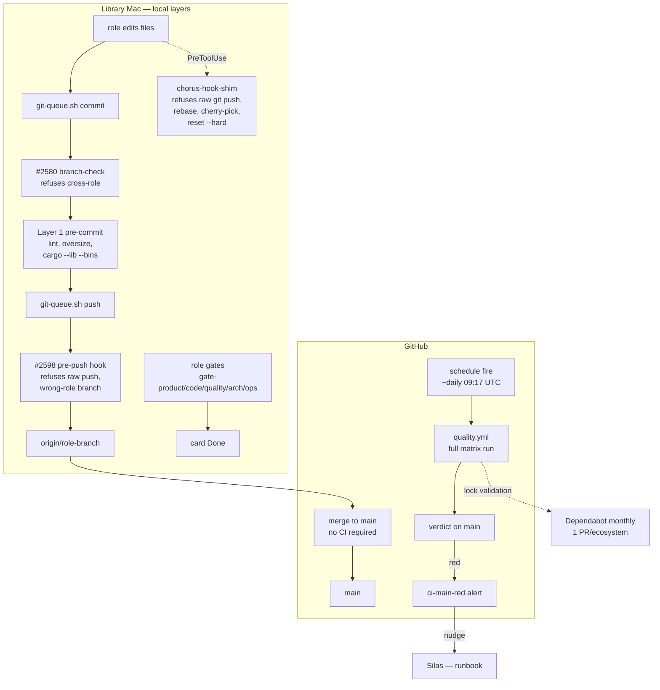
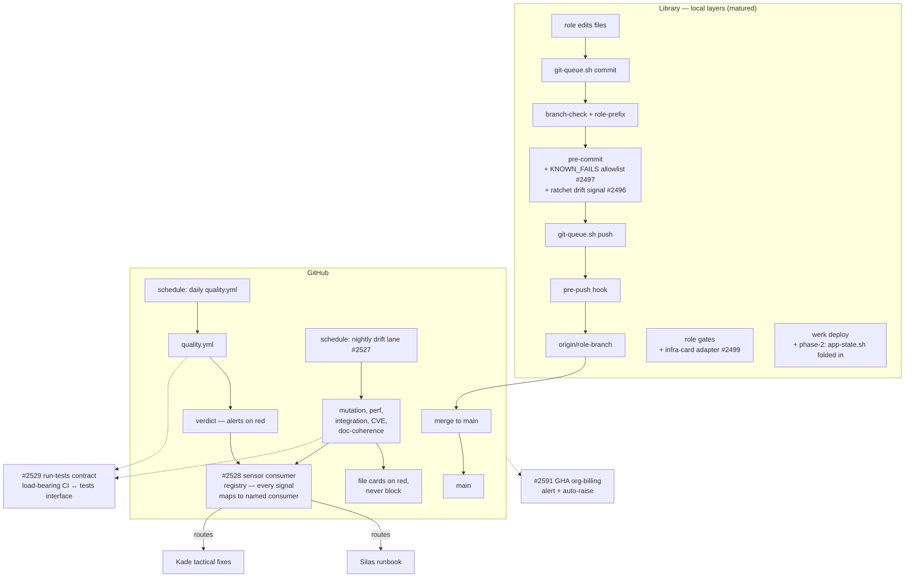

# CI Pipeline — Service Design

**Kade, 2026-04-25 / refreshed 2026-04-29 (post cost-stop + substrate-uniformity landings). Source: `.github/workflows/quality.yml`, `platform/hooks/{pre-commit,pre-push}`, `platform/scripts/{git-queue.sh,werk}` (Layer 0 substrate, #2580/#2598), `/gate-*` skills (Layer 2), ADR-026 (CI architecture + lock-file policy), DEC-2525 (required-checks governance + amendment), `proving/domains/alerts/ci-main-red.yml` (red-main alert), today's session (#2580 / #2586 / #2597 / #2598 / #2600).**

## Promise

Every change that reaches `main` has been measured by the same gates regardless of which role authored it: pre-commit hooks running tsc/jest/cargo per affected package; the queue-layer branch-check refusing cross-role contamination; the pre-push hook refusing raw `git push` and wrong-role-prefix branches; the chorus-hook-shim PreToolUse extension refusing raw mutating git ops; the role-gate chain recording AC-pass on the card. CI itself (this service) is the post-merge witness — a scheduled GitHub Actions workflow that re-runs the suite on `main` once a day and alerts Silas if it goes red. When CI is healthy, Jeff can ask "is `main` shippable?" and the local-layer substrate plus the daily re-run answer yes by construction. When CI drifts, locks fall out of sync, the schedule fires red and nobody notices, or the local-layer substrate develops gaps that a once-a-day pass can't catch fast enough.

## Overview

CI is one piece of a multi-layer quality system. Per ADR-026 §a + Jeff's 2026-04-29 reframe ("all three execute identically, no improvisation paths"), redundancy across layers is intentional — different threat models, not duplication. The layer shape shifted today: pre-#2600 was a 12-job per-PR matrix; post-#2600 is a once-daily scheduled re-run with `0` required-status-checks; per-PR validation has been pushed left into Layer 0 (substrate refusal at four threat surfaces) + Layer 1 (pre-commit) + Layer 2 (role gates).

| Component | Status | Source | Gap |
|-----------|--------|--------|-----|
| Workflow definition | REAL — schedule-only | `.github/workflows/quality.yml`, ~daily 09:17 UTC; matrix retained but unfired by push/PR | Schedule fire alerts on red, but post-merge regressions discoverable only at next fire (≤24h delay) |
| Layer-0 substrate | REAL — landed 2026-04-29 | `git-queue.sh` branch-check (#2580), `werk` wrapper (#2598), `pre-push` hook (#2598), chorus-hook-shim PreToolUse refusal extension (#2598) | werk currently covers chorus-hook-shim/claudemd-gen/install-hooks; service deploys (chorus-api/clearing/pulse) still via app-state.sh — phase-2 candidate |
| Pre-commit (Layer 1) | REAL | `platform/hooks/pre-commit` runs lint-ratchet + principle-edit + catalog-oversize + cargo --lib --bins + doc-coherence | KNOWN_FAILS pattern uses `--no-verify` w/ trace; not enforced in tooling (#2497) |
| Role gates (Layer 2) | REAL | `/gate-product` `/gate-code` `/gate-quality` `/gate-arch` `/gate-ops` skills | Demo skill assumes user-facing; infra cards adapt via #2499 |
| Branch protection | EMPTIED | classic protection on `main` retained for non-status rules; `required_status_checks` empty post-#2600 | Without required checks, accidental main-push can land red, only schedule-fire catches |
| Repository Ruleset 15547153 | EMPTIED | mirrored required-checks (DEC-2525 amendment) — also emptied post-#2600 | Lockstep contract intact; both sides empty |
| Lock-file policy | REAL | per-package + root + Cargo locks committed; `npm ci`; Dependabot reduced to monthly + 1 PR/ecosystem post-#2600 | Drift between local + scheduled-CI invisible until next fire |
| Reactive alert | REAL | `proving/domains/alerts/ci-main-red.yml` polls Actions API every 10 min; daily cooldown | Schedule fires ~daily; alert wakes at most once/day on red |
| ESLint ratchet | REAL | `npm run lint:ratchet` per-rule baseline; runs in pre-commit + scheduled CI | Baseline drift between branches silent (#2496) |
| Required-checks ↔ workflow coupling | RESOLVED VIA EMPTYING | Both branch-protection and Ruleset 15547153 carry empty required-checks lists | When required-checks come back, drift detector #2500 still applicable |
| Smoke-check (app surface) | OUT OF SCOPE | Lives in `jeff-bridwell-personal-site` repo's CI | ADR-026 addendum 2026-04-25 |
| MCP round-trip | DONE | #2495 closed; CI job restored | — |
| Test-isolation in chorus-hooks/inject | PARTIAL | cargo-test green via CHORUS_ROOT env override | #2491 still Later — hardcoded `/Users/jeffbridwell` paths |

## Current State (As-Is, 2026-04-29)

What this shape buys: cost ~$15/mo (down from $225 projected), substrate refuses contamination at four surfaces, per-PR validation lives on Library not in cloud, schedule fire is the post-merge witness.

What it costs: regressions on `main` discoverable up to 24h after merge instead of immediately; trust burden on local-layer maturity; if pre-commit drifts (e.g., flaky test bypassed via `--no-verify`), CI's once-a-day pass is the only catch.

## Target State (To-Be)

What changes: drift lane catches slow signals (mutation/perf/integration/CVE/doc-coherence) as cards, never blocking; sensor consumer registry routes every CI / alert / drift signal to a named consumer (no orphan signals); run-tests contract becomes the load-bearing interface between CI substrate and tests substrate; billing alert prevents recurring quota wedge; KNOWN_FAILS allowlist closes the `--no-verify` convention drift; ratchet drift signal stops baseline accretion. The local-layer substrate (Layer 0) stays the per-PR enforcement surface.

What stays the same: schedule-only main re-run, no per-PR matrix unless local-layer maturity proves insufficient and Jeff reinstates required-checks via DEC-2525-amendment-governed lockstep.

## Sub-Domain Interaction Model

CI today has a smaller surface than before. It doesn't act on push or PR; it fires on schedule and produces a verdict that alerts Silas if red. The per-PR threat model has moved to Layer 0 substrate + Layer 1 pre-commit.

| Trigger | Produces | Consumed By | Surface |
|---------|----------|-------------|---------|
| **Schedule fire (~daily 09:17 UTC)** | One workflow run, full matrix | `ci-main-red.yml` alert poll | `https://github.com/gathering-chorus/chorus/actions` |
| Push to `main` | (no workflow run today, post-#2600) | — | n/a |
| Pull request | (no workflow run today, post-#2600) | Branch protection no longer gates on CI verdict | n/a |
| Workflow run completes red on `main` | `red:<run-url>` line in alert check stdout | `ci-main-red.yml` action — nudges Silas, daily cooldown | `nudge silas` |
| Layer-0 substrate refusal (commit / push / git op) | spine event `commits.branch.mismatch_detected` or hook-deny | Drift dashboards (Silas), incident reconstruction | chorus.log |
| Lock-file out of date | Dependabot opens monthly PR | Role review queue, then merge → next schedule fire validates | `gh pr list --label deps` |
| Ratchet baseline shrinkable | (today) silent | (should feed) #2496 ratchet-drift signal | **NOT WIRED** |
| Test fails but is upstream-known | `--no-verify` with #NNNN trace in commit message | (today) commit-message convention only; no machine-checkable allowlist | **NOT WIRED — #2497** |

The core pattern: CI is a **periodic verdict producer**, layer-0 substrate is the **per-PR enforcer**, alerts are the **safety net**. Verdicts at scheduled cadence catch what substrate missed; substrate refusal catches at commit-time before pre-commit even runs. The safety-net window grew (≤24h vs ≤immediate) so the load-bearing requirement is that Layer 0 + Layer 1 catch the obvious-broken case first.

## Dependencies

Per Wren's 4-layer pattern (#2159): CI sits on principles + practices + policies + decisions.

| Dependency | Sub-domain | Status | Instances | Notes |
|-----------|------------|--------|-----------|-------|
| Principles | loom-principles | POPULATED | 5 CI-relevant | `quality-at-source` (CI catches what local missed), `tests-hermetic-by-default-integration-gated-explicitly`, `infrastructure-is-your-codebase-too`, `parallel-paths-not-fallback-chains` (Layer 0/1/2/3 are parallel paths at different threat surfaces), `every-ceremony-must-yield` (cost-stop applied — per-PR matrix didn't yield enough) |
| Practices | loom-practices | POPULATED | 2 CI-relevant | `production-ready` (CI = "does this build clean?"), `api-first` (workflow YAML is the API to enforcement) |
| Policies | loom-policies | MISSING | — | Sub-domain blocked on #2151. CI will depend on: KNOWN_FAILS allowlist (#2497), ratchet drift policy (#2496), red-main escalation policy, required-checks coupling (#2500), schedule-cadence policy (post-#2600 — what fire frequency justifies vs schedule-only re-run cost) |
| Decisions | loom-decisions | SHELL | 0 populated | ADR-026 + 2026-04-25 addendum, DEC-2525 + amendment, #2600 (schedule-only retreat) all CI-load-bearing but not yet harvested as graph instances; #2152 covers harvest |

**Why dependencies matter to CI:** the layer shape derives from principles (quality-at-source, parallel-paths-not-fallback-chains), practices (production-ready), policies (when a check bites: pre-commit vs gate vs CI vs drift-lane), and decisions (why specific checks bite where they do). When principles shift (e.g., "every-ceremony-must-yield" applied as cost-stop justification on 2026-04-29), the layer shape shifts too — that's exactly what #2600 was. Without policies populated, the layer can drift faster than the doc that describes it.

## Components

### Workflow definition (`.github/workflows/quality.yml`)
Single GitHub Actions workflow, matrix retained, **trigger changed to schedule-only post-#2600** (~daily 09:17 UTC). Each job is one concern: lint-ratchet, MCP shape, catalog-oversize, principle-direct-edit, tsc matrix (5 packages), jest matrix (4 packages), cargo-test matrix (chorus-hooks + chorus-inject). Adding a new job is mechanical.

### Layer-0 substrate (#2580 + #2597 + #2598)
The four-surface refusal that replaced the per-PR matrix as the per-PR enforcement layer. `git-queue.sh` branch-check refuses commits/pushes off-role-prefix; `werk` wrapper composes cargo build + claudemd-gen + install-hooks under a verify_main_sha gate; pre-push hook refuses raw `git push` (no `_GIT_QUEUE_PUSH` marker) or wrong-role branch; chorus-hook-shim PreToolUse extension refuses raw `git push`/`rebase`/`cherry-pick`/`reset --hard` from Claude's Bash tool. All four emit spine events for incident reconstruction.

### Pre-commit hook (`platform/hooks/pre-commit`)
Layer 1. Rust-implemented via `chorus-hook-shim`. Runs lint-ratchet, principle-direct-edit, catalog-oversize, `cargo test --lib --bins` per affected Rust crate, doc-coherence ratchet (when CLAUDE.md fragments change). Skippable via `--no-verify` — explicitly overridden by the schedule-fire as authoritative-but-delayed. KNOWN_FAILS pattern (carded test failures from other roles) goes through `--no-verify` with #NNNN reference; #2497 wires the allowlist.

### Role gates (Layer 2)
Five skills, one per concern: `/gate-product` (Wren — AC, Experience, domain), `/gate-code` (Kade — tests green, build clean, warning diff), `/gate-quality` (Kade — hooks, regression, console.log, smoke when local), `/gate-arch` (Silas — namespace, boundaries, structural fit), `/gate-ops` (Silas — health, log flow, rollback). Recorded as card comments + spine events. Skippable for `type:chore`/`type:swat`. Demo skill (DEC-048) assumes user-facing; #2499 covers infra-card adapter.

### Branch protection + Repository Ruleset (DEC-2525 amendment)
Both surfaces still exist; both `required_status_checks` lists were emptied post-#2600. The lockstep contract from DEC-2525 amendment ("required-checks list lives in two GitHub protection systems") is intact — both sides match (both empty). When required-checks come back, DEC-2525 amendment governs the coupling and #2500 drift detector closes the manual loop.

### Lock-file policy + Dependabot
ADR-026 §c. Per-package `package-lock.json` committed, root + Cargo locks committed. CI runs `npm ci` (not `npm install`) — drift between local and CI is a red flag. Pre-#2600: Dependabot weekly Mon, 11 ecosystem-directory pairs. Post-#2600: monthly + 1 PR/ecosystem. Schedule fire validates against current locks once/day.

### Reactive alert (`ci-main-red.yml`)
Polls GitHub Actions API every 10 minutes for the most recent run on `main`. If `status=completed && conclusion=failure`, fires nudge to Silas with daily cooldown. Read-only; never auto-reverts (ADR-026 §d).

### ESLint ratchet (`npm run lint:ratchet`)
Per-rule baseline at `platform/state/eslint-baseline.json`. Pre-commit + scheduled CI both run the same check. New rule firings require fix or `npm run lint:baseline` to adopt. Drift signal #2496 still Later.

### Red-main runbook (Silas-owned)
Triggered by `ci-main-red` schedule fire. Triage tree: (1) recent merge unrelated to in-flight → revert merge, file fix card; (2) forward-fix is quick (≤10 min, root cause obvious) → push fix direct to main, watch next schedule fire green; (3) else → file swat card with failing job name, mark known-red, decide team-wide whether to revert or freeze merges. Daily cooldown means triage runs once per incident.

## Surfaces

CI exposes the following read surfaces:

- **GitHub Actions UI** — `https://github.com/gathering-chorus/chorus/actions` — primary read surface, run history, log streaming
- **PR Checks tab** — empty post-#2600 (no per-PR matrix)
- **Branch protection settings page** — `https://github.com/gathering-chorus/chorus/settings/branches` — non-status rules retained, status checks empty
- **Repository Rulesets page** — `https://github.com/gathering-chorus/chorus/rules` — Ruleset 15547153 paired with branch-protection (DEC-2525 amendment), status checks empty
- **Dependabot PRs** — `gh pr list --label deps` — monthly cadence post-#2600
- **`ci-main-red` nudge** — Silas's terminal + messaging API, daily cooldown
- **chorus.log spine events** — `commits.branch.mismatch_detected`, `werk.deploy.*`, hook-deny events — post-#2600 the substrate spine is the per-PR signal surface
- **`werk check`** — local drift visibility for any role; closes the "is the runtime in sync with main" question without round-tripping CI
- **Pipelines-domain page** — `http://localhost:3000/gathering-docs/domain-detail.html?id=pipelines-domain`

## Consumers

| Consumer | Uses | Status |
|---|---|---|
| Branch protection | (used to consume CI verdict for merge gating) | NO LONGER WIRED post-#2600 |
| `ci-main-red.yml` alert | verdict on `main` post-schedule-fire | WIRED |
| Roles (PR authors) | local-layer verdicts (pre-commit + role gates); CI verdict no longer pre-merge | WIRED |
| Dependabot | produces input (lock-update PRs); consumes output (next schedule fire validates) | WIRED |
| `/gate-code` skill | pre-commit + werk check state | WIRED |
| `/demo` skill | gate-chain state | WIRED (#2499 still pending for infra-card adapter) |
| `werk` wrapper | `git rev-parse origin/main` for SHA gate; emits `werk.deploy.*` spine events | WIRED |
| Drift lane (#2527) | slow signals → cards | NOT WIRED — follow-on |
| Sensor consumer registry (#2528) | every signal mapped to consumer | NOT WIRED — follow-on |
| run-tests contract (#2529) | CI substrate ↔ tests substrate interface | NOT WIRED — follow-on |
| GHA org-billing alert (#2591) | recurring quota wedge guardrail | NOT WIRED — follow-on |

## Gaps

1. **Schedule-fire latency** — regressions on `main` discoverable up to 24h after merge. Acceptable trade for cost, but raises pressure on Layer 0 + Layer 1 to catch obvious-broken before commit.
2. **No drift lane (#2527)** — slow signals (mutation, perf, integration, CVE, doc-coherence) have no surface today. Promoted in importance post-#2600 — primary backstop for what schedule-only main fire can't catch.
3. **No sensor consumer registry (#2528)** — every CI check / alert / drift signal should map to a named consumer; today some signals fire into the void. Load-bearing once #2527 lands.
4. **No run-tests contract (#2529)** — load-bearing interface between CI substrate and tests substrate; without it, "what runs validation" is ambiguous when the matrix shape evolves.
5. **No KNOWN_FAILS allowlist (#2497)** — `--no-verify` convention is uncoded; future drift invisible.
6. **No ratchet drift signal (#2496)** — baseline accretion only caught via manual audit.
7. **No GHA org-billing alert (#2591)** — recurring quota wedge unprotected.
8. **No infra-card demo adapter (#2499)** — infra demo = prove threat closes, not "show CI green."
9. **No required-checks drift detector (#2500)** — less urgent post-#2600 (both sides empty), but applies when required-checks come back.
10. **chorus-hooks/inject test isolation (#2491)** — hardcoded `/Users/jeffbridwell` paths in some tests.
11. **sessions.test.ts pre-existing fail (#2493)** — validator change made test stale.
12. **Decisions sub-domain SHELL** — ADR-026, DEC-2525 + amendment, #2600 are CI-load-bearing but not yet graph-queryable instances; #2152 covers harvest.
13. **werk wraps only chorus-hook-shim/claudemd-gen/install-hooks** — service deploys (chorus-api/clearing/pulse) still via app-state.sh; phase-2 candidate to fold in.

## Next Steps

1. **#2598 lands** (in flight, PR #56) — closes Layer 0 substrate; pre-push hook + raw-git refusal extension activate post-merge + werk-deploy.
2. **#2527 + #2528 + #2529** in that order (Silas) — post-cost-stop architecture; drift lane is the primary backstop, sensor registry maps signals to consumers, run-tests contract is the load-bearing interface.
3. **#2591** (Silas) — billing alert is independent; can ship parallel.
4. **#2496 + #2497** — quieter improvements; can wait until structural cards above settle.
5. **Loom-decisions harvest of ADR-026 + DEC-2525 + #2600** (#2152 follow-on) — Decisions row goes from SHELL to POPULATED; layer model becomes graph-queryable.
6. **Required-checks reinstatement** (no card) — when local-layer maturity warrants it (or schedule-only proves insufficient), reinstating required-checks via DEC-2525-amendment-governed lockstep is a one-PR move.

## Not in scope for this design

- The Gathering app's own CI (lives in `jeff-bridwell-personal-site` repo). Smoke-check is its problem, per ADR-026 addendum.
- Production deploy automation — chorus runs natively on Library/Bedroom; werk handles canonical deploys, not CI.
- Coverage thresholds and pyramid shape — Quality service design's territory.
- Test-value policy — also Quality.
- Cost / runtime budget for CI minutes — addressed by #2600 (schedule-only); becomes principle-level in 4-layer dependency once policies sub-domain stands up.

## References

- ADR-026 — CI architecture + lock-file policy (`roles/silas/adr/ADR-026-ci-architecture-and-lock-file-policy.md`), including 2026-04-25 addendum (smoke-check stays out)
- DEC-2525 — required-checks governance, including 2026-04-29 amendment (lives in two GitHub protection systems: branch-protection + Repository Rulesets)
- Card #2481 — initial CI ratchet implementation (closed)
- Card #2487 — MCP round-trip CI scaffolding (closed)
- Card #2495 — api-boot ESM/CJS (closed)
- Card #2498 — Trunk-vs-Rulesets cleanup (closed; replaced with DEC-2525 amendment)
- Card #2580 — git-queue branch-check (Done 2026-04-29)
- Card #2586 — commits-domain service design (Done 2026-04-29)
- Card #2597 — git-queue silent-exit fix (Done 2026-04-29)
- Card #2598 — werk wrapper + pre-push hook + raw-git refusal extension (in flight, PR #56)
- Card #2600 — CI cost-stop swat (Done 2026-04-29; PR #49)
- Cards #2496 / #2497 / #2499 / #2500 / #2491 / #2493 / #2589 / #2599 — gaps tracked above
- Cards #2200 / #2333 / #2527 / #2528 / #2529 / #2530 / #2591 — Silas's CI architecture line
- `proving/domains/alerts/ci-main-red.yml` — reactive alert
- Pipelines-domain page — `http://localhost:3000/gathering-docs/domain-detail.html?id=pipelines-domain`
- Quality service design (`designing/docs/quality-service-design.md`) — sibling layer
- Roles service design (`designing/docs/roles-service-design.md`) — template followed
- Commits service design (`designing/docs/commits-service-design.md`) — Layer 0 substrate sibling
