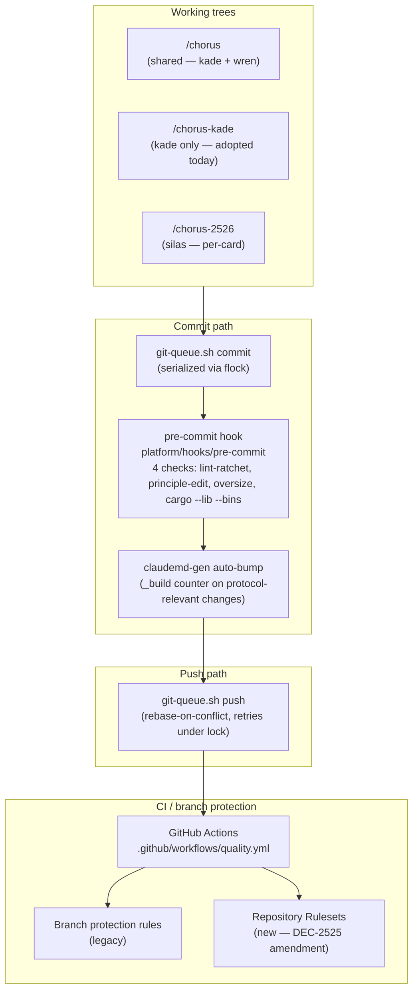
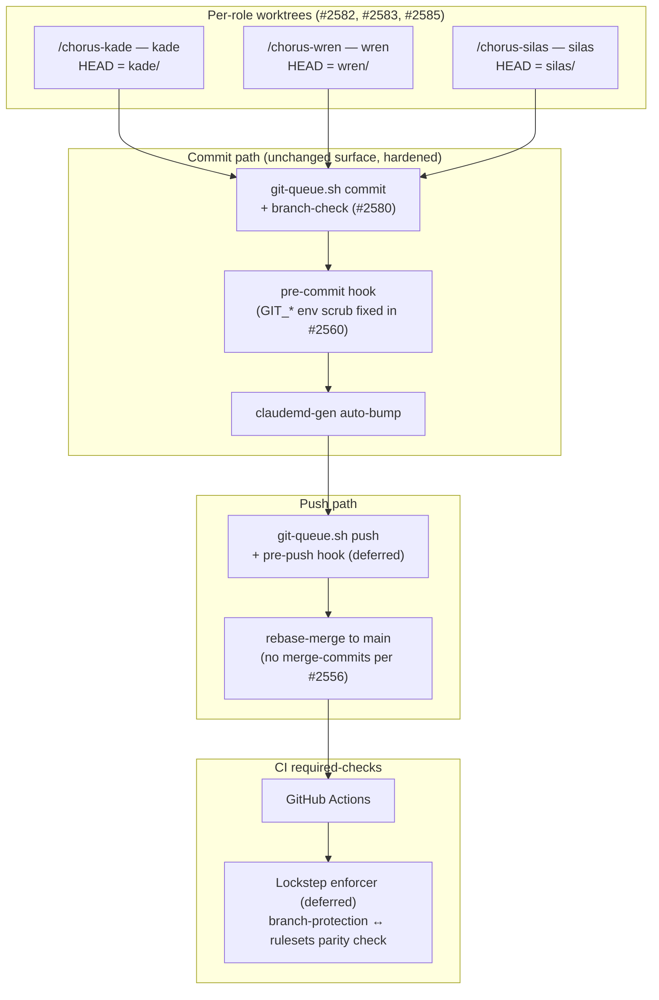

# Commits Service Design

**Kade, 2026-04-29. Updated 2026-05-02 (v3). PM constraint: Wren. Architecture: Silas. Card #2586.**

## v3 amendment (2026-05-02)

**Architectural primitive (load-bearing): the substrate owns the working tree.** Everything else in this amendment — who owns branches, locks, hooks, push, role-state — follows from that single shift.

**Class B implementation mode — thin → thick.** ADR-028's Class B "single canonical adapter" did not previously distinguish thin (shells out to git, integrity depends on agent discipline) from thick (substrate executes the contract internally). v2.5's `git-queue.sh` is thin; v3 graduates it to thick. Same shape as #2652 cards CLI (was thin shell-script, became canonical adapter all transports delegate to) and #2649 chorus-api (was vendor copies, became transport over gathering's `public/`). v3 is the same move applied to commits. Maps to `chorus:AuthBoundary.checkType: 'service'` vs `'ad-hoc'` from the security model — ad-hoc boundaries are migration candidates exactly because their integrity depends on agent discipline.

v2.5 named three failure modes and accepted (A) read-stale-content as residual risk. The morning of 2026-05-02 produced the (A) receipt: Silas's uncommitted ontology + design-doc work was overwritten on disk when Kade ran `git checkout` on the shared tree to gate-code wren/2649. Cost: ~30 min of architect work, recovered from `/tmp` fragments. The lesson is not "be more careful" — it's that **invariant execution cannot rest on agent discipline.** v2.5's accepted-residual was a norm with a hopeful name.

This amendment names the structural answer.

### Invariant vs norm

A norm asks each agent to remember N rules every commit (don't switch branches with peer dirty, don't bypass pre-commit, don't set the test override env, don't push raw, don't merge with merge-commit, etc.). Invariant execution makes the rules properties of the system: the only paths exposed to the agent are paths that satisfy the contract. There is no env to flip because no env is on the wire. There is no flag to skip because no flag is on the wire. There is no shared `.git/HEAD` to corrupt because the agent does not touch git directly.

### Inversion of control

Today: agent runs the procedure (stage → branch-check → hook → queue → push → watch for race → watch for env → watch for tree-state). Ten things, every commit, hoping. Inverted: the agent makes one declarative request — "commit my changes for the card I'm building" — and the substrate runs the procedure or refuses with a reason. The remembering-surface goes to zero because there is nothing left to remember.

This is the same shape as #2652 (CLI canonical, MCP/HTTP delegate), #2649 (chorus-api as single source for static assets), DEC-107 (nudge persist+deliver atomic). The pattern repeats: one canonical surface owns the work, peripheral surfaces delegate to it. v3 is not "add a new service" — it is "finish that pattern for the commits surface."

### What the substrate owns

- **Working tree.** Service owns a working directory per role. Agent reads but does not switch HEAD.
- **Branches.** Service creates/switches/pushes the branch that matches the role's active card. Agent has no `git checkout` exposure.
- **Locks.** Lock acquisition is internal. Agent does not see flock or its absence.
- **Hooks.** Pre-commit checks run inside the service. Their pass/fail is the service's response to the agent. There is no `--no-verify` because there is no `git commit` for the agent to run.
- **Push protocol.** Rebase, retry-on-conflict, race serialization are service properties. Agent gets a single response: landed-on-main with SHA, or refused-with-reason.
- **Role-state-to-card attestation.** Service reads role-state internally to derive the active card. Agent does not pass card-id at all — the service derives it from the role's declared state. Closes (C) same-role-wrong-card structurally: agent and substrate cannot disagree about which card is being committed for, because there is only one source.

### What the agent calls

A small declarative interface:

- `commit(role, paths, message)` — service derives card from role-state, stages, validates, commits, pushes, returns SHA or reason. (Card is **not** an agent-passed argument; service derives it.)
- `status(role)` — current branch state, any pending push, any hook failures from the last attempt.
- (no other surface)

No `branch_create`, no `push`, no `set_env`, no `bypass`. If the surface needs to grow, it grows by adding card-types the service recognizes — never by adding flags the agent passes.

### SWAT / emergency — encoded as card type, not as flag (Wren constraint)

Any "skip" or "emergency" flag exposed at the wire is a bypass-class door. v3 closes that door by making fast-path a property of the **card** the agent is committing for, not of the call.

A `type:swat` card declares its lighter-weight rules (e.g., allow no-test-evidence, allow same-branch-as-target). The service reads the card type at commit time and applies the matching rule set. The agent's call is the same — `commit(role, paths, message)` — but the card itself carries the relaxation. There is no agent-side flag to flip; the relaxation is a property of the work, not of the actor.

### Failure modes after v3

- **(A) read-stale-content** — disappears. Agent does not switch HEAD. Service's working directory per role removes shared `.git/HEAD`.
- **(B) cross-role commit-on-wrong-branch** — disappears. Service derives branch from role's active card; agent cannot specify branch.
- **(C) same-role wrong-card** — disappears. Service binds commit to the role's active card; mismatched intent fails at the wire.
- **(D) raw-push race** — disappears. No raw push surface.
- **(E) stale-CI on merged SHA** — addressed at the GitHub side (already-shipped settings + lockstep enforcer, deferred); v3 does not change this.

### Single Contract — restated

> **A commit lands when, and only when, the role calls the service's `commit` for its active card, and the service (a) verifies the role's branch matches its role-prefix and active-card, (b) runs the pre-commit checks against the staged paths and they pass, (c) pushes via its serialized internal queue, and (d) GitHub's branch-protection rebase-merges to main with required-checks green against the merged SHA. The agent's only signal is the response from the service: SHA-on-main, or refused-with-reason.**

### Status of v2.5 mechanisms after v3

- **`git-queue.sh`** — internal mechanism of the service. Agent no longer calls it directly.
- **Branch-check (#2580/#2641)** — internal validation step inside the service.
- **Pre-commit hook** — internal validation step inside the service. The bypass surface (`--no-verify`) is no longer exposed because the agent does not run `git commit`.
- **`CHORUS_TEST_FORCE_FIX_CARD` env (and any other test/smoke bypass)** — does not exist after v3. Tests that need fix-card behavior receive it as a parameter or as service state, not as a process env.

### What this amendment does not do

- It does not rename existing artifacts (`git-queue.sh`, hooks). They become internal.
- It does not retire `--no-verify` from raw git — that's outside chorus's enforcement scope. It removes the *path* through chorus that exposes it.
- It does not solve (E) stale-CI; that lives at the GitHub-settings layer.
- It does not specify the wire protocol (HTTP vs MCP vs IPC) — implementation detail for cards under this design.

### Sequencing

To be filed as cards under this design after v3 is signed off. PR #75 (silas/2626 follow-on, quote-aware command split) becomes obsolete under v3 — it patches a hook that doesn't exist after v3 retires text-parsing surfaces; close on v3 sign-off.

## v2.5 amendment (2026-05-01)

The v2 amendment drafted earlier on 2026-05-01 (internal `chorus/.worktrees/<role>-<hash>/` + mandatory SessionStart cwd-enforcement) was rejected by Jeff. The protected primitive: **role-directory IS session-start, the foundational coherence of that is correct.** Any mechanism that moves session-start away from `/chorus/roles/<role>/` is in the rejected family. v2.5 supersedes both v1 and the abandoned v2:

1. **All sibling worktrees retired** (`chorus-kade/`, `chorus-wren/`, `chorus-silas/`, `chorus-2526/`). Branches preserved in `chorus/.git/` and on origin. The team operates from `/chorus/` only.
2. **`worktree_contamination_guard` hook retired** (#2625 dispatcher hookup removed in #2640). The guard's recommended-fix paths pointed at the now-retired siblings; without that referent it became net-negative friction. Module file kept on disk for audit history.
3. **Three failure modes, three positions:**
   - **(A) read-stale-content** — peer's `git checkout` rewrites disk content under your reading session. **Accepted-residual-risk.** Cost of physical isolation (worktree mechanism) was rejected as higher than residual (A) cost. Watch via spine events; if a 4-29-class incident recurs, it's a metric, not a regression.
   - **(B) cross-role commit-on-wrong-branch** — caught by `git-queue` branch-check (#2580) + pre-push hook (#2598/#2625/#2639). **Already shipped.**
   - **(C) same-role wrong-card** — strict `<role>/<active-card-id>` check from role-state. **Sequenced as #2641 (P1 follow-on).**
4. **No worktree convention.** The Per-Role Worktree Convention fragment is retired (`designing/claudemd/shared/worktree-convention.md`). All three roles launch from their canonical `/chorus/roles/<role>/` directory.

## Problem

The commits domain — every git mechanic between "I have a change" and "main reflects it" — emerged as a stack of tactical fixes rather than a designed surface. Today (2026-04-29) surfaced four classes of incident in a single session:

1. **Cross-branch contamination ×3** — wren and kade share `/chorus`'s working tree; one role's checkout is the other role's working state. Wren's #2575 fix landed on kade's #2558 branch; kade's #2558 narrow-refinement started on wren's branch. Substrate: shared `.git/HEAD`. (#2582 ships per-role worktrees as the structural fix.)
2. **Required-checks asymmetry** (#2498 side-finding) — branch-protection rules and Repository Rulesets list different sets of required jobs. Merges that satisfy one bypass the other. DEC-2525 amendment names both systems as required surfaces.
3. **git-queue branch-blindness** (#2580) — git-queue.sh commits whatever branch the working tree is on; if the role's session left a peer's branch checked out, the commit lands on the wrong branch with no warning. P1 defense-in-depth for the worktree convention.
4. **Worktree grain** unresolved — silas adopted per-card worktree (chorus-2526), kade adopted per-role (chorus-kade); wren is mid-decision (#2585 spike). No design says which is the convention vs the exception.

Each was handled tactically. None has a unified service-design surface, so future commits-related cards re-litigate the same questions.

The pattern matches nudge-service-design / independence-service-design / gate-set-service-design: a parent design lands first, tactical cards align under it. Kade owns commits per the 2026-04-26 cross-cutting allocation (Code · Tests · Commits · Pipelines · Heralds).

## As-Is (verified 2026-04-29)



What's actually in place today:

- **git-queue.sh** — `commit` and `push` subcommands; `flock` on `/tmp/chorus-git-queue.lock` serializes across roles. Reads `DEPLOY_ROLE` env. Stages listed paths plus any prior-staged mods (#feedback_git_queue_stages_more_than_listed).
- **pre-commit hook** (`platform/hooks/pre-commit`) — runs lint-ratchet, principle-direct-edit, catalog-oversize, and `cargo test --lib --bins` per affected Rust crate (DEC-2525 wave 1). Skippable via `--no-verify` (CI is authoritative).
- **claudemd-gen auto-bump** — when fragments under `designing/claudemd/` change, `_build` counter increments and CLAUDE.md regenerates.
- **Branch naming** — `<role>/<card-id>` per kade's AC7 of #2556. Lifecycle is informal (branches accrete; #2440 had ~134 commits before merge).
- **Required checks** — listed in branch-protection AND Repository Rulesets; DEC-2525 amendment makes the lockstep explicit but enforcement is manual when adding a new check.
- **Hooks layer** (Layer 1 of ADR-026) — pre-commit only. No post-commit, no pre-push (a pre-push would catch git-queue branch-blindness if the user-side push slipped past the queue).

## To-Be



The five To-Be moves:

1. **Per-role worktrees as default** — convention extends to all three roles. Symlink at `~/.claude/projects/<encoded-cwd>/` preserves Claude Code memory continuity (Wren's #2585 spike). Per-card worktrees become a documented exception for crisis/swat work.
2. **git-queue branch-check** (#2580) — verifies `HEAD` matches `<role>/*` before staging; refuses to commit on a peer's branch.
3. **GIT_* env scrub** in code paths that spawn `git` (#2560 wave 2 fixed `file_has_git_history`; sweep needed across other call sites).
4. **Role-suffixed runtime sockets** — `/tmp/chorus-hooks-<role>.sock` once per-role daemons land (Silas's #2559 SIGTERM cleanup is the precondition; multi-role launch is the trigger). Today's single-instance assumption is fine while only one role runs the daemon, but per-role worktrees + per-role daemons removes that assumption.
5. **Required-checks lockstep enforcer** (deferred card) — script that diffs branch-protection's required-checks against Repository Rulesets', fails CI if they drift.

## Single Contract

> **A commit lands when, and only when, it (a) was authored on the role's own worktree and branch, (b) passed the local pre-commit hook layer, (c) was pushed via git-queue, (d) merged to main via rebase-merge after CI's required-checks (mirrored in branch-protection AND rulesets) ran green, and (e) the merged SHA is the SHA against which required-checks ran green.**

Failure modes the contract names:
- (a) excludes cross-branch contamination — caught by per-role worktrees + git-queue branch-check.
- (b) excludes broken-tree commits — caught by pre-commit; CI is the authoritative re-check.
- (c) excludes raw-`git push` races — git-queue.sh push is the only sanctioned path.
- (d) excludes merge-commit cruft and one-system-only required-checks — rebase-merge per #2556, lockstep per DEC-2525 amendment.
- (e) excludes stale-CI-on-force-push and config-drift between checks-ran-against and checks-required-on-merge — addressed via GitHub branch-protection setting "Require branches to be up to date before merging" plus the lockstep enforcer (deferred card). Per Silas's #44 review: day-1 without (e) we hit a case where (a-d) all read green and a force-pushed SHA lands on main without re-running checks.

## Worktree grain — resolved

**Per-role is the convention.** Per-card is the exception.

Rationale:
- **Per-role** retires the substrate condition (shared `.git/HEAD`) for the failure class. One worktree per role, branch checkouts within the worktree are role-scoped, peer's checkout never affects yours.
- **Per-card** would multiply onboarding cost (Claude Code project-keying setup per worktree, per Wren's #2585 spike) and create transient state to garbage-collect.
- **Crisis/swat exception**: when a role is mid-card and a swat lands on the same role, a temporary chorus-<role>-<swatcard> worktree is acceptable. Document, retire after merge.

Onboarding cost (per role, one-time):
1. `git worktree add ../chorus-<role> <role>/main-checkpoint`
2. **Memory continuity choice** (per Wren's #2585 + #2583 reasoning): either (a) symlink `~/.claude/projects/<encoded-cwd-of-worktree>` → `~/.claude/projects/<encoded-cwd-of-canonical>` to preserve accumulated session memory, OR (b) split-memory: accept that the new worktree's project-key starts empty and rebuilds in-place. (a) preserves continuity at the cost of one piece of indirection; (b) honors no-symlinks discipline at the cost of memory-rebuild time (days, not weeks). Both are valid; pick by your role's preference. Wren chose (b) for chorus-wren onboarding. Kade chose (a) implicitly during chorus-kade adoption today.
3. Update role startup CLAUDE.md fragment to launch from the worktree
4. Smoke-test: read a memory file, verify it round-trips

## Cross-branch contamination class — canonical evidence

Three incidents, 2026-04-29 ~11:00–11:30:
1. Wren's #2575 fix committed via git-queue from /chorus while kade's #2558 branch was checked out → fix landed on kade's branch.
2. Kade started #2558 narrow-refinement work in /chorus while wren's branch was the active checkout → edits applied against wren's tree.
3. Kade's manifest.json regeneration in /chorus while a third checkout was active → contaminated mid-rebase.

Substrate cause: `/chorus/.git/HEAD` is one variable shared across all sessions in `/chorus/`. Trigger: any role's `git checkout` mutates it. No detection until after the fact.

The class disappears under per-role worktrees because each worktree has its own `HEAD`. git-queue branch-check (#2580) is defense-in-depth.

## Branch protocol

- **Naming**: `<role>/<card-id>` (e.g., `kade/2560-clippy-ops-cascade`). Optional kebab suffix for human readability.
- **Lifecycle**: branch lives from `cards move WIP` to merge. After merge, branch is deleted via GitHub PR auto-delete.
- **Retirement**: stale branches (>14 days no commits, no open PR) are cleaned up by the role who created them at session close. Inventory check via `git branch -r --merged main`.
- **Long-lived branches** (134-commit #2440 case) are an antipattern; if accretion happens, file a card to wave-merge.

## Push/merge protocol

- **Push**: only `git-queue.sh push`. Raw `git push` is contraindicated (loses lock serialization, no rebase-on-conflict).
- **Conflict resolution**: rebase, not merge. `git update-index --add` for hook-blocked staging during rebase resolution; commit lands as the rebased version of the original.
- **Merge style**: rebase-merge (#2556 lesson — merge-commits in main caused the 134-commit untangling). GitHub PR setting "Allow rebase merging" only.
- **Required checks**: branch-protection AND Repository Rulesets must list the same checks (DEC-2525 amendment). Until the lockstep enforcer ships, manual diff at every promotion.
- **Merge-on-CI-green discipline**: don't merge red. Don't merge yellow with the intent to "fix forward" — fix on the PR branch.

## Hook layer (relationship to ADR-026)

Layer 1 of ADR-026 ("will this commit obviously break something?") = pre-commit. Today this layer covers:

- Lint-ratchet (eslint baseline non-regression)
- Principle-direct-edit (catalog content protection)
- Catalog-oversize (file-size budget)
- Rust hermetic test slice (`cargo test --lib --bins` per affected crate)
- Doc-coherence ratchet (when CLAUDE.md fragments change)

High-priority follow-on:
- **pre-push hook** — load-bearing for the cross-branch-commit failure class, not optional. **#2580 (Done) closes the queue-path half** by enforcing `branch-prefix = role` inside `git-queue.sh commit` and `git-queue.sh push`. A pre-push hook is the **unfinished defense-in-depth half** — it would catch raw `git push` invocations that bypass git-queue entirely. Together they cover both queue-path and bypass-path; without pre-push, anyone running `git push` directly still slips through. Driver: cross-branch failure class. Per Silas's #2580 review.

Deferred / not yet shipped:
- **post-commit hook** — would emit `commits.commit.created` spine events for analytics. Cost: noise unless filtered.
- **commit-msg hook** — would enforce `<role>: <verb> #<card>` format. Cost: existing message lint isn't blocking and hasn't drifted enough to warrant.

The principle: **Layer 1 (hooks) makes the obviously-broken case fast-fail; Layer 3 (CI) is authoritative on main.** Don't let Layer 1 grow into a CI mirror — its job is the obviously-broken slice, not the full battery.

## Governance — DEC-2525 required-checks

DEC-2525 amendment names two surfaces (branch protection + Repository Rulesets) as joint authorities. Promotion criteria for adding a check:
1. Check is hermetic (no external state, no network, no live-role coupling — axis-4 per #2526).
2. Check has been run in CI as `continue-on-error: true` for ≥1 week with no flake.
3. Check is added to **both** branch-protection and Repository Rulesets in the same PR.
4. Lockstep verified manually post-merge until the enforcer ships.

Demotion criteria: if a check flakes ≥3× in 30 days for non-code reasons (env, infra), demote to non-required and file a hardening card.

## Spine events

Canonical namespace: `commits.*` (rename existing `git-queue.commit.*` emissions to `commits.*` in the implementation pass — one canonical surface before #2528 sensor consumer registry reads it). Past-tense event shape per existing convention (`nudge.emitted`, `card.pulled`, `gate.completed`):

```
commits.queue.lock_acquired      <role> branch=<branch>
commits.commit.created           <role> branch=<branch> sha=<sha>
commits.commit.pushed            <role> branch=<branch> sha=<sha>
commits.branch.mismatch_detected <role> expected=<role>/* actual=<branch>   (#2580)
commits.merge.rebased            <role> pr=<num> base_sha=<sha>
commits.required_checks.drift_detected   delta=<list>   (lockstep enforcer)
commits.force_push.detected      <role> branch=<branch> old_sha=<sha> new_sha=<sha>   (clause-(e) backstop)
```

Renames vs the first draft: `queue.acquired → queue.lock_acquired` (disambiguates what was acquired); `queue.committed → commit.created` (past-tense, non-reflexive, symmetric with `card.pulled`); `queue.pushed → commit.pushed`; `branch.mismatch → branch.mismatch_detected` and `required_checks.drift → required_checks.drift_detected` (past-tense parity for noun-state events). Per Silas's review.

## Connections

- **#2582** (Done — worktree convention fragment) — this design names per-role as canonical.
- **#2583** (WIP — wren onboards) — pending #2585 spike outcome.
- **#2585** (Wren spike) — Claude Code project-keying via symlink. **Per-role worktree IS viable.**
- **#2580** (P1 — git-queue branch-check) — tactical, defense-in-depth.
- **#2556** (Done — rebase-merge lesson, #2440 untangling) — informs push/merge protocol.
- **#2498** (side-finding — required-checks asymmetry) — informs DEC-2525 amendment.
- **#2526** wave-N — pre-commit narrowed to `--lib --bins`; informs hook-layer scope.
- **#2560** wave 2 — GIT_* env scrub fix in `file_has_git_history` (one site).
- **#2588** (P3 — Wave 3 dead-code) — architectural orphan retirement under chorus-hooks.
- **#2589** (P2 — env-scrub helper) — class-fix follow-on to #2560; migrates three known git-spawn sites behind a `git_command()` helper.
- **ADR-026** — three quality layers; this design slots into Layer 1 + Layer 3 boundary.
- **DEC-2525** + amendment — required-checks governance.
- Sibling designs: nudge-service-design (Silas), independence-service-design (Wren), gate-set-service-design (Wren).
- **#2592 (P2 — forward arc)** — workspace-API ("code asks the service, doesn't spawn git"). Per-role worktrees retire the `HEAD`-sharing instance of role-identity-bound-to-filesystem-location coupling, but not the underlying class — code that reaches into git's filesystem state (e.g., `file_has_git_history` spawning `git log` and inheriting GIT_*) carries the same coupling. The forward arc decouples by mediating all git access through a service. This design (#2586) does not block on it; it slots under #2592 when that lands.

## References

- `platform/scripts/git-queue.sh` — commit/push surface
- `platform/hooks/pre-commit` — Layer 1 hook
- `designing/claudemd/manifest.json` — auto-bump trigger
- `.github/workflows/quality.yml` — CI required jobs
- `roles/kade/CLAUDE.md` — Per-Role Worktree Convention fragment (#2582)
- `decisions/DEC-2525.md` + amendment — required-checks governance
- `decisions/ADR-026.md` — three quality layers
- Wren's #2585 spike brief (chat transcript 2026-04-29) — Claude Code project-keying findings
