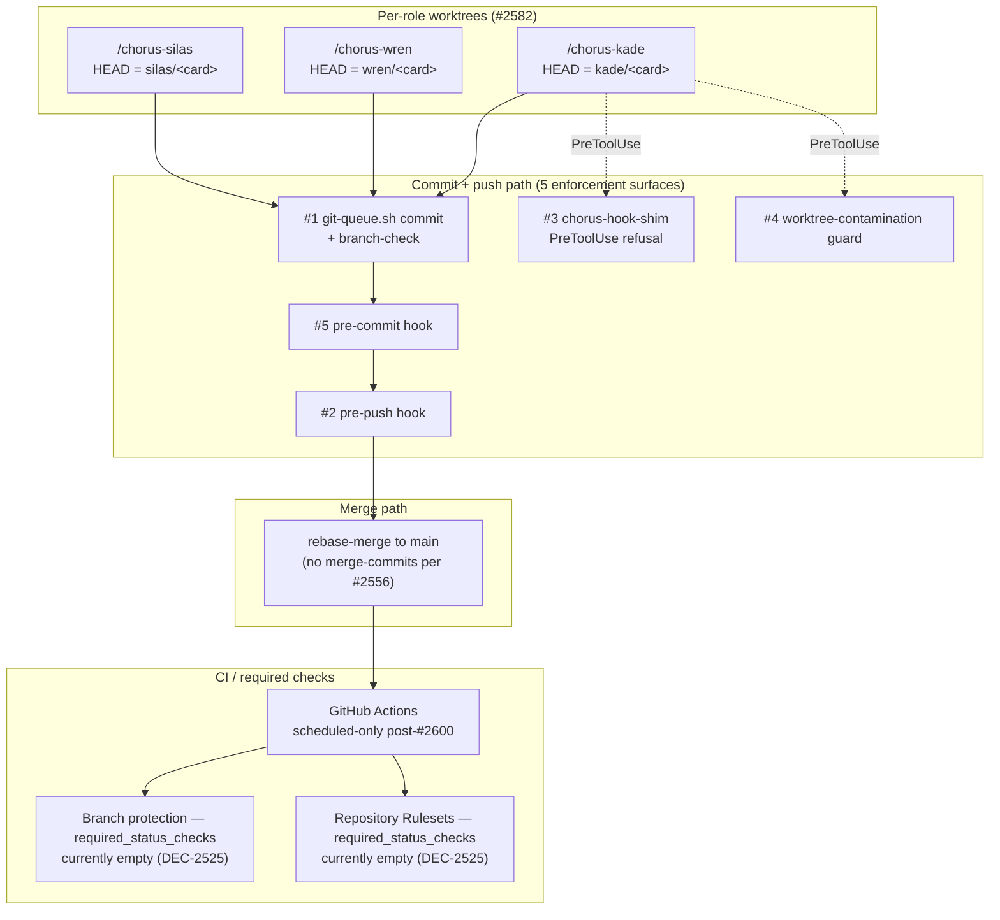
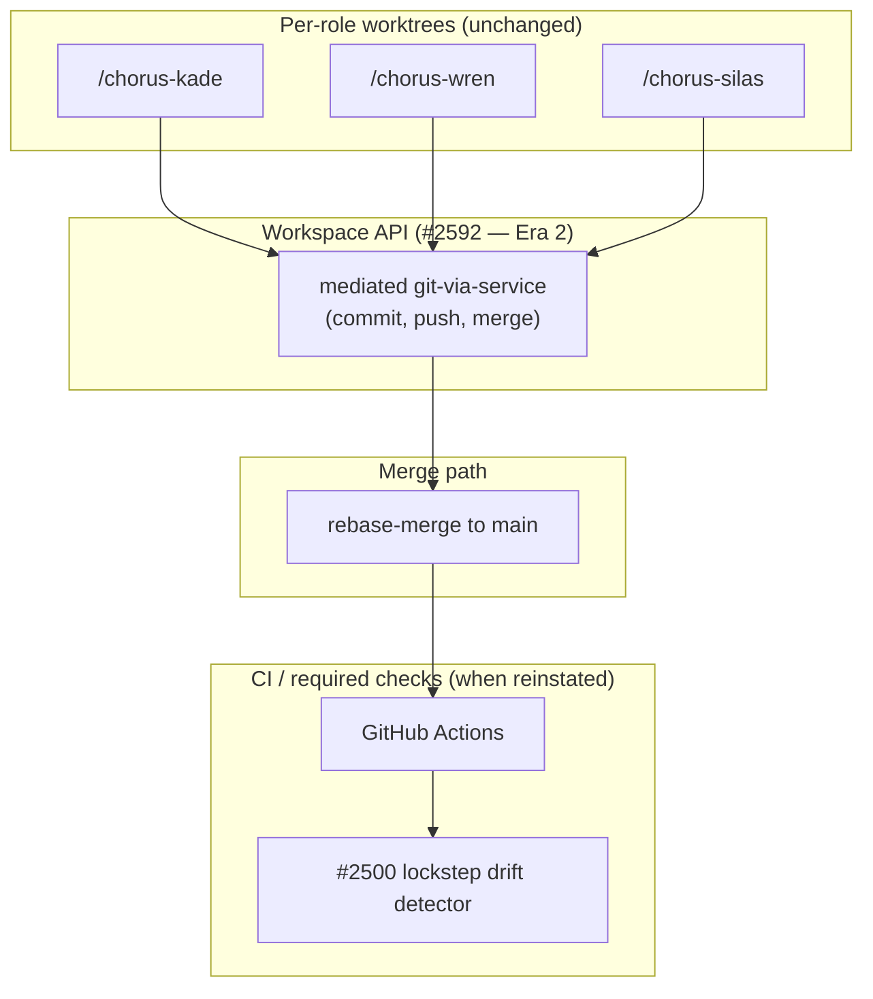

# Commits Service Design

**Kade, 2026-04-29 / refreshed 2026-04-30 (post worktree-contamination guard, pre-push hook, plain-language pass, subagent corrections folded; restructured to match ci-pipeline-service-design section order). This doc is the canonical source for the five pre-merge enforcement surfaces; the CI/CD service design references this doc for surface detail rather than restating.**

## Promise

Every commit that reaches `main` was authored on the right branch in a non-shared working tree, passed pre-commit checks, was pushed via the serialized commit queue, and merged via rebase against an up-to-date base. Five hooks fire pre-merge. An engineer joining the project should be able to read the contract once and understand which hook catches which failure mode.

**Honest scope:** four of the five surfaces block unconditionally; the fifth (pre-commit) is `--no-verify`-skippable for the carded `KNOWN_FAILS` pattern, and the allowlist enforcing that convention is still a planned card (#2497). Today's `/chorus` canonical clone is intended read-only but in practice carries an in-flight role branch — the worktree-contamination guard fires correctly, but the convention isn't structurally enforced. A future era of this doc (#2592 workspace-API) would dissolve the queue + shim layer into a single mediated API; until then, this surface is a layered defense, not a single point.

## Vocabulary

The codebase uses internal terms that map to industry-standard concepts. Reading this section once lets the rest of the doc parse without translation.

| Internal term | Industry standard | What it actually is |
|---|---|---|
| `git-queue.sh` | Serialized commit + push wrapper | Mutex-locked git wrapper enforcing branch-name conventions |
| `werk` | Deploy wrapper script | Shell script bundling cargo build + claudemd-gen + install-hooks under a SHA gate |
| `werk check` | Status query | Reports whether the local worktree is in sync with `main` |
| Per-role worktree | One git worktree per developer | Sibling clones (`/chorus-kade`, `/chorus-wren`, `/chorus-silas`) so each session has its own `.git/HEAD` |
| Topic worktree | Per-card worktree | Optional sibling clone for a specific card (e.g., `/chorus-2526`); used for crisis/swat work |
| Spine events / `chorus.log` | Structured audit log | JSONL event stream for incident reconstruction |
| Card | Ticket | Vikunja kanban ticket (e.g. #2580) |
| Wren / Kade / Silas | PM / Engineer / Architect | Role names for the three engineers on the team |
| Jeff | Project owner | The human directing the team |
| `chorus-hook-shim` | Hook executable | Rust binary called by Claude Code's PreToolUse for refusals |
| PreToolUse | Anthropic Claude Code hook surface | Pre-execution gate that can deny tool calls before they run |
| `claudemd-gen` | CLAUDE.md regeneration script | Auto-bumps a build counter and regenerates per-role CLAUDE.md from fragments under `designing/claudemd/` |
| Loom | Decision/principle/practice graph subdomain | Where ADRs (`loom-decisions`), principles, patterns, policies live |
| DEC-NNN / ADR-NNN | Decision record | A numbered architecture/team decision document |

## Pre-Merge Enforcement (Five Surfaces)

Each surface catches a distinct attack vector on the path from "engineer edits code" to "main has the change." The five aren't enumerated for symmetry — they're derived from where wrong-shape commits can enter the system.

| # | Attack vector caught | Hook | Refuses | Card |
|---|---|---|---|---|
| 1 | **Wrong-branch commit** (engineer commits to a peer's branch via shared `HEAD`) | Per-role worktrees + `git-queue.sh` branch-check | Cross-role branch contamination at substrate + queue | #2582 + #2580 |
| 2 | **Raw push** (bypassing the queue) | pre-push hook | `git push` without the `_GIT_QUEUE_PUSH` marker, wrong-role branch | #2598 |
| 3 | **Dangerous git from agent** (Claude Bash tool runs raw git mutations) | `chorus-hook-shim` PreToolUse | Raw `git push`/`rebase`/`cherry-pick`/`reset --hard` on the team repo | #2598 |
| 4 | **Cross-worktree contamination** (running git ops on the canonical clone) | worktree-contamination guard | `git checkout`/`pull`/`reset`/`switch` on the canonical clone — unconditional; the canonical clone is read-only by invariant, not by who-is-building | #2625 |
| 5 | **Bad commit content** (typecheck/lint/test failures, secrets, oversize) | pre-commit hook | tsc errors, jest/cargo failures, lint violations, dup-strings, cog-complexity over 12, secrets, oversize binaries | (built up over many cards including #2603, #2627) |

All five emit JSONL audit events to `platform/logs/chorus.log`.

Surface 5 is the only one bypassable: `--no-verify` skips it for the `KNOWN_FAILS` pattern (carded test failures from other engineers, traced via `#NNNN` in the commit message). The allowlist enforcing that convention is #2497 (planned). Note: `--no-verify` bypasses **all** pre-commit checks, not just the KNOWN_FAILS scope — until #2497 lands, the convention is honor-system.

## The Single Contract

> **A commit lands when, and only when:**
>
> **(a)** it was authored on the engineer's own per-role worktree, AND
>
> **(b)** the commit's branch matches the engineer's role-prefix (`<role>/*`), AND
>
> **(c)** the commit passed the pre-commit hook layer (or carries a tracked `--no-verify` exemption), AND
>
> **(d)** it was pushed via `git-queue.sh` (raw `git push` is refused at three surfaces), AND
>
> **(e)** it was merged to `main` via rebase (no merge-commits) against an up-to-date base, AND
>
> **(f)** if any required checks are configured, the merged SHA is the SHA against which they ran green.

Failure modes the contract names:
- **(a)** excludes cross-branch contamination at the substrate (wrong worktree → wrong `HEAD`)
- **(b)** excludes branch-blindness at the queue (right worktree, wrong branch)
- **(c)** excludes broken-tree commits — pre-commit catches obvious-broken; CI's nightly run is authoritative-but-delayed
- **(d)** excludes raw-push races — refused at pre-push hook + shim PreToolUse + infra-guardrails for non-Claude callers
- **(e)** excludes merge-commit cruft (#2556 — merge-commits caused a 134-commit untangling)
- **(f)** is currently vacuously satisfied (required checks are empty post-#2600 cost-stop). Becomes load-bearing when checks return; #2500 detector closes the manual loop

**Documented escape hatches** (each is bounded and audited):
- `--no-verify` on commit — bypasses pre-commit; convention requires `#NNNN` trace; allowlist (#2497) not yet wired
- `// cog-override: <reason>` magic comment — exempts a function from cog-complexity at error 12; emits a `cog.override.used` audit event per applied override
- `# worktree-override` magic comment — exempts a Bash command from the worktree-contamination guard for legitimate cross-worktree work; emits an audit event
- `DEPLOY_ROLE_PREPUSH_OVERRIDE=1` env var — bypasses the pre-push git hook (Layer 2) for emergency recovery; not for routine use. **Note:** consulted only by Layer 2; the `chorus-hook-shim` PreToolUse refusal (Layer 1) doesn't read this env var because Layer 1 text-matches the agent's bash command rather than inspecting the binary. Per Silas arch review 2026-04-30, this is over-broad-surface, not missing-override; #2636 retires Layer 1's push refusal

## Pre-Commit Detail (Surface 5)

`platform/hooks/pre-commit` runs as part of every `git-queue.sh commit`. Each check fires only when staged files trigger its scope.

- **Typecheck** — `tsc --noEmit` on changed TypeScript packages
- **Tests** — `jest` on changed JS/TS, `cargo test --lib --bins` on changed Rust crates (hermetic only)
- **Secrets scan** — refuses commits writing API keys / .env / credentials
- **Catalog oversize** — refuses oversize binaries to `data/catalog/`
- **Principle direct-edit** — refuses edits to `data/principles/` outside the canonical write path
- **Sonarjs error tier (Check 4.4, #2603 + #2627)** — blocks on `no-duplicate-string` (threshold 5) or `cognitive-complexity` (threshold 12) in staged TypeScript. Magic-comment override `// cog-override: <reason>` exempts a function and emits an audit event
- **MCP tool description shape** — staged MCP tool definitions match the description-shape contract
- **Doc-coherence ratchet** — when `claudemd-gen` source fragments change, doc references stay coherent

The CI/CD service design previously duplicated this checklist verbatim; that doc now references this section as the canonical source.

## Worktree Convention — Per-Role Is Canonical

Per-role is the convention. Per-card (topic worktrees like `chorus-2526`) is the exception, retired after merge.

Today's actual worktree topology:
- `/chorus` — canonical clone; intended for read-only inspection + `git fetch`. **Today's drift:** sometimes carries an in-flight role branch (e.g. wren/2631 during this session). When a role works there, the cross-worktree contamination guard fires
- `/chorus-kade`, `/chorus-wren`, `/chorus-silas` — per-role worktrees with isolated `HEAD`
- `/chorus-2526` — silas topic worktree (still open for that card's work)

Rationale for per-role as default:
- **Per-role** retires the substrate condition (shared `.git/HEAD`) for the failure class. One worktree per role; branch checkouts within the worktree are role-scoped; a peer's checkout never affects yours
- **Per-card** would multiply onboarding cost (Claude Code project-keying setup per worktree per Wren's #2585 spike) and create transient state to garbage-collect

Onboarding (per role, one-time):
1. `git worktree add ../chorus-<role> <role>/main-checkpoint`
2. **Memory continuity choice** (per Wren's #2585): either (a) symlink `~/.claude/projects/<encoded-cwd-of-worktree>` → canonical to preserve session memory, OR (b) split-memory: accept that the new worktree starts empty. Both are valid; pick by preference. Wren chose (b); Kade chose (a)
3. Update role startup CLAUDE.md fragment to launch from the worktree
4. Smoke-test: read a memory file, verify it round-trips

## Branch + Push/Merge Protocol

- **Branch naming**: `<role>/<card-id>` (e.g., `kade/2580-git-queue-branch-check`). Optional kebab suffix for human readability
- **Lifecycle**: branch lives from `cards move WIP` to merge. After merge, branch is deleted via GitHub PR auto-delete
- **Retirement**: stale branches (>14 days no commits, no open PR) cleaned up at session close. Inventory via `git branch -r --merged main`
- **Long-lived branches** are an antipattern — if accretion happens, file a wave-merge card
- **Push**: only `git-queue.sh push`. Raw `git push` is refused at three surfaces (pre-push git hook = Layer 2; `chorus-hook-shim` PreToolUse = Layer 1, retired by #2636 as over-broad text-match; infra-guardrails for non-Claude callers)
- **Conflict resolution**: rebase, not merge. Hook-blocked staging during rebase resolution: `git update-index --add`. The rebased commit lands as the original author
- **Merge style**: rebase-merge (#2556 — merge-commits in main caused a 134-commit untangling). GitHub PR setting "Allow rebase merging" only
- **Required-checks lockstep**: branch-protection AND Repository Rulesets must list the same checks (DEC-2525 amendment). Both are deferred today (empty post-#2600 cost-stop). The lockstep enforcer (#2500) is not in force; it becomes load-bearing when required checks return

## Spine Events (Current + Target)

Today's emissions are a mix of namespaces inherited from the build-up of the substrate. Reality (verified 2026-04-30 against `git-queue.sh`):

| Event | Current namespace | Source |
|---|---|---|
| Branch mismatch detected | `commits.branch.mismatch_detected` | `git-queue.sh:64` (#2580) |
| Commit landed | `commit.landed` (singular, legacy) | `git-queue.sh:329` (#2193) |
| Queue lock acquired/released | `build.queue.*` | `git-queue.sh:207, 213, 221, 263, 286, 290, 340` |
| Push started/completed/failed | `build.push.*` | `git-queue.sh:370, 399, 404` |
| Build/ontology version changed | `build.ontology.*` / `ontology.version.changed` | `git-queue.sh:301` |

Target: unify under `commits.*` in past-tense parity with `nudge.emitted` / `card.pulled`. New emissions to add:

```
commits.queue.lock_acquired      <role> branch=<branch>
commits.commit.created           <role> branch=<branch> sha=<sha>
commits.commit.pushed            <role> branch=<branch> sha=<sha>
commits.merge.rebased            <role> pr=<num> base_sha=<sha>
commits.required_checks.drift_detected   delta=<list>   (#2500 lockstep enforcer when wired)
commits.force_push.detected      <role> branch=<branch> old_sha=<sha> new_sha=<sha>   (clause-(f) backstop)
```

The rename + new emissions land together as the namespace consolidation card (Phase C item 6).

## Current State (As-Is)



What this shape buys: substrate-level isolation of `.git/HEAD` per role; layered defense (queue + hook + shim + guard) means no single bypass lands a wrong-shape commit; rebase-only merge keeps `main` linear; spine events let any incident be reconstructed from JSONL.

What it costs: onboarding a role is multi-step (worktree add + memory-continuity choice + CLAUDE.md fragment); `--no-verify` is honor-system until #2497 lands; namespace drift across `commit.*` / `commits.*` / `build.*` makes spine queries inconsistent. The queue layer + shim refusal + worktree convention are three mechanisms for one invariant — workable today, but the successor design (#2592) collapses them.

## Target State (To-Be — Era 2 candidate)

This is the future-era shape *if* #2592 workspace-API lands. Per service-design-lineage policy (Wren 2026-04-30), it folds back into this doc as `## Era 2` rather than spawning a parallel file.



What changes:
- `#2592` workspace-API mediates all git mutations — code asks the service, the service enforces the contract. Dissolves the three-mechanism layer (queue + shim + guard) into one
- `commits.*` namespace consolidation — one prefix for all commit-flow events
- `#2497` KNOWN_FAILS allowlist — `--no-verify` becomes machine-checkable, not honor-system
- `#2500` required-checks drift detector — branch-protection vs Repository Rulesets stays in lockstep automatically when checks return

What stays the same: per-role worktrees as substrate; rebase-merge as merge style; pre-commit as the bypassable-but-load-bearing fifth surface. The Era 2 shape replaces the *enforcement layer*, not the discipline — and lives in this doc as a sibling section, not a sibling file.

## Implementation Plan

Done across the prior arc and today's session:
- Per-role worktree convention — #2582 ✓
- Branch-check at queue surface — #2580 ✓ (with #2597 silent-exit fix)
- Pre-push hook + shim PreToolUse refusal — #2598 ✓
- Worktree-contamination guard — #2625 ✓ (with #2626 follow-on RCA)
- Pre-commit error-tier quality rules — #2603 + #2627 ✓
- Wren onboarded to chorus-wren worktree — #2583, #2585 ✓
- `claudemd-gen` auto-bump on fragment change — earlier work ✓

**Phase A — pre-commit maturity:**
1. **#2497 KNOWN_FAILS allowlist** — codifies `--no-verify` + `#NNNN` trace as machine-checkable
2. **#2496 Ratchet baseline drift signal** — surface when a per-rule baseline can shrink instead of letting accretion sit silent

**Phase A.5 — substrate hardening (separate concern from pre-commit hooks):**
3. **#2589 chorus-hooks git-spawn env-scrub helper** — migrate 3 known sites + audit. Hardens git-spawning code paths so they don't inherit GIT_* env from the parent process
4. **#2599 Sweep remaining 24 chorus scripts to source-from-substrate** — eliminate-runtime-dep applied to script bootstrap; commits-flow scripts inherited the old shape

**Phase B — required-checks governance (when checks come back):**
5. **#2500 Required-checks drift detector** — script that diffs branch-protection's required-checks against Repository Rulesets'; fails if they drift. Vacuously satisfied today (both empty), load-bearing when checks are reinstated

**Phase C — observability + namespace cleanup:**
6. **Spine namespace consolidation** (no card yet) — current state is a mix: `commits.branch.mismatch_detected` already on `commits.*`; `commit.landed` is legacy from #2193 (singular); queue/push/ontology under `build.queue.*` / `build.push.*` / `build.ontology.*` / `ontology.version.changed`. Target: unify under `commits.*`. File a card before next session frame
7. **#2588 Wave 3 dead-code retirement under chorus-hooks** — architectural orphan cleanup
8. **#2200 Cross-language contract tests** — TS↔Rust hash-parity is the only enforcement today; broader coverage when wired

**Future era of this doc (NOT a phase, NOT a successor file):**
- **#2592 workspace-API** — code asks the service, doesn't spawn git directly. If/when this lands, it dissolves the queue layer, the shim PreToolUse refusal, and the worktree convention into a single mediated API. **Per Wren PM call 2026-04-30** (re: service-design-lineage policy): when #2592 lands, fold its design into this same doc as `## Era 2: workspace-API mediation` rather than spawning a successor file. One canonical reference per surface; eras are sections, not files. Reserve "new doc replaces old" for cases where the surface itself fundamentally changes (rare).

## Sub-Domain Interaction Model

Commits-flow today is a chain of refusal surfaces. Every interaction either passes the contract or gets refused with a named error and an audit event.

| Trigger | Produces | Consumed By | Location |
|---|---|---|---|
| `git-queue.sh commit <files>` | Lock acquire → pre-commit run → commit object → lock release | local engineer; spine consumers via `chorus.log` | `platform/scripts/git-queue.sh` |
| `git-queue.sh push` | Pull --rebase → push → audit event | GitHub remote; `commits.commit.pushed` consumers | `platform/scripts/git-queue.sh:391` |
| Raw `git commit/push/rebase/cherry-pick/reset --hard` from agent | Refused at PreToolUse | Engineer sees BLOCKED message; nothing reaches git | `platform/services/chorus-hooks/src/hooks/infra_guardrails.rs:101-146` |
| Raw `git push` from any caller | Refused by `pre-push` hook (no `_GIT_QUEUE_PUSH=1` marker) | Engineer sees refusal | `platform/hooks/pre-push` |
| `git checkout/pull/reset/switch` on canonical `/chorus` | Refused unconditionally by worktree-contamination guard | Engineer sees BLOCKED + `# worktree-override` instruction | `platform/services/chorus-hooks/src/hooks/worktree_contamination_guard.rs` |
| Pre-commit failure | Exit non-zero + spine event | Engineer fixes or `--no-verify` (carded) | `platform/hooks/pre-commit` |
| Branch-name mismatch in `git-queue.sh` | Refused with `commits.branch.mismatch_detected` event | Engineer corrects branch | `git-queue.sh:64` |
| Merge to `main` | Rebase-merge via GitHub PR | `commits.merge.rebased` consumers (when wired) | `https://github.com/gathering-chorus/chorus/pulls` |

## Dependencies on Other Sub-Domains

| Dependency | Sub-domain | Status | Notes |
|---|---|---|---|
| Principles | loom-principles | POPULATED | `quality-at-source`, `infrastructure-is-your-codebase-too`, `no-competing-implementations`, `eliminate-runtime-dep` |
| Practices | loom-practices | POPULATED | `production-ready`, `api-first` (relevant to #2592 successor) |
| Policies | loom-policies | MISSING | Sub-domain blocked on #2151. Commits-flow will depend on: KNOWN_FAILS allowlist policy, retirement-gate-when-warranted policy, branch-naming policy |
| Decisions | loom-decisions | SHELL | DEC-2525, ADR-026, #2556 are commits-flow-load-bearing but not yet graph-queryable instances; #2152 covers harvest |
| CI/CD | pipelines | SIBLING | `ci-pipeline-service-design.md` references this doc as the canonical source for the five-surface enforcement layer |

## Surfaces

- **`git-queue.sh`** — `commit`, `push` subcommands; serialized via `flock`
- **`werk check`** — local visibility into "is this worktree in sync with main"
- **`platform/hooks/pre-commit`** — Layer 1 enforcement
- **`platform/hooks/pre-push`** — Layer 1 push-side enforcement (refuses raw push)
- **`chorus-hook-shim`** PreToolUse — refuses raw `rebase`/`cherry-pick`/`reset --hard`/dangerous-git on canonical clone
- **Audit log** — `platform/logs/chorus.log` — JSONL events from all enforcement surfaces
- **GitHub Actions** — `https://github.com/gathering-chorus/chorus/actions`
- **Branch protection + Repository Rulesets** — DEC-2525-governed lockstep, both empty today
- **Pipelines-domain page** — `http://localhost:3340/gathering-docs/domain-detail.html?id=pipelines-domain`

## Gaps (open work)

The Implementation Plan above ties each gap to its card. Summary by impact:

1. **No `KNOWN_FAILS` allowlist** (#2497) — `--no-verify` convention is uncoded; mechanism is unbounded today
2. **No ratchet baseline drift signal** (#2496) — baseline accretion only caught via manual audit
3. **GIT_* env scrub incomplete** (#2589) — 3 known sites need helper migration
4. **Required-checks drift detector** (#2500) — deferred today (both lists empty); load-bearing when checks return
5. **Spine namespace not yet unified** under `commits.*` — current state is a mix of `commits.*` + `commit.*` + `build.*` + `ontology.*`. Card filing pending
6. **Workspace-API successor design** (#2592) — when started, obsoletes parts of this design; needs its own doc
7. **Daemon-during-rebase race** (no card yet) — surfaced 2026-04-30 when `git-queue.sh`'s stash-pull-pop dance raced with `claudemd-gen` daemon writing to `manifest.json`. Hit twice in one session. Needs pattern-naming + card
8. **Two-doc-lockstep with no detector** — this doc and the CI/CD service design must co-update when the surface table changes. There's no automated check that catches drift. Same failure class DEC-2525 names for required-checks but applied to designs themselves
9. **Canonical clone drift** — `/chorus` is intended as read-only canonical, but in practice currently carries an in-flight role branch. Cross-worktree contamination guard fires correctly when this happens, but the convention "/chorus is read-only" isn't structurally enforced
10. **Layer 1 push-refusal is over-broad, not under-overridden** (no card yet — but #2636 retires it) — surfaced 2026-04-30. Read changed during demo per Silas arch review: Gap #10 is not "shim has no override for git push." It's "Layer 1 (`chorus-hook-shim` PreToolUse on Bash text) duplicates Layer 2 (the `pre-push` git hook) by text-matching the agent's bash command — and text-matching can't see what binaries the command will actually invoke (`gh pr create` shells to git-push and escapes Layer 1; valid no-upstream pushes hit Layer 1 with no escape because `_GIT_QUEUE_PUSH` is the only marker and `DEPLOY_ROLE_PREPUSH_OVERRIDE` is consulted only by Layer 2). Adding an override to Layer 1 doubles down on the anti-pattern. The architectural fix is **#2636's structured-input refactor**: either delete Layer 1's push refusal (rely on Layer 2's already-working override) or migrate Layer 1 to binary-level hooks (hard on macOS without LaunchD-level instrumentation; default-delete is probably the right move). Workaround today: `gh pr create` (accidental escape, not intentional bypass), or `git-queue.sh push` once `pull --rebase` is patched for missing-upstream. Both are interim — #2636 retires the surface.

## Cross-cutting patterns (cross-reference)

These patterns surfaced 2026-04-30 from the same substrate work but don't directly enforce the commit-flow contract — they're sibling refusal patterns that share the *enforcement-at-every-surface* shape with the Five Surfaces table. Detail lives in `ci-pipeline-service-design.md`; cross-referenced here so the commits doc isn't read in isolation.

- **Affordance-layer refusal** (#2467, #2629) — when a deprecated input shape needs to disappear, refuse it at every surface that could reach the affordance (writer parser + HTTP API + bats gate + schema column drop). One invariant; four surfaces are different from this doc's five
- **Retirement gates** (#2467, #2632) — when a surface is retired, the deletion ships with a small bats file containing grep-assertions enforcing structural absence. Forward-only structural assertion encoded as test
- **No-warn-tier convention** — every lint either blocks or doesn't fire (Jeff's call 2026-04-30). Discipline, not currently self-enforced

## Hook-layer relationship to ADR-026

ADR-026 names three quality layers:
- **Layer 1 (pre-commit)** — "will this commit obviously break something?" Fast-fail; skippable; CI is authoritative on `main`
- **Layer 2 (role gates)** — card-level acceptance, recorded as PR/card comments
- **Layer 3 (CI)** — scheduled re-run on `main`, post-merge witness

This design slots into Layer 1 + the substrate beneath it (worktrees, queue, hooks-on-Bash-tool). Layer 1's job is the obviously-broken slice, not a CI mirror.

## Not in scope

- CI / Layer 3 — covered by CI/CD service design
- Role gates / Layer 2 — covered by sibling designs
- Production deploy — `werk` handles canonical deploys, not commits
- Test pyramid + coverage thresholds — Quality service design

## References

- `platform/scripts/git-queue.sh` — commit/push surface
- `platform/hooks/pre-commit` + `pre-push` — Layer 1 hooks
- `platform/services/chorus-hooks/src/hooks/{worktree_contamination_guard,infra_guardrails}.rs` — PreToolUse refusal
- `designing/claudemd/manifest.json` — auto-bump trigger
- `roles/<role>/CLAUDE.md` — Per-Role Worktree Convention fragment (#2582)
- ADR-026 — three quality layers
- DEC-2525 + amendment — required-checks governance
- Wren's #2585 spike brief — Claude Code project-keying findings
- Cards (Done): #2580, #2582, #2583, #2585, #2598, #2625, #2603, #2627, #2467, #2629, #2632, #2526, #2611
- Cards (Phase A): #2497, #2496
- Cards (Phase A.5): #2589, #2599
- Cards (Phase B): #2500
- Cards (Phase C): #2588, #2200 (+ spine-namespace consolidation card pending)
- Future era of this doc: #2592 workspace-API (folds in as `## Era 2` when it lands; not a separate file — per service-design-lineage policy 2026-04-30)
- Sibling: `ci-pipeline-service-design.md` (Layer 3 + meta-shape of the three-layer system)
