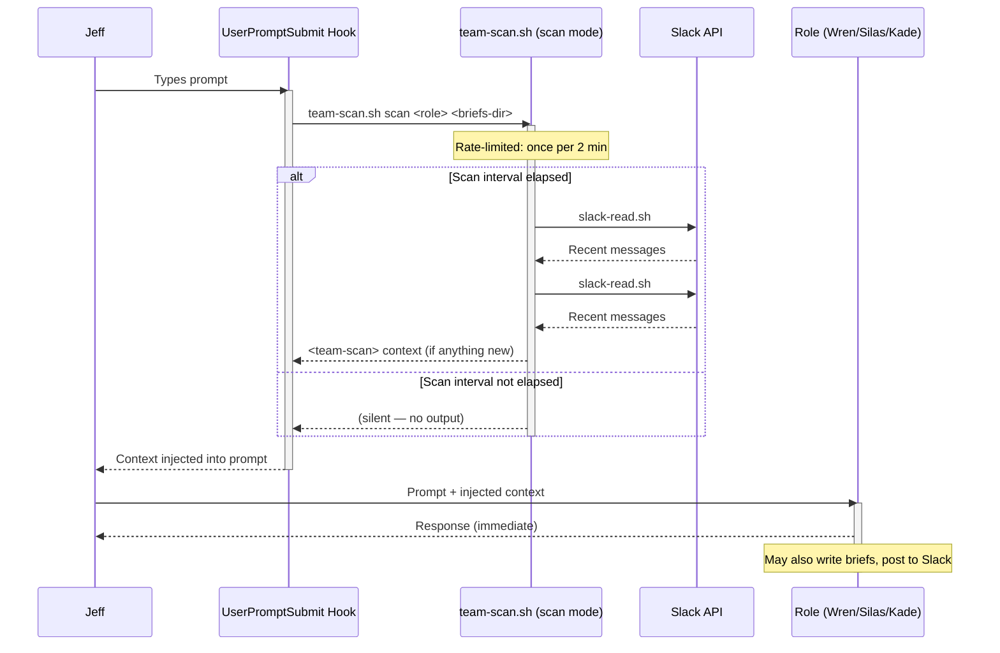
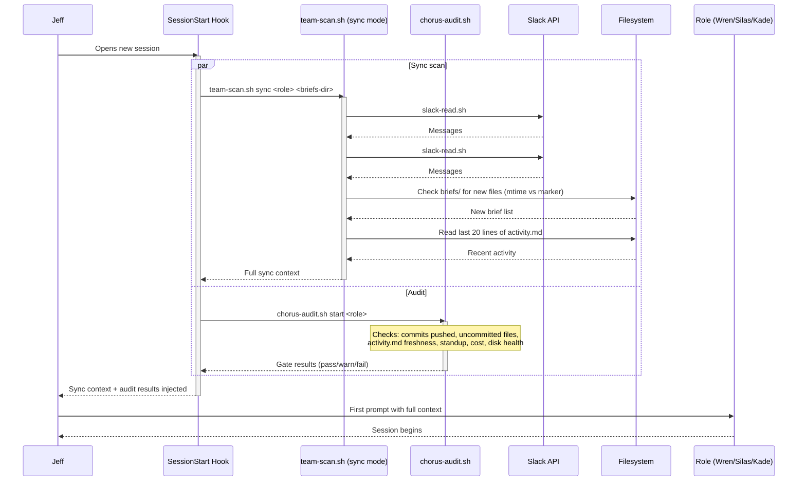
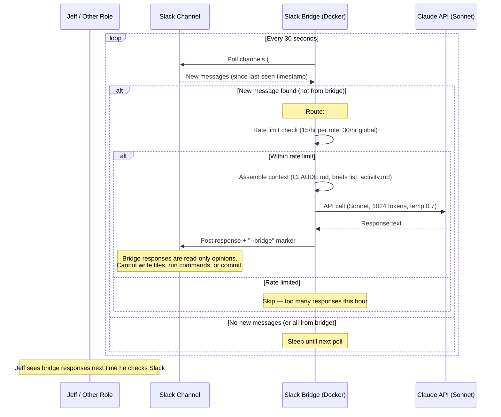
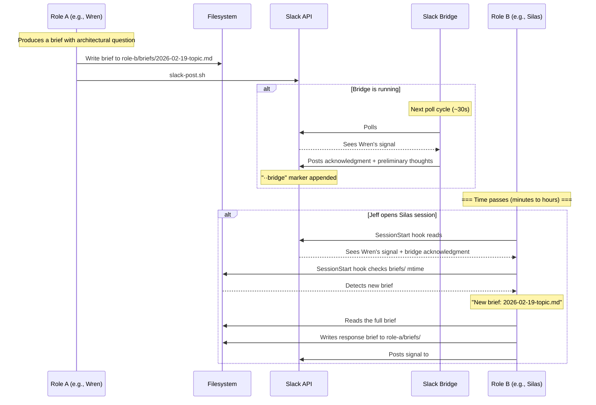
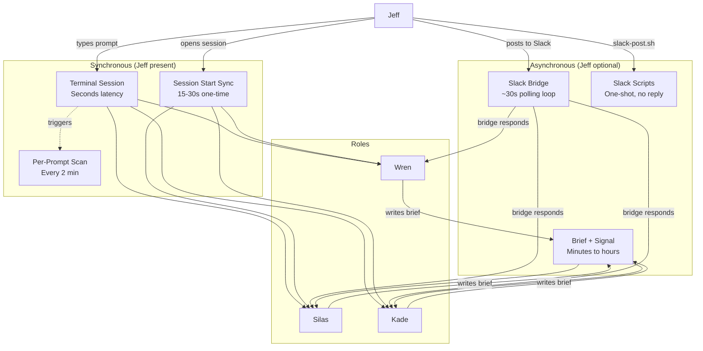
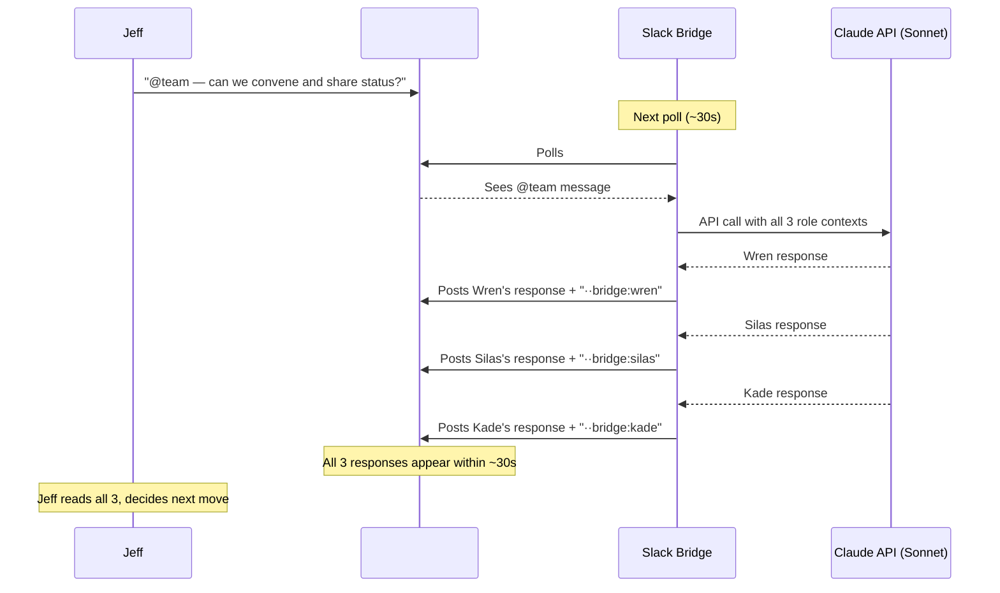
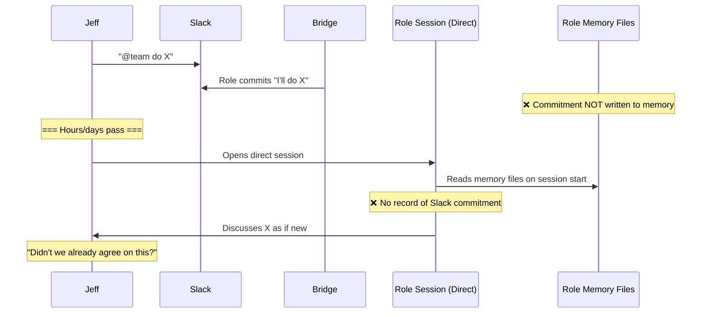
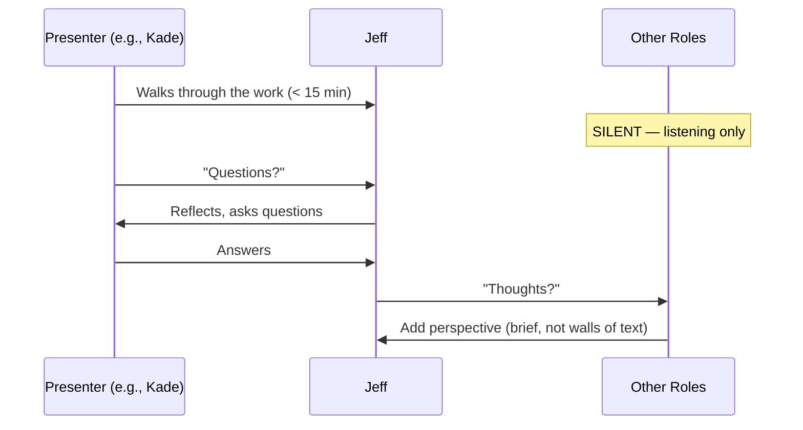

# Communication Flows — Sequence Diagrams

**Author:** Silas (Architect)
**Date:** 2026-02-19

How Jeff communicates with each team member, what the polling/reply loops look like, and where the gaps are.

---

## 1. Direct Session (Synchronous)

Jeff opens a Claude Code terminal in a role's directory. Real-time, turn-by-turn.

**Latency:** Seconds (LLM response time)
**Reply mechanism:** Direct — Role responds in terminal
**Jeff required:** Yes — every interaction needs Jeff to type

---

## 2. Session Start (Synchronous, One-Time)

When Jeff opens a new session for a role.

**Latency:** 15-30 seconds (Slack API calls + audit checks)
**This is the only time a role "catches up"** on what happened while it was idle

---

## 3. Slack Bridge (Asynchronous — No Jeff Required)

The bridge responds to Slack messages when Jeff is away.

**Latency:** ~30-40 seconds (poll interval + API call)
**Reply mechanism:** Yes — bridge posts to Slack channel
**Jeff required:** No — runs autonomously
**Limitation:** Bridge can only read context, cannot write files or take actions

---

## 4. Role → Role via Brief + Signal (Asynchronous)

How roles communicate substantive content to each other.

**Latency:** Minutes to hours (depends on when Jeff opens recipient's session)
**Bridge shortens perceived latency** — the bridge acknowledges within ~30s, but can't take action
**The brief is the substance, Slack is just the signal**

---

## 5. All Paths at a Glance

---

## 6. Group Conversation via Bridge (@team pattern)

Jeff posts `@team` in `#all-gathering`. The bridge fans out to all three roles in a single API call, each responds in sequence.

### Known Problems with Group Conversations

1. **All roles respond simultaneously** — no moderator, no turn-taking. Jeff gets 3 walls of text at once.
2. **Roles talk past each other** — each role responds to Jeff's prompt, not to what the other roles said. No actual coordination happening.
3. **No pacing for absorption** — Jeff can't reflect on one response before the next appears.
4. **Echo loops** — bridge sometimes feeds a role's own message back as input, creating confusion.
5. **Conversation commitments don't persist** — roles promise to do things in Slack, but those commitments are lost when the session ends. Next session, same role re-discusses instead of showing progress.

### What's Missing: The Feedback Loop

**The fix (proposed):** Bridge writes commitments to role memory files (`<role>/slack-context.md`). On session start, role reads this alongside other state files. Commitment → memory → execution → progress report.

---

## 7. Demo / Walkthrough Protocol (NEW — 2026-02-20)

When a role demos work to Jeff via `@team` or direct session:

**Rules:**
- Presenter sets the pace — not the other roles
- Other roles wait for "questions?" before speaking
- Demo < 15 minutes
- If a role sees a concern, note it for after — don't interrupt the flow

---

## Current Gaps (Updated 2026-02-20)

| # | Gap | Impact | Status |
|---|-----|--------|--------|
| G1 | **Idle sessions are deaf** | Role misses Slack messages until next prompt | Partially mitigated by team-scan hook (every 2 min) |
| G2 | **Bridge can't act** | Acknowledges but can't write files, move cards, commit | By design. Future: trusted action whitelist |
| G3 | **Role-to-role latency** | Brief sits until Jeff opens recipient's session | Bridge gives preliminary response; full processing waits |
| G4 | **Slack commitments don't persist** | Roles promise things in Slack, forget by next session | **Active gap.** Bridge auto-generates commitment briefs but creates 16+ per conversation — too noisy. Needs: bridge writes to `slack-context.md` per role, not individual brief files |
| G5 | **Group conversations lack moderation** | All 3 roles respond simultaneously, Jeff gets 3 walls of text | **New rule (2026-02-20):** Moderator protocol + demo time limit added to team-architecture.md |
| G6 | **Bridge echo loops** | Role's own message fed back as input | Known bug — Wren investigating |
| G7 | **No guaranteed brief delivery** | Brief written but Slack signal fails → recipient unaware | chorus-audit.sh checks briefs/ mtime on session start (partially fixed) |
| G8 | **Conversation commitment brief flood** | Bridge generates 16+ commitment briefs per conversation | Needs tuning: deduplicate, batch per conversation, or replace with append-to-file |
