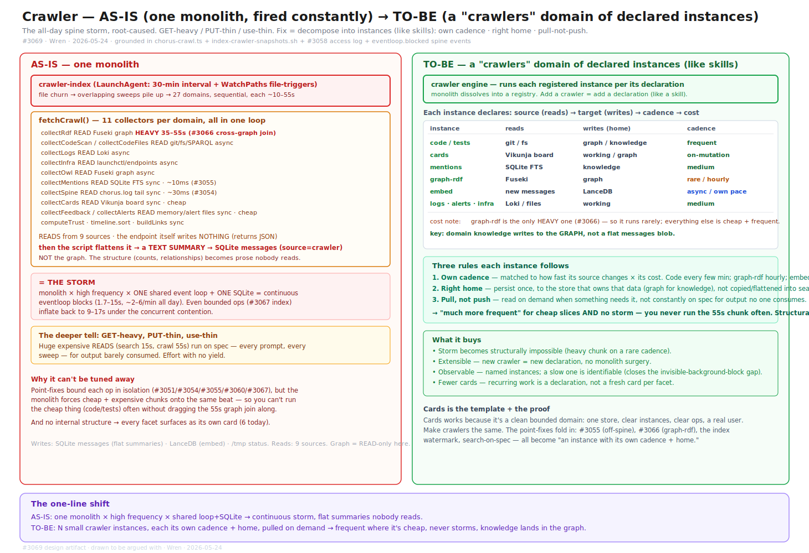

# Crawler — AS-IS → TO-BE (one monolith → a "crawlers" domain of declared instances)

**#3069 · Wren · 2026-05-24** · drawn to be argued with.

The all-day spine storm, root-caused. **GET-heavy / PUT-thin / use-thin.** Fix = decompose into instances (like skills): own cadence · right home · pull-not-push.

## AS-IS — one monolith

`crawler-index` (LaunchAgent: 30-min interval + WatchPaths file-triggers). File churn → overlapping sweeps pile up → 27 domains, sequential, each ~10–55s.

`fetchCrawl()` runs 11 collectors per domain, all in one loop:

| Collector | Source | Cost |
|---|---|---|
| collectRdf | Fuseki graph | **HEAVY 35–55s** (#3066 cross-graph join) |
| collectCodeScan / collectCodeFiles | git/fs/SPARQL | async |
| collectLogs | Loki | async |
| collectInfra | launchctl/endpoints | async |
| collectOwl | Fuseki graph | async |
| collectMentions | SQLite FTS | sync · ~10ms (#3055) |
| collectSpine | chorus.log tail | sync · ~30ms (#3054) |
| collectCards | Vikunja board | sync · cheap |
| collectFeedback / collectAlerts | memory/alert files | sync · cheap |
| computeTrust · timeline.sort · buildLinks | (compute) | sync |

**Reads from 9 sources. The endpoint itself writes nothing (returns JSON).** Then the script flattens it → a TEXT SUMMARY → SQLite `messages (source=crawler)`. **Not the graph.** The structure (counts, relationships) becomes prose nobody reads.

### = THE STORM

Monolith × high frequency × one shared event loop + one SQLite = continuous eventloop blocks (1.7–15s, ~2–6/min all day). Even bounded ops (#3067 index) inflate back to 9–17s under the concurrent contention.

**The deeper tell: GET-heavy, PUT-thin, use-thin.** Huge expensive reads (search 15s, crawl 55s) run on spec — every prompt, every sweep — for output barely consumed. Effort with no yield.

### Why it can't be tuned away

Point-fixes bound each op in isolation (#3051/#3054/#3055/#3060/#3067), but the monolith forces cheap + expensive chunks onto the same beat — so you can't run the cheap thing (code/tests) often without dragging the 55s graph join along. And no internal structure → every facet surfaces as its own card (6 today).

## TO-BE — a "crawlers" domain of declared instances (like skills)

A `crawler engine` runs each registered instance per its declaration. The monolith dissolves into a registry. Add a crawler = add a declaration (like a skill).

Each instance declares: **source (reads) → target (writes) → cadence → cost**.

| Instance | Reads | Writes (home) | Cadence |
|---|---|---|---|
| **code / tests** | git / fs | graph / knowledge | frequent |
| **cards** | Vikunja board | working / graph | on-mutation |
| **mentions** | SQLite FTS | knowledge | medium |
| **graph-rdf** | Fuseki | graph | rare / hourly |
| **embed** | new messages | LanceDB | async / own pace |
| **logs · alerts · infra** | Loki / files | working | medium |

`graph-rdf` is the only HEAVY one (#3066) — so it runs rarely; everything else is cheap + frequent. **Key: domain knowledge writes to the GRAPH, not a flat messages blob.**

### Three rules each instance follows

1. **Own cadence** — matched to how fast its source changes × its cost. Code every few min; graph-rdf hourly; embed async.
2. **Right home** — persist once, to the store that owns that data (graph for knowledge), not copied/flattened into search.
3. **Pull, not push** — read on demand when something needs it, not constantly on spec for output no one consumes.

→ "much more frequent" for cheap slices AND no storm — you never run the 55s chunk often. Structural, not tuning.

### What it buys

- Storm becomes structurally impossible (heavy chunk on a rare cadence).
- Extensible — new crawler = new declaration, no monolith surgery.
- Observable — named instances; a slow one is identifiable (closes the invisible-background-block gap).
- Fewer cards — recurring work is a declaration, not a fresh card per facet.

### Cards is the template + the proof

Cards works because it's a clean bounded domain: one store, clear instances, clear ops, a real user. Make crawlers the same. The point-fixes fold in: #3055 (off-spine), #3066 (graph-rdf), the index watermark, search-on-spec — all become "an instance with its own cadence + home."

## The one-line shift

> **AS-IS:** one monolith × high frequency × shared loop+SQLite → continuous storm, flat summaries nobody reads.
>
> **TO-BE:** N small crawler instances, each its own cadence + home, pulled on demand → frequent where it's cheap, never storms, knowledge lands in the graph.

## Related

- [crawler-instance-model.html](./crawler-instance-model.html) — the to-be contract (AC2 + AC3)
- [crawler-dependency-map.html](./crawler-dependency-map.html) — verified writers → outputs → consumers (#3071)
- [crawler-service-design.html](./crawler-service-design.html) — full component anatomy
- [crawler-dependency-map.svg](./crawler-dependency-map.svg) — visual dep-map

Silas-side synthesis (crawler as Borg's 13th domain + 2-heralds): [roles/silas/architecture/crawler-as-13th-borg-domain.md](../../roles/silas/architecture/crawler-as-13th-borg-domain.md).
