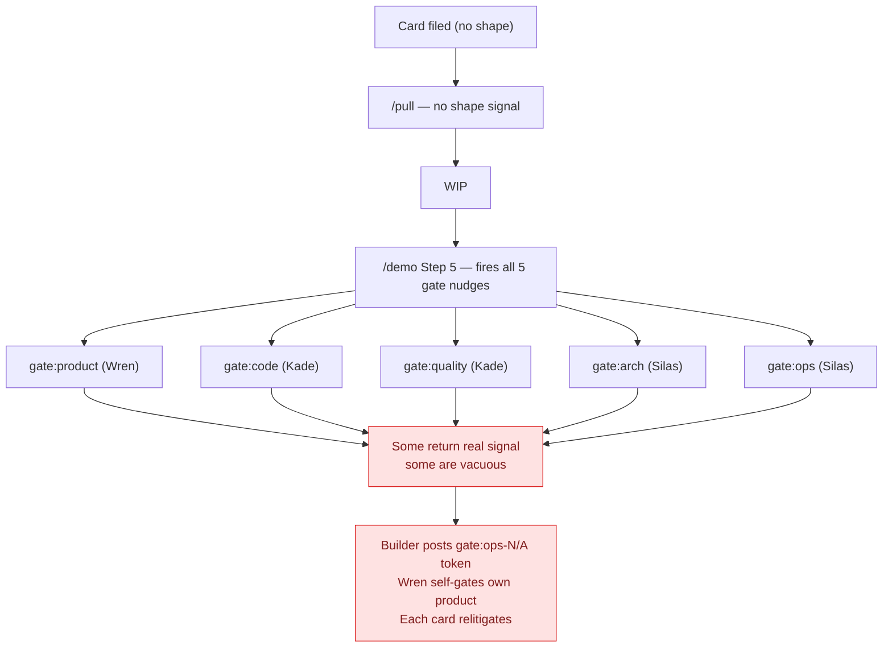
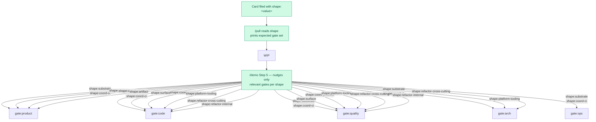
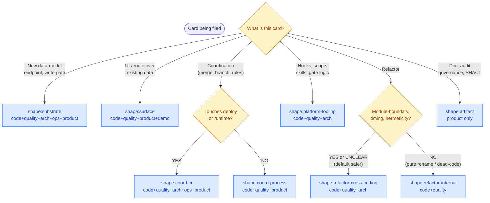

# Gate-Set Service Design

**Wren, 2026-04-29.** Card #2566. Drafted as the structural artifact above the five implementation children of #2561 (gate ceremony research). Pattern matches `nudge-service-design` + `independence-service-design` — the design lands first; cards align under it.

## Promise

Each card carries one shape label that names what kind of work it is. The shape determines which gates fire — not all five every time, only the ones that produce signal for that shape. The decision is made at filing time by the builder, not at gate time by the reviewer. `/pull` reads the shape and prints the expected gate set; `/demo` Step 5 nudges only the relevant gates. Reviewers stop running gates that have nothing to bite on; builders stop relitigating which gates apply per card.

## Problem

Until #2561, every card ran the full 5-gate ceremony (code + quality + arch + ops + product) regardless of shape. The audit data (#2543, #2577, #2522 sample) showed roles already self-tier informally — investigation cards run product-only, refactors skip arch, doc cards skip everything except product. The pattern is real but ad hoc: each card relitigates "does this need arch?" mid-flow, gate-runners post `gate:ops-N/A` tokens by hand, and the ceremony cost compounds across N cards × 5 gates × serial-time.

The fix isn't to invent gate-tiering — roles already do it. The fix is to **codify what's already practice**, anchor it on a shape label, and let the protocol pick the gate set automatically.

## As-Is



Red = ceremony cost without signal. Mean gate count per card = 3.1 (audit, 2026-04-28); ceiling = 5. The variance is informal, not codified.

## To-Be



Green = the canonical surface. Each shape routes to a deterministic gate set. No relitigation; no ad-hoc N/A tokens (except the kept gate:ops-N/A escape hatch, see Decisions).

## The Flow Chart (decision tree)



Two questions, three decision points. Builder runs this once at filing, picks a shape, label attaches. Done.

## Single Contract

```
File: cards add "title" --shape <value>           # at filing time
Read: /pull reads shape label, prints gate set    # builder sees what gates will run
Fire: /demo Step 5 nudges only relevant gates     # no wasted gate-runs
```

Eight valid shapes:
- `shape:substrate` — full 5
- `shape:surface` — code + quality + product + demo
- `shape:coord-ci` — full 5 (touches deploy)
- `shape:coord-process` — code + quality + product
- `shape:platform-tooling` — code + quality + arch (no product)
- `shape:refactor-internal` — code + quality
- `shape:refactor-cross-cutting` — code + quality + arch
- `shape:artifact` — product only

## Components

| Component | What it does | Owner |
|---|---|---|
| Vikunja shape labels (IDs 160-167) | Persistent label storage on the board | Wren (already shipped via #2566 AC1) |
| `cards add --shape <value>` | Filing-time tagging via CLI | Kade (#2567) |
| `cards set <id> shape=<value>` | Retrofit existing cards | Kade (#2567) |
| `/pull` shape reader | Reads card label, prints expected gate set | Wren (#2567) |
| `/demo` Step 5 shape-aware nudge | Nudges only relevant gates for the shape | Silas (#2568) |
| TEAM_PROTOCOL.md mapping table | Authoritative shape → gate-set table | Wren (already shipped via #2566 AC2) |
| This service design | Structural spec; canonical source | Wren (this card AC6) |

## Spine Events

- `card.shape.declared` — card-id, shape, builder, declared-at-filing-time
- `card.shape.changed` — card-id, prior-shape, new-shape, reshape-reason (audit trail for AC reshapes)
- `gate.skipped.by-shape` — card-id, shape, skipped-gate (vacuous-by-shape; not the same as gate:ops-N/A)
- `gate.fired.by-shape` — card-id, shape, gate, runner

The audit emits these for the 2-week run-data evaluation per #2561. The audit answers: did filing-time shape predict gate-time signal? When it didn't, the shape taxonomy needs sharpening.

## Decisions

- **Filing-time discipline, not gate-time correction.** Builder picks shape at filing, not reviewer at gate. By gate-time the brief framing has already shaped the reviewer's read; the question must be asked before the brief is written, when the builder is forced to look at the diff and answer themselves. Same shape as TDD-gate's "tests describe Jeff's experience" — discipline at the writing surface.

- **`gate:ops-N/A` token kept as escape hatch.** Within a shape that includes ops, gate-runner can declare N/A when no service surface is touched. Taxonomy says WHO gates; gate-runner says WHETHER-substance. Two decisions kept independent (Kade's framing).

- **Refactor split at filing time, not in the diff.** The split criterion ("does this commit interact with timing, hermeticity, or visibility?") catches the #2543 class only when applied honestly at filing — not by the reviewer post-hoc. Mechanical diff-pattern detection (module-level const / static state / cross-call captures) runs as a `/pull` heuristic and over-rides builder's claim if the diff contradicts.

- **Default-to-cross-cutting on uncertainty.** When refactor type is unclear, default to cross-cutting (safer). Skip arch only when the answer is unambiguously "no boundary touch."

- **AC reshape transparency.** When a card's shape changes mid-build (e.g., refactor-internal → refactor-cross-cutting because a new module-level capture appeared), reshape gets logged via `card.shape.changed` event. Reshape-on-the-card before gate-runs is the precedent (#2516, #2514).

- **Move 7 gate-product split.** When distribution lands, gate-product splits into AC-verification (peer-runnable mechanical) + experience-integration (Wren/Jeff only judgment). Three-criteria peer-runnable test (Silas): deterministic command + binary observable + no Wren-context. Judge-separation rule (Liang 2024, Kade): peer running AC-verification MUST NOT share largest framing overlap with builder's domain. Belt-and-suspenders: Wren-built cards always run experience-integration by another role or Jeff.

## Migration

The five implementation children sequence the migration:

1. **#2566 (this card)** — Labels exist + TEAM_PROTOCOL mapping + service design (foundation; Done at AC6).
2. **#2567** — Cards CLI + /pull skill read shape; print expected gate set; backfill recent Done cards.
3. **#2568** — /demo Step 5 nudges only relevant gates per shape; owner-pair concurrent execution (Kade-pair || Silas-pair).
4. **#2569** — Self-attest path for `shape:artifact` with low scope (typo-fix, lint-only, doc-only) — judgment-layer skip; machine-layer (hooks/CI) fires unchanged.
5. **#2570** — Gate-product distribution (Move 7): AC-verification + experience-integration split, judge-separation rule, three-criteria peer-runnable test.

Each child unlocks the next. After all five land + 2-week run, the audit data evaluates whether the prediction held. The honest correction modeled today (Kade's 40% wall-time was overstated; realized 20% gate-count reduction on #2543) is the audit's value — per-card honesty over aggregate hand-waving.

## Connection to Existing Work

- **#2561** — research card; this design is the spec content the recommendation pointed at
- **#2543, #2577, #2558** — first three audit data points; instrumented under the new ceremony framework
- **#2543 reshape data** — proved refactor:internal vs refactor:cross-cutting split is necessary
- **#2522, #2549, #2550** — substrate/surface examples cited in the mapping table
- **#2575** (originator-side quiet output), #2581 (receiver-side rendering) — adjacent interaction-surface load fixes; not gate-set, but emerged from same observation
- **`independence-service-design.md`** — sibling design; gate-set protocol is what `/demo` Step 5 invokes when distributed gate-product (Move 7) needs independence enforcement
- **`nudge-service-design.md`** — model for this design's structural shape (Problem / As-Is / To-Be / Single Contract / Components / Decisions / Migration)
- **DEC-069** — intellectual honesty; the AC reshape discipline this design enforces is the structural form

## References

- Card #2561 v4 + v5 (gate ceremony research and the ten peer-review pushes that landed)
- Card #2566 (this card)
- Audit data: #2543 (refactor:cross-cutting test-mechanics), #2577 (refactor:cross-cutting deployment-touching), #2558 (refactor:cross-cutting lib.rs export)
- TEAM_PROTOCOL.md "Card Shape → Gate Set Mapping" section (canonical mapping)
- Kade's `social-contagion-and-framing-research.md` — empirical grounding for the judge-separation rule
- `independence-service-design.md` — sibling pattern for distributed-gate work

## Open Questions

- How does shape change interact with /demo Step 5 already-fired gates? (Reshape mid-build: emit `card.shape.changed`; if upstream gates already passed under prior shape, mark as "passed under prior shape" and re-run only newly-required gates. Migration card #2567 implementation detail.)
- What's the threshold for self-attest (#2569)? `shape:artifact` + scope:doc-only is the start; expansion gated on audit data over 2 weeks.
- When does `shape:platform-tooling` cross into `shape:substrate`? Edge case: a hook that emits new spine event types. The diff-pattern check (new event type = arch-territory anyway) handles it; flag in #2567 implementation.

## What this design is NOT

- Not a replacement for individual gate skills — gates still run as they do; only the gate *set* per card changes
- Not a CI change — CI runs whatever required-checks list DEC-2525 names; this is about role-side gate ceremony, not platform-level CI gates
- Not retroactive — historical cards stay un-shaped; backfill is organic during #2567 rollout
- Not enforced by tooling at filing time today — depends on builder discipline until #2567 ships filing-time validation
