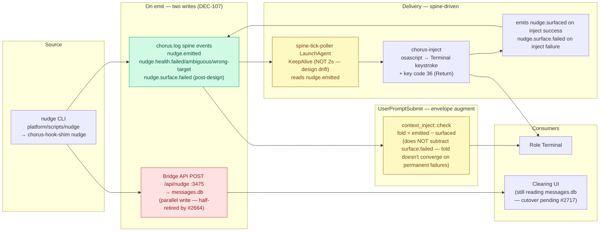
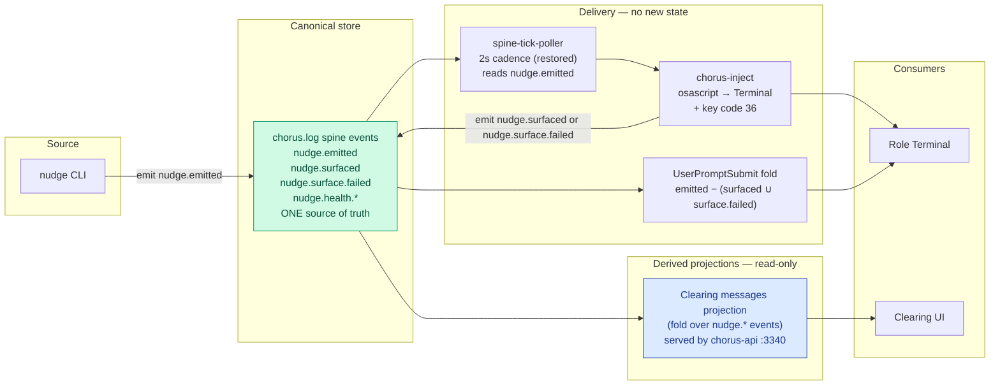

# Nudge Service Design

**Original: Silas, 2026-04-20, card #2283.**
**Revision: Wren, 2026-05-06, post-incident revision after triage of role-to-role unreliability across 2026-05-04 → 2026-05-06.** Owner remains Silas; this revision is a draft for review.

## What changed since 2026-04-20

The original design's structural premises (spine as canonical, one delivery path, UserPromptSubmit as drain, DEC-107 persist+deliver) all still hold. Three classes of incident since 2026-04-20 forced revision:

1. **TCC durability (#2548, 2026-05-04).** macOS Transparency/Consent/Control framework binds AppleEvents/Accessibility permissions to a binary's cdhash. Ad-hoc signing churned the cdhash on every `cargo build --release`, silently revoking osascript's keystroke grant. Failure mode `osascript is not allowed to send keystrokes (1002)` produced 159 inject failures on 2026-05-04 alone. Fixed by upgrading `build-signed.sh` to keychain-identity signing (`Chorus Local Signing`). The design did not anticipate that the build process itself was a delivery dependency.

2. **Spine producer outage (#2728, 2026-05-04).** A 9-day window (2026-04-26 → 2026-05-04) where the spine writer had failed silently — 430k events recovered, 170k unrecoverable. The design treats spine as the canonical store; this incident showed the spine writer's availability is itself a load-bearing dependency. Fixed by moving `chorus.log` out of the working tree and adding a heartbeat probe LaunchAgent.

3. **Bridge API retirement, half-shipped (#2664, 2026-05-04).** The original design's "one PR delta" — delete Bridge API `/api/nudge` write, repoint Clearing UI to spine fold — landed only in part. `pulse.rs::assemble_nudges` now sources from spine fold (good); the Bridge API write to `messages.db` still exists at `pulse/src/service.ts:78-85` (bad). Clearing UI cutover (#2717) and schema sunset (#2718) are filed but unshipped. **Result today:** messages.db has 10,528 rows in `pending` because the persist path still writes but no consumer marks `acknowledged_at`. The design's "fire-and-forget" claim becomes a permanent leak without the rest of the cutover.

The triage also surfaced four failure modes the original design didn't name; addressed in new sections below.

## As-Is (verified 2026-05-06)



Green = canonical. Red = the parallel write that should have been retired by #2664 but persists in `pulse/src/service.ts:78-85`. Yellow = drift from original design (cadence and fold convergence).

**Retired since 2026-04-20:** `/tmp/voice-inbox/<role>/pending-inject.txt` queue file (gone post-#2435; the Single Contract section's queue-on-inject-fail step no longer exists in code), PostToolUse drain, `nudge.persisted/delivered/failed` events.

## To-Be

One canonical store (spine). messages.db retired entirely. Clearing reads spine-fold via chorus-api.



Note the fold change: convergence requires subtracting both `surfaced` AND `surface.failed`. Without this, permanent delivery failures (TCC denied, no window found) accumulate as forever-pending nudges in the augment envelope.

## Single Contract (revised)

Replaces the original Single Contract section (lines 112–127). The original prescribed `if inject fails: queue to /tmp/voice-inbox/...` — that path was retired by #2435. The original prescribed `Persist → POST /api/nudge` — that write is half-retired and accumulates unacked rows.

```
nudge <role> <message>
  │
  ├── 1. Emit nudge.emitted to spine — ALWAYS, before any delivery attempt.
  │      Caller exits non-zero if spine emit fails. No silent let-_.
  │
  ├── 2. Persist (transitional, until #2717 + #2718 ship)
  │      POST /api/nudge → messages.db.
  │      Failures logged but do not block. Will be removed when Clearing reads spine fold.
  │
  └── 3. Deliver via spine-tick-poller (asynchronous, receiver-side):
            poller reads nudge.emitted → invokes chorus-inject → terminal.
            On inject success: emit nudge.surfaced.
            On inject failure (typed): emit nudge.surface.failed with reason ∈ {
              tcc-denied,           // permanent until manual re-grant
              no-window-found,      // permanent until role terminal opens
              window-ambiguous,     // permanent until duplicate window closes
              encoding-error,       // permanent (e.g. non-BMP not escaped)
              inject-nonzero,       // catch-all rc=1 with stderr captured
              focus-gate-miss       // transient OR permanent, depending on cause
            }
            Permanent failures DO NOT retry. Transient failures may be retried by poller.
```

**Jeff path:** `nudge jeff <message>` → Bridge API at localhost:3470 (the Clearing app, not :3475 messages.db). Same command, different routing. Not a separate path.

## Failure mode taxonomy (new)

The original design treated inject as a black box that either succeeded or queued for retry. Reality is finer:

| Failure | Transient? | Mechanism | Detection | Resolution |
|---------|-----------|-----------|-----------|-----------|
| TCC denied (`error 1002`) | NO | osascript Accessibility grant revoked. Often caused by cdhash churn (rebuilt binary). | stderr contains `not allowed to send keystrokes` | Manual: re-grant System Events for osascript in System Settings → Privacy. Structural fix: keychain-identity signing (#2548 done). |
| No window found | NO (until terminal opens) | Target role's terminal isn't open, or window title doesn't match `<role>` + `claude` pattern. | `count_windows` returns 0 | Wait for terminal to open. Or fix window-naming convention. |
| Window ambiguous | NO (until extras close) | Multiple windows match the role pattern. | `count_windows` returns >1 | Close stale windows. Improve disambiguation logic. |
| Encoding error | NO | Non-BMP codepoint (e.g. 🪶 U+1FAB6) passed through `escape_for_applescript` which only handles BMP. | Receiving terminal shows mangled prefix ("aa…") | Extend escape function to handle non-BMP via codepoint iteration. |
| inject-nonzero (catch-all) | maybe | Any rc=1 from chorus-inject not classified above. | rc=1 + stderr | Read stderr, classify, re-categorize over time. |
| focus-gate-miss | maybe | Frontmost-app gate refused injection (target window not frontmost when injection attempted). | reason=focus-gate-miss in event | Investigate per occurrence. |

Permanent failures are NOT retry-eligible from the spine-tick-poller. Transient ones may be. Today the poller does not distinguish; this is a design gap addressed in the plan below.

## Error observability contract (new)

The original design did not specify which failures are visible to whom. Today the codebase has multiple `let _` discards on critical paths (curl-to-persist, chorus_log emit, command output). The contract going forward:

- **Spine emit failure** (the `nudge.emitted` event itself fails to write) — **fatal**, caller exits non-zero with stderr. The whole system depends on this event.
- **Persist failure** (Bridge API POST fails) — **logged-but-not-fatal** until #2717+#2718 land. Caller still exits 0 if spine emit succeeded.
- **Inject failure** — **emits `nudge.surface.failed` with typed reason**. Caller (poller) does NOT exit non-zero (the poller is a daemon and crashing it would be worse than logging). Reason routed to the fold-aware consumer.
- **chorus_log internal errors** — **fatal to the call site** (we cannot afford silent observability gaps in observability). Caller exits non-zero.

No `let _` on any of these paths. Every failure must produce either a spine event or a non-zero exit code, never silence.

## Fold convergence contract (new)

The fold today: `pending = emitted − surfaced`. With permanent delivery failures producing `nudge.surface.failed` (not `nudge.surfaced`), the fold never converges. The augment envelope grows monotonically.

Revised fold: `pending = emitted − (surfaced ∪ surface.failed)`. Permanent failures count as resolved-by-failure. The augment envelope shows "pending" only for nudges still in the delivery pipeline.

Separately, a **stuck-nudge metric** (`emitted` count whose only resolution is `surface.failed` over the last 24h) is the right signal for the fitness probe (Jeff's 99.9% SLA).

## OS-chain durability (new section)

The design treats `chorus-inject → osascript → keystroke` as a black box. Three layers actually matter:

1. **cdhash stability.** Every `cargo build --release` of `chorus-inject` or `chorus-hook-shim` is a production deploy. CI sensors that build these binaries in-place break TCC for the team for ~14 hours minimum. Enforced by memory `feedback_target_release_is_deployed_code` and #2548 keychain-identity signing.
2. **Window-naming convention.** `chorus-inject` finds the target by matching `<role>` substring AND `claude` substring in window titles. This convention is implicit; if a role's terminal is renamed (e.g., session reboot creates "wren - zsh" without "claude"), inject fails with no-window-found. Convention should be explicit in role bootstrap.
3. **Encoding boundary.** `escape_for_applescript()` in `chorus-inject/src/lib.rs:35-42` covers em-dash + smart quotes. Non-BMP codepoints (emoji ≥ U+10000) pass through verbatim and may be mangled by AppleScript's `keystroke` interpreter. Either (a) escape non-BMP explicitly, (b) refuse non-BMP at the wrapper, or (c) document the limitation as a known restriction on message content.

## What gets removed (revised)

| Path | Verdict | Reason |
|------|---------|--------|
| PostToolUse drain | **Already removed** (#2435) | Drained same queue as UserPromptSubmit → duplicates |
| Artifact auto-nudge | **Already removed** (#2435) | Ambient noise; roles nudge explicitly |
| `--level` flag | **Already removed** | DEC-107 removed passive path; flag was dead code |
| `--reply-to` URL | **Already removed** | Clearing-specific hack |
| `/tmp/voice-inbox/` queue | **Already removed** (#2435) | Queue-on-inject-fail no longer in production code path |
| Bridge API POST /api/nudge → messages.db write | **Removal pending** (#2717 + #2718) | Half-retired by #2664; full cutover blocked on Clearing UI repoint |
| messages.db itself | **Removal pending** (#2718) | Schema sunset after Clearing reads spine fold |
| PostToolUse persist | **Kept** | Persist to spine is fast and harmless |

## Drain rules

- **PostToolUse:** persist to spine only. Never read a queue file. Never inject. (Unchanged from original.)
- **UserPromptSubmit:** invoke fold (emitted − surfaced − surface.failed). Inject pending content inline before Jeff's turn. (Convergence rule revised.)
- **Atomic state-machine on the receiver** — emit `surfaced` xor `surface.failed`, never both, never neither.

## Sender detection

`detect_sender()` checks `DEPLOY_ROLE` env var first and returns immediately. The lsof-based CWD fallback exists for callers without `DEPLOY_ROLE`. The bash nudge wrapper exports `DEPLOY_ROLE` explicitly. (Unchanged from original.)

## Files in scope (revised)

- `pulse/src/service.ts:78-85` — delete Bridge API `/api/nudge` write to messages.db (#2717 territory)
- `pulse/src/store.ts` — delete `sendNudge()` (#2717 territory)
- `pulse/src/store.ts` (schema) — drop messages.db nudge columns (#2718)
- `platform/api/src/handlers/nudges-recent.ts` (or new) — serve spine-fold projection for Clearing
- Clearing UI source — repoint nudge rendering from messages.db to chorus-api spine-fold endpoint
- `platform/services/chorus-inject/src/lib.rs:35-42` — extend `escape_for_applescript` for non-BMP
- `platform/services/chorus-inject/src/lib.rs:104-105` — return typed error from `inject()` instead of "no window found" string
- `platform/services/chorus-hooks/src/nudge.rs:266-274` — remove `let _` on persist curl; log explicit failure
- `platform/services/chorus-hooks/src/nudge.rs:100-106` — remove `let _` on chorus_log; fatal on failure
- `platform/services/chorus-hooks/src/hooks/context_inject.rs` (fold) — change fold to subtract `surface.failed` as well as `surfaced`
- `platform/scripts/spine-tick-poller` — distinguish permanent vs transient failures; do not retry permanent
- `platform/scripts/install-tick-poller-plists.sh:31-62` — restore explicit cadence (StartInterval=2 or document KeepAlive intent)
- LaunchAgent for fitness probe (new) — emit synthetic nudge end-to-end every N minutes; alert on >0.1% failure rate

## Decisions

- **DEC-107** (preserved) — persist AND deliver on every nudge.
- **Single canonical adapter** — chorus-inject is the only injection path. Wrappers around it are not separate paths.
- **Permanent failures do not retry** — TCC, no-window, ambiguous-window, encoding errors are not retry-eligible. The fold treats `surface.failed` as terminal.
- **Spine writer is load-bearing** — `chorus.log` lives outside the working tree and has heartbeat probe (#2728).
- **Build process is delivery process** — every cargo build of `chorus-inject` or `chorus-hook-shim` is a production deploy. Use `build-signed.sh`. Never raw `cargo build`.

## References

- DEC-107 — persist AND deliver on every nudge
- #2031 — original cleanup card (superseded by this design)
- #2283 — original design card
- #2435 — queue retirement (pre-design wave that removed `/tmp/voice-inbox/`)
- #2548 — keychain-identity codesign (TCC durability fix, 2026-05-04)
- #2664 — Bridge API partial retirement (pulse.rs assemble_nudges → spine fold, 2026-05-04)
- #2717 — Clearing UI spine-fold cutover (Next, blocking the design's full ship)
- #2718 — messages.db schema sunset (Next, follows #2717)
- #2726 — Clearing UI nudge visibility (parked 2026-05-06; subset of #2717's scope)
- #2728 — chorus.log out of working tree + heartbeat probe (2026-05-04)
- Memory: `feedback_target_release_is_deployed_code`, `feedback_never_reset_tcc`, `feedback_nudge_arg_order`
