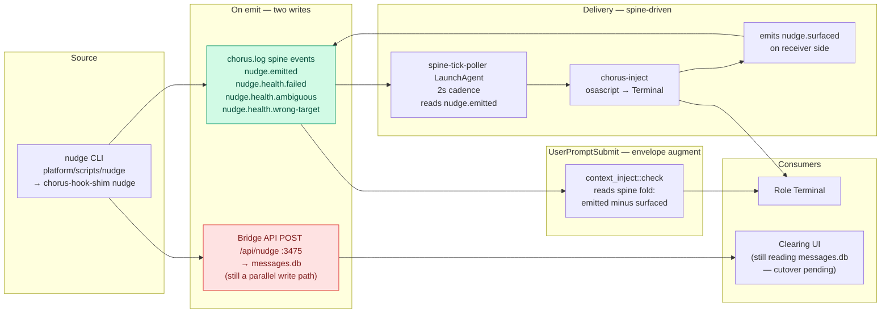
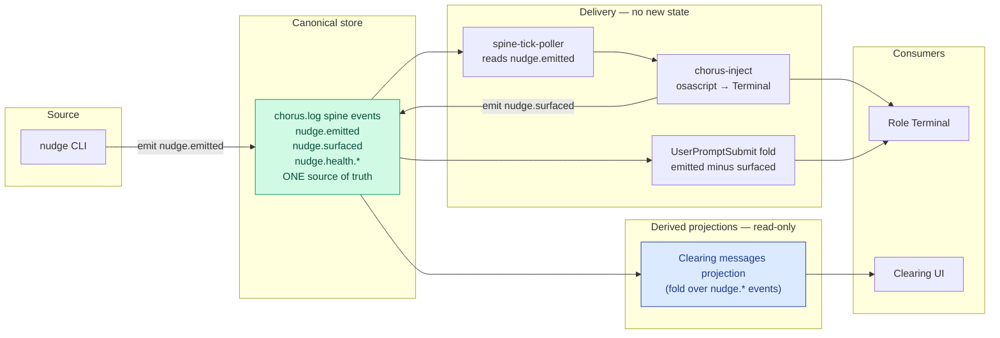

# Nudge Service Design

**Silas, 2026-04-20. Card #2283.**

## Problem

Nudge accumulated 6 delivery paths over time. Two drain the same queue independently, causing duplicate delivery. Dead flags exist in the code from decisions that were made (DEC-107) but never cleaned up. #2031 was the original cleanup card — it was never finished.

## As-Is (verified against code 2026-04-24)

Most of the three-store mess is already gone. #2435 retired the queue file, the PostToolUse drain, and the `nudge.persisted/delivered/failed` events. The one remaining competing implementation is **Bridge API `/api/nudge` :3475 still writing to messages.db** in parallel with the spine emit — that surface hasn't been retired.



Green = canonical. Red = the last remaining competing write. The retired surfaces (queue file, `nudge.persisted/delivered/failed`, PostToolUse drain, `/tmp/voice-inbox/*`) are gone from code; they survive only in the diagram's historical memory.

## To-Be

One canonical store (spine). messages.db becomes a derived projection or retires entirely. Clearing reads the spine fold.



**Delta from as-is (one PR):**
- Delete `pulse/src/service.ts:78-85` (Bridge API `/api/nudge` → messages.db write)
- Repoint Clearing UI from messages.db to a new spine-fold endpoint on chorus-api :3340
- Delete the POST `/api/nudge` route and `sendNudge()` in `pulse/src/store.ts`
- Retire messages.db as a write target; keep it read-only during cutover or drop it entirely
- Same commit: grep returns zero hits for `sendNudge`, `messages.db` writes, POST `/api/nudge`

Retirement is part of the implementation, not a follow-up card.

## Single Contract

One path. No variants.

```
nudge <role> <message>
  │
  ├── 1. Persist → POST /api/nudge (3475) — history, fire-and-forget
  │
  ├── 2. Inject → chorus-inject binary → osascript → Terminal keystroke
  │         if inject succeeds: DONE. Do not queue.
  │         if inject fails: queue to /tmp/voice-inbox/<role>/pending-inject.txt
  │
  └── 3. Drain (on next UserPromptSubmit only)
            read queue file → inject content inline → clear atomically
```

**Jeff path:** `nudge jeff <message>` → Bridge API (localhost:3470). Same command, different target routing. Not a separate path.

## What Gets Removed

| Path | Verdict | Reason |
|------|---------|--------|
| PostToolUse drain | **Removed** | Drains same queue as UserPromptSubmit → duplicates |
| Artifact auto-nudge | **Removed** | Ambient noise; roles nudge explicitly |
| `--level` flag | **Removed** | DEC-107 removed passive path; flag is dead code |
| `--reply-to` URL | **Removed** | Clearing-specific hack; Clearing should use nudge directly |
| PostToolUse persist | **Kept** | Persist to API is fast and harmless; just remove the drain |

## Drain Rules

- **PostToolUse:** persist to API only. Never read the queue file. Never inject.
- **UserPromptSubmit:** read queue atomically (rename → read → delete temp). Inject content inline before Jeff's turn. One read, one clear.
- **Atomic rename prevents double-read** — but removing the PostToolUse drain eliminates the race entirely.

## Sender Detection

`detect_sender()` checks `DEPLOY_ROLE` env var first and returns immediately. The lsof-based CWD fallback exists for callers without `DEPLOY_ROLE`. This is acceptable but should be documented: callers without `DEPLOY_ROLE` pay a ~20ms lsof penalty. The bash nudge wrapper should export `DEPLOY_ROLE` explicitly.

## Files in Scope

- `platform/services/chorus-hooks/src/nudge.rs` — remove --level, --reply-to, artifact auto-nudge
- `platform/services/chorus-hooks/src/shim.rs` — remove PostToolUse drain_nudge_inbox call
- `platform/scripts/nudge` — export DEPLOY_ROLE
- `platform/services/chorus-hooks/src/main.rs` (user_prompt_submit handler) — verify drain is UserPromptSubmit only

## Decisions

- **UserPromptSubmit is the drain point** (Wren: "last moment a queued nudge can land without interrupting a turn")
- **PostToolUse persist stays, drain removed** (Kade: confirmed PostToolUse drain is the dupe source)
- **--level removed** (DEC-107, 2026-04-20 confirmation)
- **Artifact auto-nudge removed** (roles nudge explicitly per this design)

## References

- DEC-107 — persist AND deliver on every nudge
- #2031 — original cleanup card (superseded by this design)
- #2283 — this card
