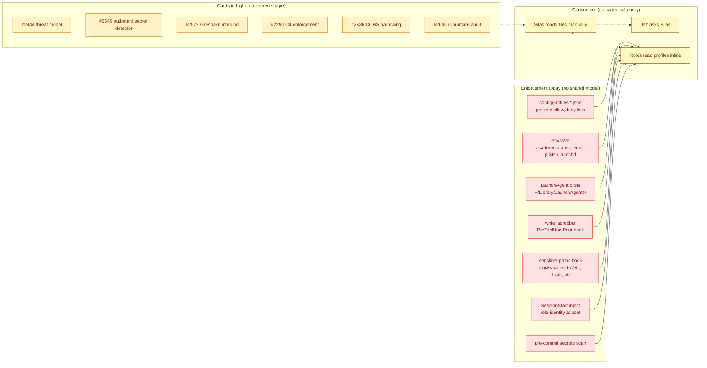

# Security Service Design

**Silas, 2026-05-01 (initial). Card #2659. Status: Draft. Class A per ADR-028.**

**Owner:** Silas (operations layer — DEC-022 makes ops including security a Silas responsibility).
**Persistence:** `urn:chorus:instances` (Class A — graph-backed substrate).
**Schema:** `urn:chorus:ontology` — `chorus:Credential`, `chorus:Permission`, `chorus:SecurityProbe`, `chorus:AuthBoundary` declared at `roles/silas/ontology/chorus.ttl:1514–1738` (committed 2026-05-02).
**Subdomain:** `chorus:security-domain` (registered in chorus.ttl, currently consumed by 26+ peer domains).

## Promise

When the security domain is complete, Chorus answers four questions about every role action with attestation, not assertion:

1. **Who is acting** — role-identity from bootstrap, verified at the boundary the action crosses (`chorus:AuthBoundary`).
2. **What they are allowed to do** — authority resolved from `chorus:Permission` instances against subject + action + resource, closed-world default.
3. **What credentials are in play** — `chorus:Credential` instances declare scope, source location, rotation policy, and severity-if-leaked. Values never live in the graph; only the references and metadata.
4. **What the current security posture is** — `chorus:SecurityProbe` instances continuously attest credential expiry, port exposure, hook bypass count, and write-scrubber match rates. Drift between declared posture and observed state is itself a probe.

The security domain owns these four classes end-to-end. Today they exist as schema only. The work is populating instances, wiring the canonical write/read paths, and turning the existing scattered enforcement into observable surface.

## Cards in flight (receipts of work, not the totality)

The work below is what Chorus has filed against security shape today. Each is a receipt of a specific gap — not a roadmap.

- **#2444** — Threat model for Chorus (Greshake-aware, role-boundary-aware). AC1 is the parallel populate-instances card to this design.
- **#2645** — Outbound secret detector — write-scrubber hardening at the boundary.
- **#2572** — Greshake / inbound prompt-injection protections at session boundaries.
- **#2290** — C4 enforcement — boundary-as-architecture, related to `chorus:AuthBoundary`.
- **#2436** — CORS narrowing on chorus-api endpoints.
- **#2646** — Cloudflare tunnel audit — external-edge boundary review.

Six cards, no shared model, no inventory, no canonical service. This design proposes the model that lets each card land into a coherent surface.

## Problem

The security domain has five concrete gaps today:

1. **No canonical model.** Credentials live as env-var names in `config/profiles/*.json`, plist keys, and shell scripts. Permissions are encoded across permission profiles, hook decision tables, and inline string checks. There is no graph-citable surface for "what credentials does Chorus depend on" or "what is the role × action × resource grant table."
2. **Distributed enforcement, no inventory.** Pre-commit hooks, the `write_scrubber` PreToolUse hook, the sensitive-paths hook, the SessionStart inject, role permission profiles, and worktree contamination guards each enforce a slice. None of them know about the others. Adding a new boundary means adding a new enforcement point; removing one is invisible.
3. **Six cards, no domain.** #2444 / #2645 / #2572 / #2290 / #2436 / #2646 each address a real gap. Without a domain to land into, each card invents its own shape — a threat-model doc here, a CORS list there, a Cloudflare audit somewhere else. The next card (and there will be one) reinvents again.
4. **No live attestation surface.** Security posture today is "Silas read the relevant config files this morning and they looked fine." There is no `GET /api/athena/subdomains/security-domain/probes` returning current state of credential expiry, port exposure, or bypass counts.
5. **Bootstrap-as-security implicit.** SessionStart establishes role-identity, protocol-trust, context-attestation, and authority-assertion (per `project_bootstrap_is_security`). Today these are availability-framed concerns. Bypass paths (e.g., `CHORUS_MCP_BYPASS=1`) cross the boundary that establishes those primitives, but the audit captures rate, not what guarantee degraded.

**Cost of staying scattered:** every security card pays the discovery cost of "where does this fit?" Decisions made in one card (e.g., "credentials reference env-var name, never value") are not visible to the next card. Drift accumulates across the cards before they ship. The principles arc paid this cost five times before the contract was named (ADR-028); the security domain is on track to pay it six.

## As-Is

Red = enforcement points without a shared model. Yellow = open work that has nowhere coherent to land. The three consumers all flow through Silas-as-human-index because no canonical query exists.

## To-Be

```mermaid
flowchart LR
  subgraph ONTO["urn:chorus:ontology"]
    CRED_C["chorus:Credential"]
    PERM_C["chorus:Permission"]
    PROBE_C["chorus:SecurityProbe"]
    BOUND_C["chorus:AuthBoundary"]
    SHACL["SHACL shapes<br/>(committed 2026-05-02)"]
  end

  subgraph INST["urn:chorus:instances"]
    CRED_I["Credential instances<br/>(env-var refs, rotation, scope)"]
    PERM_I["Permission instances<br/>(subject × action × resource)"]
    PROBE_I["SecurityProbe instances<br/>(port, expiry, bypass-count)"]
    BOUND_I["AuthBoundary instances<br/>(domain↔domain edges)"]
  end

  subgraph WRITE["Single write path (Athena)"]
    REST_W["POST /api/athena/subdomains/<br/>security-domain/{credentials,<br/>permissions,probes,boundaries}"]
    MCP_W["MCP tools<br/>chorus_credentials_create<br/>chorus_permissions_create<br/>chorus_probes_create"]
  end

  subgraph READ["Single read path"]
    REST_R["GET /api/athena/subdomains/<br/>security-domain/..."]
    MCP_R["MCP tools<br/>chorus_credentials_list/get<br/>chorus_permissions_list/get<br/>chorus_probes_list/get"]
    PAGE["/security/dashboard<br/>(live attestation page)"]
  end

  subgraph BACKSTOP["Hooks + drift"]
    HOOK["pre-commit backstop<br/>refuses direct TTL adds<br/>of Credential/Permission/<br/>SecurityProbe/AuthBoundary"]
    DRIFT["drift test<br/>book/security-reconstructed.html<br/>vs graph"]
    SHACL_V["SHACL validation<br/>cross-graph"]
  end

  ONTO --> SHACL_V
  SHACL_V --> INST
  REST_W --> INST
  MCP_W --> REST_W
  INST --> REST_R
  REST_R --> MCP_R
  REST_R --> PAGE
  HOOK -.->|blocks bypass| INST
  DRIFT -.->|gates CI| INST

  classDef onto fill:#dbeafe,stroke:#1e40af,color:#1e3a8a
  classDef inst fill:#d1fae5,stroke:#059669,color:#064e3b
  classDef path fill:#f3e8ff,stroke:#7e22ce,color:#581c87
  classDef gate fill:#fef9c3,stroke:#854d0e,color:#713f12
  class CRED_C,PERM_C,PROBE_C,BOUND_C,SHACL onto
  class CRED_I,PERM_I,PROBE_I,BOUND_I inst
  class REST_W,MCP_W,REST_R,MCP_R,PAGE path
  class HOOK,DRIFT,SHACL_V gate
```

Blue = ontology (schema). Green = instances (populated content). Purple = single canonical write/read paths. Yellow = backstop and gates. The arrows describe the only legal flows.

## Single Contract

The security domain owns:

- The four canonical classes (`chorus:Credential`, `chorus:Permission`, `chorus:SecurityProbe`, `chorus:AuthBoundary`) and their instance population.
- The canonical Athena write/read paths for those classes.
- The MCP tool surface (`chorus_credentials_*`, `chorus_permissions_*`, `chorus_probes_*`, `chorus_boundaries_*`).
- The pre-commit backstop hook for direct-TTL writes against the four classes.
- The drift test that gates CI against the security graph.
- Spine event emission for security-shaped state changes.

The security domain does NOT own:

- The actual hook implementations enforcing permissions (those are infrastructure / per-role tooling — security publishes the contract, hooks consume it).
- Secret value storage (keychain, env vars, plists are the runtime — security publishes the location, never the value).
- The threat model itself as a free-text artifact (#2444 produces that — security domain provides the structured shape `chorus:SecurityProbe` instances reference).
- The CI workflow or branch-protection config (those live in code-domain / commits-domain — security expresses the invariant, the gates enforce).
- Bootstrap procedure code (lives in chorus-domain / SessionStart — security names what bootstrap establishes, not how).

## Components

Six sub-areas. Most are unstarted today.

| Sub-area | Current State | Target State | Named Cards | OWL Class |
|---|---|---|---|---|
| Authentication | Implicit — role from cwd / env / DEPLOY_ROLE | Cryptographic role-identity at session start, attested by AuthBoundary instance check | #2311, #2450 | `chorus:AuthBoundary` |
| Authorization | Permission profiles per role (JSON, ungoverned) | `chorus:Permission` instances, closed-world default, queryable surface | #2290 | `chorus:Permission` |
| Permissions | Static JSON allow/deny lists | Generated from `chorus:Permission` instances; profiles become projections | #2290 | `chorus:Permission` |
| Security health | Manual file reads (Silas eyes) | `chorus:SecurityProbe` instances reporting expiry / exposure / bypass / scrubber-match continuously | #2645 | `chorus:SecurityProbe` |
| Security monitoring | write_scrubber + sensitive-paths hooks (no inventory) | Probes register with the alerts/monitors domain; bypass events emit to spine | #2572, #2645 | `chorus:SecurityProbe` |
| Keys+tokens storage | Scattered env / plist / keychain | `chorus:Credential` instances reference source location + rotation policy; values stay where they live | #2436, #2646 | `chorus:Credential` |

### Authentication

**Current:** Role identity is inferred at every boundary independently — `detectRole()` cwd parsing in `cards`, `DEPLOY_ROLE` env var in nudge, the SessionStart inject for first-turn context. No single attestation. No verification — a role asserts identity, the boundary trusts it.

**Target:** `chorus:AuthBoundary` instances declare every trust edge. Each boundary names check type (`header` / `signature` / `ledger` / `ad-hoc`); `ad-hoc` is a smell. Bootstrap establishes role-identity once at session start; downstream boundaries verify via the established attestation rather than re-inferring.

**Cards:** #2311 (boot-time protocol contract — establishes the trust hash); #2450 (SessionStart inject — the boot envelope).

### Authorization

**Current:** `config/profiles/*.json` per role, hand-maintained, no graph.

**Target:** `chorus:Permission` instances bind subject (Role or SubDomain) × action × resource × conditions × explicitGrant. Closed-world default — absence denies. Queryable: "what is silas allowed to do in production?" answered by SPARQL over instances.

**Cards:** #2290 (C4 enforcement — boundary-as-architecture).

### Permissions

**Current:** profile JSON files are the source. Drift between profiles and runtime behavior is invisible.

**Target:** Profile JSON becomes a projection generated from `chorus:Permission` instances. The graph is the source; the JSON is materialized for runtime consumption. Adding or revoking a permission means writing through the canonical Athena path; the next generator run produces the matching profile.

**Cards:** #2290.

### Security health

**Current:** Posture is whatever Silas remembers. No probes, no continuous attestation.

**Target:** `chorus:SecurityProbe` instances declare what's watched (port, file path, env var name, service URL), how the signal arrives (`expiry-check`, `log-pattern`, `http-probe`, `fs-watch`), and framing class (`symptom` / `cause` / `status`). Probes fire on schedule and emit results to the spine. The dashboard renders current state from probe results.

**Cards:** #2645 (outbound secret detector — the first probe to land).

### Security monitoring

**Current:** Hooks fire when triggered (write_scrubber on every PreToolUse, sensitive-paths on writes). Match rates are not aggregated; bypasses are not counted; trends are invisible.

**Target:** Each enforcement point registers as a probe. Probes report match rate, bypass count, last-fired timestamp. Alerts wire to the alerts-monitors domain. Greshake-class inbound (#2572) becomes a probe with framing-class `cause` and signal-type `log-pattern`.

**Cards:** #2572 (Greshake inbound), #2645 (outbound).

### Keys+tokens storage

**Current:** Env vars in shell rc, plists in LaunchAgent, keychain entries — three locations, no inventory.

**Target:** Every credential gets a `chorus:Credential` instance referencing its source location (`env-var` / `plist` / `keychain` / `fuseki` / `external`), scope (`session` / `service` / `system` / `external`), rotation policy, severity-if-leaked. Values never enter the graph. Rotation cadence becomes queryable; expired credentials become a probe trigger.

**Cards:** #2436 (CORS narrowing — bounded-by-credential), #2646 (Cloudflare tunnel audit — external boundary credential surface).

## Bootstrap-as-Security (Layer 0 cross-cutting)

Bootstrap is not an availability primitive. It is the security primitive that fires at session-start and establishes four guarantees:

1. **Role-identity** — this session is authentically silas / kade / wren, not a peer or external actor.
2. **Protocol-trust** — running the right protocol version, with non-tampered CLAUDE.md, with verified principles set.
3. **Context-attestation** — operating under known role-state, declared active card, claimed authority within bounds.
4. **Authority-assertion** — what the role is allowed to do (commit / push / read / write across role-boundary) is bounded and verifiable.

Cards anchored here:

- **#2311** — boot-time protocol contract (the hash that says "you are running v1.3 with the right CLAUDE.md").
- **#2450** — SessionStart inject (the live principles + state context that turns CLAUDE.md from a static file into an attested boot envelope).
- Project memory: `/Users/jeffbridwell/.claude/projects/-Users-jeffbridwell-CascadeProjects-chorus/memory/project_bootstrap_is_security.md`.

Bypass paths (`CHORUS_MCP_BYPASS=1`, `--no-verify`, others) cross the boundary that establishes these primitives. Each bypass MUST be modeled as a `chorus:AuthBoundary` instance with `bypassEnvs` populated and `bypassAudit=true`. A silent bypass (`bypassAudit=false`) is debt the security domain owns repaying.

## Spine Events

The security domain emits and consumes the following typed events:

| Event | Fired when | Payload |
|---|---|---|
| `security.bypass.detected` | A boundary's `bypassEnvs` is set during a privileged operation | `boundary_uri`, `env_var`, `caller_role`, `operation` |
| `security.credential.rotated` | A `chorus:Credential` instance is updated with a new rotation timestamp | `credential_uri`, `old_rotated_at`, `new_rotated_at`, `actor` |
| `security.permission.violated` | An action fails the `chorus:Permission` check | `subject`, `action`, `resource`, `closest_grant_uri` |
| `security.probe.fired` | A `chorus:SecurityProbe` reports a signal change | `probe_uri`, `framing_class`, `severity`, `target`, `value` |
| `security.attestation.completed` | Bootstrap completes its four-primitive establishment | `role`, `session_id`, `protocol_hash`, `boundary_uris[]` |

These names are reserved and additive — they MUST NOT collide with existing `borg.*` or `alert.*` events. `security.probe.fired` is a sibling of `borg.probe.fired`, not a rename; security probes are a subset of probes (see Connections below).

## Decisions

**DEC-022 (anchored):** Operations responsibilities — Silas owns ops including security. This design lands inside that mandate; no new DEC needed for ownership.

**Possible new DECs to surface during build:**

- **DEC (closed-world default for `chorus:Permission`):** absence of an explicit grant denies. Whitelist-only, no implicit allow. Aligns with the SHACL `explicitGrant` field minCount 1.
- **DEC (audit-on-bypass invariant):** every `chorus:AuthBoundary` with non-empty `bypassEnvs` MUST set `bypassAudit=true`. Silent bypass is rejected at SHACL validation time once the constraint lands.
- **DEC (credential value stays out of graph):** `chorus:Credential` instances reference source location only. Writing a value into a credential instance is rejected by the write API.
- **DEC (security-probe materialization):** when a probe is materialized from an alert rule (`chorus:sourceAlert`), the alert and probe stay synchronized — alert change triggers probe re-materialization.

These are draft. Final DEC numbers assigned on first card that needs to bind.

## Connections

The security domain does not stand alone. Five named connections to peer domains:

- **Borg (observability).** Security signals are observability signals. `chorus:SecurityProbe` ⊂ `chorus:Probe` family; security dashboards reuse borg's probe rendering. The split exists because the framing-class question (`symptom` / `cause` / `status`) needs to be answerable for security posture independent of generic operational health.
- **Commits (substrate enforcement).** The pre-commit hook is the substrate enforcement layer for security writes. Direct TTL adds of `chorus:Credential` / `chorus:Permission` / `chorus:SecurityProbe` / `chorus:AuthBoundary` are blocked by the commits hook; the typed API is the only legal write surface.
- **Cards.** Security-shaped cards route to security-domain via subdomain query. Once the canonical Athena `subdomain:` axis is live (per cards-service-design), `subdomain:security-domain` becomes the routing tag and #2444 / #2645 / #2572 / #2290 / #2436 / #2646 all carry it.
- **Alerts-monitors.** Probes and alerts overlap by construction. A `chorus:SecurityProbe` MAY reference its source `chorus:Alert` via `chorus:sourceAlert`; the alert rule fires the probe. New alerts in security territory get a probe instance the same day.
- **Athena (governance).** All four canonical classes are governed via Athena's subdomain registry. `chorus:security-domain` already lists 26+ consumers (chorus.ttl:1268–1297); reads and writes flow through the standard subdomain handler chain.

## ADR-028 Class A conformance

Walk through the seven universal MUSTs.

**MUST 1 — Graph separation (Layer 1, data).** **MUST.** Schema (`chorus:Credential`, `chorus:Permission`, `chorus:SecurityProbe`, `chorus:AuthBoundary` + properties + SHACL shapes) is in `urn:chorus:ontology` (chorus.ttl:1514–1738, committed 2026-05-02). Instances live in `urn:chorus:instances`. URIs are preserved if instances later relocate. **SHOULD** test cross-graph SHACL hermetically before the first credential instance lands; the SHACL shapes are committed but cross-graph enforcement is unverified for these specific classes.

**MUST 2 — Single write path (Layer 2, write).** **MUST** write through `POST/PUT/DELETE /api/athena/subdomains/security-domain/{credentials,permissions,probes,boundaries}`. SPARQL prefixes via `SPARQL_PREFIXES` constant. URIs minted as `https://jeffbridwell.com/chorus#security-domain-{credential|permission|probe|boundary}-{slug}`. **MUST NOT** any other write surface — no direct TTL edits, no SPARQL UPDATE outside Athena handlers, no script-direct writes.

**MUST 3 — Single read path (Layer 3, read).** **MUST** read through `GET /api/athena/subdomains/security-domain/{credentials,permissions,probes,boundaries}` returning `{entities:[...]}`. **MUST** any predecessor read path 308-redirects to canonical (e.g., when `/api/chorus/context/security` is introduced as convenience, it redirects rather than re-implements). **MUST NOT** parallel read implementations.

**MUST 4 — Cite-by-ID (Layer 5, citation).** **MUST** hooks, scripts, role fragments reference URIs (`chorus:security-domain-permission-silas-deploy-prod`), never paraphrased names ("silas can deploy prod"). Role fragments: redirect-to-canonical only. **MUST** `claudemd-gen.sh` regenerate after any fragment edit.

**MUST 5 — Hook backstop (Layer 6, enforcement).** **MUST** pre-commit reject staged commits adding `chorus:Credential` / `chorus:Permission` / `chorus:SecurityProbe` / `chorus:AuthBoundary` triples to chorus.ttl outside the schema-only path. Hook scoped to the watched file. **MAY** bypass via `SECURITY_DIRECT_EDIT_SKIP=1` for one-off migration / schema-only commits; bypass MUST emit `security.bypass.detected` for audit. The typed API becomes least-resistance; the hook bites the path it replaces.

**MUST 6 — Drift test (Layer 9, test).** **MUST** a static baseline page (`book/security-reconstructed.html`) holds against the graph; divergence fails CI. **MUST** subdomain integration tests pass on every commit. **MUST** hook hermetic tests pass deterministically. **SHOULD** count assertions are floors (`≥N` credentials, `≥N` boundaries) — graphs grow.

**MUST 7 — Subdomain plumbing (Layer 8, governance).** **MUST** `chorus:security-domain` registered (already done, chorus.ttl:935). **MUST** meta-alerts wired for stale instance index, API errors on canonical path, orphan instances. **MUST** MCP tools single-verb-single-target: `chorus_credentials_list/get/create`, `chorus_permissions_list/get/create`, `chorus_probes_list/get/create`, `chorus_boundaries_list/get/create`. No `*_op(action,...)` collapses. **MUST** `X-Chorus-Role` header propagates end-to-end into spine events. **MUST** tool descriptions carry (a) what it does, (b) when to reach for it, (c) what it is NOT for.

## Migration plan

Six phases, lowest-blast-radius first per ADR-028 I-10.

1. **Subdomain registration** — `chorus:security-domain` added to chorus.ttl with `consumes` edges from peer domains. **Shipped 2026-05-02.**
2. **Class declarations** — `chorus:Credential` / `chorus:Permission` / `chorus:SecurityProbe` / `chorus:AuthBoundary` + properties + SHACL shapes. **Shipped 2026-05-02 (chorus.ttl:1514–1738).**
3. **Athena handlers** — extend `subdomain-entities.ts` ENTITY_SECTIONS with the four classes. POST/PUT/DELETE/GET routes for `security-domain/{credentials,permissions,probes,boundaries}`. Per-class atomic commit.
4. **MCP tools** — `chorus_credentials_*`, `chorus_permissions_*`, `chorus_probes_*`, `chorus_boundaries_*`. Single-verb-single-target. `X-Chorus-Role` propagation.
5. **Hook backstop** — pre-commit hook scoped to chorus.ttl, refuses lines adding instance triples for the four classes outside the API write surface. `SECURITY_DIRECT_EDIT_SKIP=1` bypass with spine event.
6. **Drift test** — `book/security-reconstructed.html` static baseline; CI assertion that graph state matches baseline (with `≥N` floors).

Each phase is a card. Phase 3's per-class atomic commit means four small commits (one per class), not one big-bang.

## Open Questions

Deferred decisions, surface during build:

1. **Cryptographic role-identity.** Today role-identity is asserted via env var. Should bootstrap establish a per-session keypair and have downstream boundaries verify via signature? Trade-off: stronger guarantee vs. operational complexity. Defer to #2311 sub-spike.
2. **Threat-model population.** #2444 AC1 is the parallel populate-instances card. Question: is the threat model itself a `chorus:SecurityProbe` (status framing) or a separate class? Lean toward probe-with-framing-class=`status`, but #2444 may surface a need for a distinct `chorus:Threat` class.
3. **MCP tool granularity.** `chorus_permissions_create` accepts a single permission. Bulk operations (e.g., grant 12 permissions for a new role onboarding) — single tool with array, or 12 tool calls? ADR-028 leans single-target; revisit when first onboarding card lands.
4. **SHACL constraints on Permission entities.** The current shape requires subject/action/resource/explicitGrant. Should it also enforce that `subject` resolves to a known `chorus:Role` or `chorus:SubDomain` URI (not a string)? Closed-world enforcement at the schema layer.
5. **Profile-as-projection generator.** If `config/profiles/*.json` becomes generated from `chorus:Permission` instances, what's the generator address? `platform/scripts/generate-profiles.sh`? When does it run — pre-commit, post-merge, on Athena write?

## References

**ADRs:**
- ADR-025 — Ontology vs Instances graph separation (foundational).
- ADR-028 — Substrate-class domain contract (the seven universal MUSTs + Class A/B addendum).

**Cards in flight:**
- #2444 — Threat model.
- #2645 — Outbound secret detector.
- #2572 — Greshake / inbound prompt-injection.
- #2290 — C4 enforcement.
- #2436 — CORS narrowing.
- #2646 — Cloudflare tunnel audit.
- #2659 — This design.

**Pages:**
- `/loom/principles-reference-impl.html` — the principles arc as proof of pattern.
- `book/security-reconstructed.html` — drift baseline (planned, Phase 6).

**Project memory:**
- `project_bootstrap_is_security.md` — bootstrap = role-identity + protocol-trust + context-attestation + authority-assertion.
- `project_no_competing_implementations.md` — single-implementation invariant applies to write paths.

**Loom principles:**
- `chorus:principle-no-competing-implementations` — security domain = one model, one write path.
- `chorus:principle-services-reliable-bounded-idempotent` — probes idempotent, attestation bounded.
- `chorus:principle-self-healing` — probes detect drift; rotation triggers self-healing on expiry.

**Sibling service designs:**
- `designing/docs/cards-service-design.md` — Class B precedent for tone and structure.
- `designing/docs/ci-pipeline-service-design.html` — HTML look-and-feel reference.
- `designing/docs/chorus-reference-model.html` — typography and palette reference.

---

**Status:** Draft. Pending Wren review (interaction-layer impact: MCP tool surface). Pending Kade review (code-impact: handler list, generator surface). Pending Jeff sign-off.
