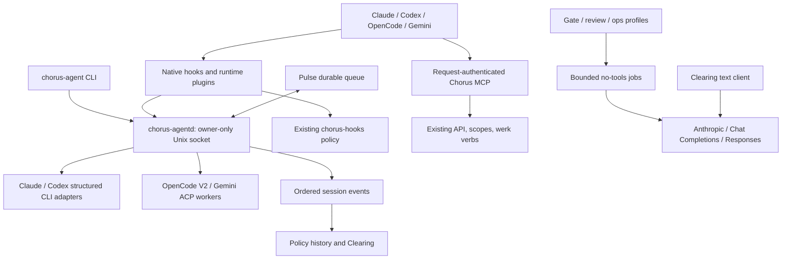

# Agent runtime migration: implementation and rollout

This implements the additive runtime boundary described in ADR-055 and the
approved arbitrary-agent migration plan. Source baseline: `90488c29`. The default
Claude deployment stays in place until an operator selects and validates a new
profile. These changes do not assert that the team Macs have been inventoried,
reconfigured, or certified.

## Components and ownership



| Area | Implementation |
| --- | --- |
| Sessions and jobs | `platform/services/chorus-agent`: private registry, primary leases, explicit conversation IDs, child ownership, handoff transaction, dedupe, event journal, bounded jobs |
| Runtime workers | `platform/agent-adapters`: versioned stdio, OpenCode V2 HTTP, Gemini ACP, text-provider jobs |
| Shared policy | `chorus-hooks/runtime_tools.rs` and `runtime_hook.rs`: runtime payload normalization, all-path patch handling, native decision translation, existing synchronous daemon path |
| Launch compatibility | `chorus-awake`: configured roles delegate to `chorus-agent`; unconfigured roles retain the legacy launcher |
| Identity | Existing CSS/ES256/model scopes through API; request-scoped MCP identity and child credentials; human-only attribution checks |
| Delivery | Pulse session binding, durable native claim/ack, managed receipt polling, uncertainty without replay |
| Instructions | `platform/scripts/agent-config.py`: canonical fragments and skill projections, source hashes, explicit budgets, runtime configuration, no overwrite |
| Observation | Canonical session events in SessionCache and Clearing, persisted Clearing cursors, explicit missing-evidence state; legacy Claude fallback only for unenrolled sessions |
| Headless work | `CHORUS_GATE_PROFILE`, `CHORUS_OPS_PROFILE`; schema validation, process-group deadlines, shared concurrency slots and provenance |
| Presentation providers | Clearing Anthropic, OpenAI-compatible Chat Completions and Responses; streaming/cancellation and unknown usage |
| Deployment | Signed CLI/daemon install shortcut and an opt-in launchd example; scheduled/manual conformance CI job |

Wren owns the adapter/session/context/MCP boundary, Silas policy/identity/reliability,
and Kade Clearing behavior. Changes to their contracts require joint review.

## Operational baseline

Run this separately on each intended deployment account before changing settings:

```sh
python3 platform/scripts/agent-baseline.py --chorus-home /absolute/chorus > /private/baseline.json
```

The diagnostic is read-only. It records installed runtime paths/versions,
configuration hashes and key names, instruction hashes, launch-agent labels and
programs, installed binary hashes, and registry counts. It never prints token
values, hook arguments, prompts or transcripts. `--no-probe` also suppresses
runtime executable probes. A local baseline is not a remote team inventory.

Record the live `binary.deployed` events from the existing spine separately to
associate signed binary hashes with commits. Keep the measured Claude hook p50/p95
latency, current nudge queue age, active settings paths, approved runtime versions,
and handoff state with the deployment record. Do not infer active configuration
from checked-in historical role settings.

## Install without changing role defaults

1. Run the relevant local tests explicitly. The checked-in quality workflow is
   scheduled/manual; this change does not silently alter its triggers or imply a
   pull request has run them.
2. Build Clearing, the MCP server, and `platform/agent-adapters` using each committed
   npm lockfile. The worker's text-job transport imports Clearing's built module.
3. Build and sign the Rust substrate through the existing pipeline:
   `platform/scripts/build-signed.sh chorus-hooks` and
   `platform/scripts/build-signed.sh chorus-agent`. The latter signs/verifies and
   installs both `chorus-agent` and `chorus-agentd` in `~/.chorus/bin`.
4. Review `platform/config/agent-profiles.example.json`, replace placeholder paths,
   versions and model IDs, and write an owner-controlled `~/.chorus/agent-profiles.json`.
   Leave `roles` empty at first. JSON paths must be absolute; `~`, `$HOME` and
   placeholders are not expanded by the supervisor.
5. Start `chorus-agentd` in the foreground for staging. After verification, adapt
   `platform/launchd/com.chorus.agent.plist.example` for the deployment account and
   use the existing operator launchd workflow. The example is not auto-installed.
6. Generate configuration into a **new staging directory**, review its manifest,
   then merge the intended generated files into the selected runtime's project
   configuration. Existing/custom instructions and unrelated client settings are
   never overwritten by the generator.

Example staged Codex bundle:

```sh
python3 platform/scripts/agent-config.py --runtime codex --role wren \
  --output /private/tmp/chorus-codex-wren --node /absolute/bin/node
```

Use `--runtime claude-code`, `opencode`, or `gemini` for other native renderers.
The manifest reports runtime-specific examples or delegation/memory instructions
that require review; projecting a skill is not proof that every workflow feature
has equivalent native support. Canonical source fragments remain shared.

## Identity is a prerequisite for production enrollment

Read [MCP identity setup](../platform/mcp-server/AGENT-IDENTITY.md). Existing
`legacy-claude` mode is a rollout compatibility lane and is **not an adversarial
authentication boundary**: an unauthenticated caller can omit headers. Move every
client on an exposed MCP endpoint to credentials and set
`CHORUS_MCP_IDENTITY_MODE=strict` before admitting arbitrary production clients.
Legacy Claude can use the same authenticated per-session stdio transport.

An identity is principal + authorized acting role. Runtime, model and provider do
not change it. The session token file is an owner-only reference, reread for each
request; renewal uses the existing Chorus credential issuer. Provider API keys
are separate environment references. `X-Chorus-Role` never proves identity in the
authenticated lane. A supplied session ID must match the verified principal,
role and active enrollment. Child verbs cannot inherit another daemon caller's
credentials or override them through tool arguments.

Only verified human identity may invoke human-attributed card creation or submit
a managed permission approval. Existing role scope and acceptance rules remain
in force. Local sockets, token files and Pulse's internal secret assume a trusted
OS account; this is not process isolation against arbitrary code running under
that same account.

## Select and exercise a runtime

Set the existing session credential reference and launch explicitly:

```sh
export CHORUS_SESSION_TOKEN_FILE=/absolute/private/wren.token
chorus-agent doctor codex-managed
chorus-agent launch wren --profile codex-managed --cwd /absolute/chorus/roles/wren
```

The response contains the Chorus session ID. Persist it in your operational record.
Use that ID in `send`, `resume`, `status`, `events` and `handoff`; no command chooses
the latest native conversation. For role defaults, add a reviewed `roles.wren`
profile mapping. `chorus-awake wren` then delegates to it. Profile changes take
effect only on explicit new enrollment/handoff, not in an existing turn.

Only one primary conversational session holds a role's inbox. Workers/subagents
must have separate IDs and `primary:false`. Supply `parent_session_id` and an
explicit card/worktree when appropriate. A failed or disconnected primary retains
its lease until reconciliation, stop or handoff; starting another client does not
silently steal it. The v2 registry is authoritative for enrolled clients; no fake
Claude PID or terminal metadata is written to satisfy old consumers.

The selected native CLI/app surface needs separate conformance checks. The Codex
CLI launch path does not claim to control the Codex desktop app. Native apps can
register a known native conversation and consume queued context at installed
hook boundaries. App Server is deliberately absent from the production path.

### Runtime-specific conditions

- **Claude:** existing launcher/terminal behavior is retained for unenrolled
  roles. Enrolled managed runs use structured `claude -p` output and explicit
  resume IDs; native projections use the new shared policy bridge.
- **Codex:** managed runs use `codex exec --json` with explicit resume. The initial
  path queues between turns; it does not advertise mid-turn steering. Native hook
  coverage, patch input parsing and local project-hook trust must be tested for
  the chosen version. Unsupported approvals are refused.
- **OpenCode:** V2 only, pinned to an exact locally tested release in
  `adapter_config.expected_version`. Its HTTP server must already be running with
  the generated configuration. Each endpoint is dedicated to **one live Chorus
  session**, including same-role workers. This avoids static MCP environment
  identity being shared between conversations. The stdio bridge resolves a
  profile binding, pins the first session, and refuses replacement until restart.
  Tool hooks resolve native IDs independently. No generic V1 compatibility is
  inferred. Projected HTTP observations are explicitly lower-fidelity history.
- **Gemini:** managed ACP negotiates advertised capabilities, owns its child
  process and accepts explicit permission responses. Generated native hooks/MCP
  configuration serves interactive clients. SessionStart cannot guarantee admission
  blocking and SessionEnd is best effort; enrollment and cleanup belong to Chorus.
  No-tools jobs use the text transport, not Gemini's native coding loop.

### Generic model endpoints through OpenCode

Use the provider block in the example profiles with an explicit protocol and
credential **environment name**. For OpenCode, `profile.model` is the runtime alias
`chorus-endpoint/coder` while `provider.model_id` is the upstream model identifier.
Render the reviewed named profile alongside the runtime bundle:

```sh
python3 platform/scripts/agent-config.py --runtime opencode --role wren \
  --profiles /absolute/private/agent-profiles.json --profile opencode-wren-chat \
  --output /private/tmp/chorus-opencode-wren --node /absolute/bin/node
```

Chat and Responses select distinct compatible-provider packages. Model limits and
capabilities remain endpoint-specific; do not label an endpoint coding-capable
just because it returns text. Before promotion, verify a multi-turn tool call,
tool-result continuation, streaming interruption, cancellation, context overflow,
unsupported options and missing usage against the intended endpoint. A text-only
endpoint can still serve gate/ops/Clearing workloads.

## Policy and trusted enrollment

The runtime adapter normalizes tool requests before existing policy handlers run.
File patches include all added, edited, deleted and moved paths and the actual tool
working directory. Unknown mutation shapes are not treated as permission. Shared
allow/deny/approval decisions translate into each supported hook dialect; an
unsupported ask response cannot become allow. Supported policy denials still
apply to trusted profiles, and policy remains synchronous with bounded outage
behavior independent of model requests.

`trusted` is set only in operator profile configuration. Enrollment JSON cannot
grant itself trusted access or supply its own capability attestation. Probe gaps
must be explicitly approved and appear in session status/events. `verified`
requires an installed report matching its SHA-256 and runtime/adapter versions,
with required protection capabilities and no unresolved gaps. The fixture suite
does not manufacture a verified upstream runtime report.

## Delivery, history and handoff

Read [Pulse's state model](../platform/pulse/AGENT-DELIVERY.md). Pulse owns durable
message content, retries and recipient binding. The supervisor owns admission
receipts, not another inbox database. Native boundary claims repeat until a
successful hook-output acknowledgement. Unicode and multiline payloads remain
intact. Queued, transport accepted, context delivered and replied are distinct;
there is no exactly-once execution guarantee.

A message targeted to a session remains targeted across disconnects. A new primary
does not inherit it silently. Old uncertain managed admissions require operator
reconciliation. API direct sends to native clients return a clear refusal and
point to the durable Pulse MCP path.

For a runtime change, finish or cancel/reconcile the old turn and submit
`handoff <old-id>` with a fresh replacement request plus a bounded handoff text.
Include card/worktree, evidence, open obligations and memory references. The
old/new lease snapshots are recoverably committed together. The new runtime gets
the handoff at its next supported boundary; vendor history is not copied across
runtimes. Native resumes outside Claude/Codex use the runtime's UI and an explicit
known conversation binding.

Detailed events are append-only, sequenced and deduplicated by IDs. Lifecycle
snapshots replay persisted events after a crash. Clearing stores its own cursor and
pending response state; first binding starts at complete EOF by default, subsequent
starts replay downtime. `turn.completed` identifies the final reply. Corrupt or
unavailable enrolled history is explicit evidence-unavailable, never an empty
transcript interpreted as successful work. Unenrolled roles retain the Claude
import path. Runtime auto-memory is not implicitly imported into shared memory.

## Headless jobs and Clearing

`CHORUS_GATE_PROFILE` and `CHORUS_OPS_PROFILE` select operator job profiles;
`CHORUS_AGENT_BIN` points to the installed runner. Leaving these unset retains the
old Claude commands. The runner requires no-tools profiles, disables coding-runtime
inheritance, validates output schemas and treats malformed/refused/truncated output
as failure. Time/token budgets and shared process concurrency are bounded. Unknown
usage/cost stays unknown. No provider switch occurs after a partial run.

The runner keeps sanitized provenance even when a verb uses `run --text`: provider,
model, profile/input/instruction/schema hashes, trace/revision, versions, outcome
and usage. The existing gate verdict and trace recording remain in their verbs.

Clearing uses its separate text-generation interface and configuration documented
in [PROVIDERS.md](../directing/clearing/PROVIDERS.md). Anthropic remains the default;
an explicitly configured deployment can run gate/ops/Clearing without either the
Claude executable or Anthropic credentials.

## Local validation and promotion

Ordinary tests use fake executables, ACP workers, HTTP/model responses, temporary
SQLite/state and local credential fixtures. They require no paid model requests.
Run the package-local Rust/TypeScript/Python checks explicitly, including existing
policy, Pulse, MCP, instruction and Clearing regressions. Use the pinned toolchain
and committed locks. The new scheduled/manual CI job repeats core contracts.

The decisive live acceptance remains the same real authorized card workflow for
each declared runtime/mode: enroll, load context, pull the correct worktree, perform
work with policy checks, exchange cross-runtime messages, build/test/review via
verbs, obtain existing human authorization, accept or report an actionable failure,
publish evidence, then resume or hand off without losing obligations. MCP discovery
and a successful chat are insufficient.

Canary one Codex primary for at least five working days and ten completed card
workflows, including restart/resume and message recovery. Monitor runtime failure,
hook p95 latency, declared coverage gaps, queue age, duplicate events, job errors,
usage and identity refusals. Investigate sustained p95 latency above 120% of the
measured Claude baseline. Only then promote additional profiles.

Rollback immediately on wrong actor/session, duplicate business execution, missing
required enforcement or unrecoverable state. Pause admissions, reconcile active
effects, retain Pulse/journals, and explicitly hand the role back to Claude. Do not
retry an uncertain mutation because an adapter disconnected. Remove the role's
profile mapping to restore the old launcher only after releasing/reconciling its
v2 lease; Pulse deliberately does not fall back to a stale terminal just because
the supervisor is unavailable.

## Delivery status and limits

The source contains the supervisor, all four runtime paths, generic endpoint
configuration, identity/delivery/history integration, headless/provider separation,
configuration renderers, fake-peer tests and opt-in deployment wiring. No installed
runtime/version or endpoint is marked verified by default. Live deployment inventory,
signed installation on the actual role Macs, credentialed workflow certification,
the multi-day canary and measured latency comparison remain deployment exit gates.
Historical Claude code remains as the explicit rollout compatibility path; remove
it only after those gates prove it is no longer needed.

Upstream contracts referenced by this implementation:

- [Codex hooks](https://learn.chatgpt.com/docs/hooks) and [noninteractive execution](https://learn.chatgpt.com/docs/non-interactive-mode)
- [OpenCode V2 migration](https://opencode.ai/v2/docs/migrate-v1/), [API](https://opencode.ai/v2/docs/api), [provider configuration](https://opencode.ai/v2/docs/providers)
- [Gemini ACP](https://geminicli.com/docs/cli/acp-mode/) and [hook lifecycle](https://geminicli.com/docs/hooks/reference/)
