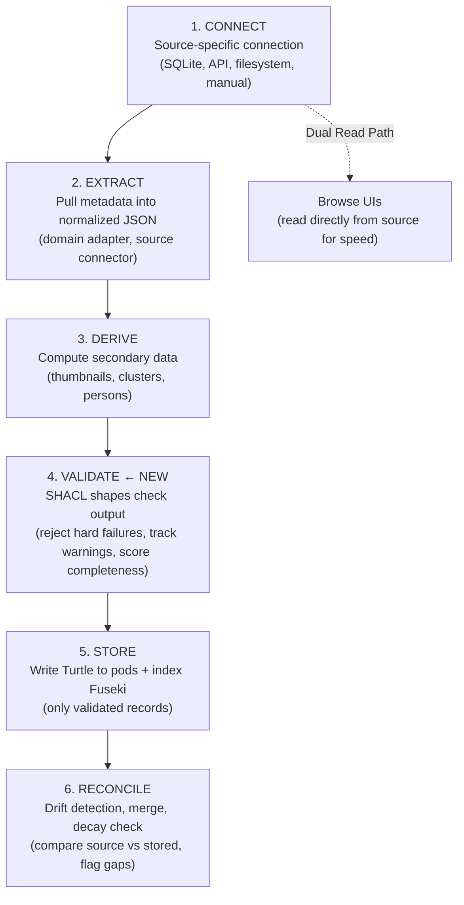

# ADR-010: Generalized Harvest Pipeline with Data Quality Gates

**Date**: 2026-02-18
**Status**: Accepted
**Decider**: Silas (architecture), Jeff (domain insight on patterns + quality concerns)
**References**: ADR-008 (cross-graph SPARQL), Music harvester (#47), Photos harvester (#68), Chorus ontology (#60), Bridwell patent US9552400B2

## Context

After building two production harvesters (Music: 66k tracks, Photos: 9,729 assets) and planning several more (Books, Blog, Garden, Movies, SMS), clear patterns have emerged. Each harvester was built independently, but they share the same structural pipeline, the same merge challenges, and the same quality gaps.

Concurrently, Jeff identified that data quality validation is missing from the pipeline entirely. Today, if a source has garbage data, we store garbage data. There's no gate between extraction and storage — no shape validation, no completeness metrics, no regression detection.

This ADR captures both the generalized pipeline pattern and the SHACL-based quality gate that should be part of every harvest.

## Problem

Three problems, one root cause:

1. **No standard pipeline.** Each harvester reinvents the same stages (connect, extract, normalize, write). Patterns discovered in one harvester (like SQLite direct read) aren't formalized for the next.

2. **No data quality gate.** Harvesters write whatever they extract. A macOS update breaking the SQLite schema would silently produce partial data. A source with missing fields writes incomplete triples. There's no validation between extraction and storage.

3. **No quality visibility.** Jeff can't answer "how healthy is my Photos data?" without manually inspecting files. There's no completeness metric, no freshness indicator, no regression signal.

## Decision

### The 6-Stage Harvest Pipeline

Every harvester follows this pipeline. Stages 1-2 are domain-specific. Stages 3-6 are increasingly generic and should share infrastructure.



### Stage Details

**Stage 1: CONNECT** — Domain-specific. Opens a read-only connection to the source.
- Apple Photos/Music: SQLite with `?mode=ro`
- WordPress: REST API with auth token
- Filesystem: Directory scan with glob patterns
- Manual entry: App UI form submission

**Stage 2: EXTRACT** — Domain adapter pulls raw data into normalized JSON matching the ontology schema. One service per source (e.g., `PhotoSqliteService`, `MusicSqliteService`). Isolation rule: a source schema change affects one file.

**Stage 3: DERIVE** — Compute secondary data from the extracted metadata.
- Thumbnails (resize from source images)
- Location clusters (group GPS coordinates by proximity)
- Person entities (extract from face detection data)
- Artist canonical names (normalize string variants)
- Dedup key computation (domain-specific composite keys)

**Stage 4: VALIDATE** — SHACL shapes check every record before storage. Three severity levels:

| Severity | Meaning | Action |
|----------|---------|--------|
| `sh:Violation` | Hard failure — required data missing or invalid | Reject record, log error |
| `sh:Warning` | Soft warning — optional data missing | Accept record, track gap |
| `sh:Info` | Completeness signal — nice-to-have data absent | Accept record, report metric |

Output: a **HarvestQualityReport** (see below) with per-run metrics.

**Stage 5: STORE** — Write validated records as Turtle files to SOLID pods. Index in Fuseki via named graphs. Only records passing Stage 4 hard validation are stored.

**Stage 6: RECONCILE** — Post-harvest consistency checks.
- Compare source record count vs stored count (drift detection)
- Identify orphaned records (in pod but not in source = deletion drift)
- Flag stale data (last harvest timestamp vs expected refresh cadence)
- Cross-source entity merge candidates (when multiple sources exist)

### SHACL Shape Contract

Each domain gets a shape file defining its data quality contract:

```
architect/shapes/
  photo-shapes.ttl      → Photo, PhotoAlbum, PhotoLocation, FaceDetection
  music-shapes.ttl      → Album, Track, Artist
  book-shapes.ttl       → Book
  glimmer-shapes.ttl    → Glimmer, GlimmerCollection
  capture-shapes.ttl    → CaptureItem
```

Example — Photo shape:

```turtle
@prefix sh: <http://www.w3.org/ns/shacl#> .
@prefix jb: <https://jeffbridwell.com/ontology#> .
@prefix xsd: <http://www.w3.org/2001/XMLSchema#> .

jb:PhotoShape a sh:NodeShape ;
    sh:targetClass jb:Photo ;

    # Hard requirements (sh:Violation)
    sh:property [
        sh:path jb:uuid ;
        sh:minCount 1 ;
        sh:maxCount 1 ;
        sh:datatype xsd:string ;
        sh:severity sh:Violation ;
        sh:message "Photo must have exactly one UUID"
    ] ;
    sh:property [
        sh:path jb:dateTaken ;
        sh:minCount 1 ;
        sh:datatype xsd:dateTime ;
        sh:severity sh:Violation ;
        sh:message "Photo must have a date taken"
    ] ;
    sh:property [
        sh:path jb:filename ;
        sh:minCount 1 ;
        sh:datatype xsd:string ;
        sh:severity sh:Violation ;
        sh:message "Photo must have a filename"
    ] ;

    # Value constraints (sh:Violation)
    sh:property [
        sh:path jb:latitude ;
        sh:minInclusive -90.0 ;
        sh:maxInclusive 90.0 ;
        sh:severity sh:Violation ;
        sh:message "Latitude must be between -90 and 90"
    ] ;
    sh:property [
        sh:path jb:longitude ;
        sh:minInclusive -180.0 ;
        sh:maxInclusive 180.0 ;
        sh:severity sh:Violation ;
        sh:message "Longitude must be between -180 and 180"
    ] ;

    # Soft warnings (sh:Warning)
    sh:property [
        sh:path jb:mediaSubtype ;
        sh:minCount 1 ;
        sh:severity sh:Warning ;
        sh:message "Photo missing media subtype classification"
    ] ;

    # Completeness metrics (sh:Info)
    sh:property [
        sh:path jb:latitude ;
        sh:minCount 1 ;
        sh:severity sh:Info ;
        sh:message "Photo has no GPS location"
    ] ;
    sh:property [
        sh:path jb:thumbnailPath ;
        sh:minCount 1 ;
        sh:severity sh:Info ;
        sh:message "Photo has no thumbnail"
    ] ;
    sh:property [
        sh:path jb:depictsPerson ;
        sh:minCount 1 ;
        sh:severity sh:Info ;
        sh:message "Photo has no face detections"
    ] .
```

### Harvest Quality Report

Each harvest run produces a quality report stored as RDF:

```turtle
@prefix jb: <https://jeffbridwell.com/ontology#> .
@prefix xsd: <http://www.w3.org/2001/XMLSchema#> .

<harvest/photos/2026-02-18> a jb:HarvestRun ;
    jb:domain "photos" ;
    jb:source <source/apple-photos-sqlite> ;
    jb:startedAt "2026-02-18T09:00:00Z"^^xsd:dateTime ;
    jb:completedAt "2026-02-18T09:01:19Z"^^xsd:dateTime ;
    jb:duration "PT79S"^^xsd:duration ;

    # Record counts
    jb:totalExtracted 9729 ;
    jb:validRecords 9680 ;
    jb:rejectedRecords 49 ;
    jb:warningRecords 412 ;
    jb:qualityScore 99.5 ;

    # Completeness dimensions
    jb:completeness [
        jb:dimension "gps" ;
        jb:coverage 0.602 ;
        jb:count 5856
    ] ;
    jb:completeness [
        jb:dimension "thumbnail" ;
        jb:coverage 0.997 ;
        jb:count 9700
    ] ;
    jb:completeness [
        jb:dimension "faces" ;
        jb:coverage 0.43 ;
        jb:count 4183
    ] ;
    jb:completeness [
        jb:dimension "mediaSubtype" ;
        jb:coverage 1.0 ;
        jb:count 9729
    ] ;

    # Comparison with previous run (drift detection)
    jb:previousRun <harvest/photos/2026-02-15> ;
    jb:recordDelta 6 ;
    jb:qualityDelta 0.2 .
```

This is queryable via SPARQL: "Show me harvest runs where quality dropped" or "Which domains have the lowest GPS coverage?"

### Dual Read Path

Browse UIs may read directly from source databases (Stage 1) for speed and freshness, bypassing Stages 3-6. This is the CQRS pattern:

| Read Path | Source | Use Case |
|-----------|--------|----------|
| **Operational** | Source database (SQLite) | Browse, filter, paginate, display |
| **Semantic** | Turtle → Fuseki | Cross-domain queries, graph traversal, reasoning |

The dual path is acceptable when:
- The source database is local and read-only accessible
- The browse UI needs real-time freshness
- The display fields are a subset of what the source provides
- Graph semantics are not needed for the specific view

The harvest pipeline continues independently, populating the knowledge graph on its own schedule.

### Cross-Source Merge Pattern

When a domain has multiple sources (e.g., Photos from Apple + Google Takeout):

1. **Harvest each source independently** — separate entities, separate provenance (`jb:personSource`)
2. **Identify overlap candidates** — by domain-specific dedup key, not by ML
3. **Present candidates for confirmation** — human validates the match
4. **Link with `owl:sameAs`** — preserves both source entities
5. **Create canonical entity** — `jb:mergedFrom` points back to sources

Wrong merges are worse than no merges. Always lazy merge.

### Dedup Keys by Domain

| Domain | Dedup Key | Why |
|--------|-----------|-----|
| Photos | filename + dateTaken | UUIDs differ across sources |
| Music | artist + album + track + discNumber | Titles alone aren't unique |
| Books | ISBN (primary), title + author (fallback) | ISBN is canonical when available |
| Blog | URL slug | WordPress permalink is stable |
| Captures | capturedAt + source + hash(content) | Timestamp + content fingerprint |

## Consequences

### Positive

- **Standardized pipeline.** New harvesters implement domain-specific Stages 1-3 and get Stages 4-6 for free.
- **Quality is measurable.** Every harvest run produces a report with pass rate, completeness, and drift signals. Jeff can see "Photos: 99.5% valid, 60% GPS" at a glance.
- **Regressions are visible.** A macOS update breaking the SQLite schema produces 0% valid records — SHACL catches it before bad data reaches the pods.
- **Completeness trends over time.** "GPS coverage went from 40% to 60% after adding SQLite extraction" — engineering work is visible in the metrics.
- **Chorus alignment.** Harvest quality gate = Chorus Build Gate. Same pattern: SHACL shapes = gate criteria, quality report = gate evaluation, reject/accept = pass/fail.

### Negative

- **SHACL validation adds runtime cost.** For 10k records this is negligible (<1 second). For 300k (SMS) it may need batching.
- **Shape maintenance burden.** Every ontology change needs corresponding shape updates. Shapes that fall behind the ontology produce false positives.
- **Dual read path creates consistency gap.** Browse UI shows real-time source data; graph shows last-harvest data. Acceptable tradeoff, but must be documented per domain.

### Neutral

- **Stage 6 (Reconcile) is not built yet.** This ADR defines it architecturally. Implementation priority is lower than Stages 1-5 — Wren's incremental sync brief addresses the sequencing.
- **Quality reports add data to Fuseki.** Each harvest run is ~20 triples. Negligible volume, high diagnostic value.

## Relationship to Other ADRs

- **ADR-003** (Visibility): SHACL shapes must be collection-scoped. A Photo shape validates photo properties, not cross-collection references.
- **ADR-008** (Cross-graph SPARQL): Quality reports are stored in their own named graph (`harvest/runs/`), queryable alongside domain data.
- **ADR-007** (Storage topology): All harvest I/O is local SSD. No network dependencies in the pipeline.

## Relationship to Patent US9552400B2

The harvest pipeline mirrors the patent's integration workflow:

| Patent Concept | Harvest Pipeline |
|---|---|
| ICD registration + validation | Extract + SHACL validate |
| Approval gates before deployment | Quality gate before pod storage |
| Semantic-level impact analysis | Drift detection (Stage 6) |
| Canonical model auto-enhancement | Ontology evolution as domains grow |
| Versioning + conflict detection | HarvestRun comparison (qualityDelta) |

The quality gate is the Build Gate from the Chorus pipeline applied to data, not code.

---

**Silas, 2026-02-18**
