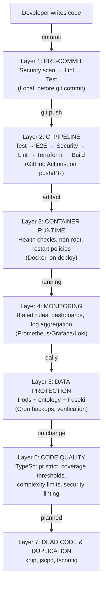
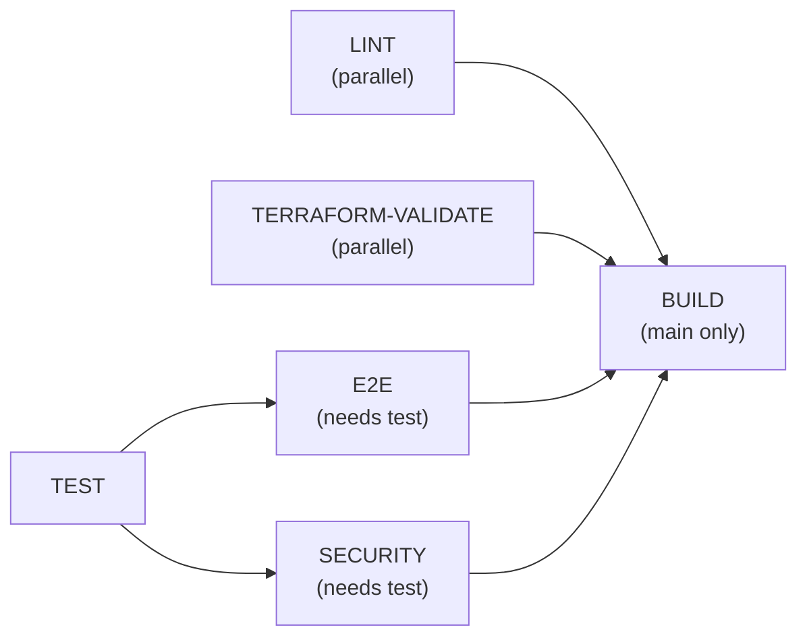

# Guardrails & Feedback Loops

Last updated: 2026-02-18
Status: Living document

How we keep the code honest when agents write fast. Every layer catches something different. If a layer is missing or weak, that's a gap.

---

## Design Principles

Before the tooling — the thinking behind the code. Drawn from Clean Code (Martin), Clean Architecture (Martin), and Domain-Driven Design (Evans), adapted for a personal semantic memory system built by a small team with AI agents.

### 1. The ontology is the innermost ring

All code depends on the model. The model depends on nothing. When Jeff has an insight, it enters the conceptual model first, gets architectural validation, then becomes code. Handlers, APIs, UI, harvesters — they all point inward toward the ontology. The ontology never reaches outward to know about Express, Fuseki, or file paths.

*From Clean Architecture: the dependency rule. Dependencies point inward toward business logic, never outward toward frameworks.*

### 2. Collections are bounded contexts

Each collection (Books, Property, Ideas, Projects, Blog) owns its domain logic. A book handler doesn't need to understand property structures. Cross-collection connection goes through the knowledge graph (SPARQL, ontology relationships), not through one handler reaching into another's data. Collections can evolve independently as long as they respect the shared ontology.

*From DDD: bounded contexts. Each context has its own model and rules. The shared kernel is the ontology.*

### 3. Harvesters use anti-corruption layers

When external data enters the system (Spotify, Google Photos, WordPress), it gets translated into Gathering's model at the boundary. External concepts don't leak into the ontology. The WordPress harvester already does this — it maps WordPress post metadata into `jb:BlogPost` triples. Every future harvester follows the same pattern: adapt at the edge, speak the internal language inside.

*From DDD: anti-corruption layer. Protect the domain model from external system concepts.*

### 4. Leave code cleaner than you found it

Not refactoring — tidying. When touching a file for a real task, small improvements are fair game: clearer names, extracting a duplicated block, removing dead code. Don't open a file just to clean it. Don't leave a file worse than you found it.

*From Clean Code: the boy scout rule.*

### 5. Build new features with clean layering; improve old code incrementally

New features (SMS capture, music harvester, vis.js graph) should separate concerns from the start: adapter → use case → domain model. Don't refactor the entire existing codebase to match — let old code improve naturally through the boy scout rule and as features touch it. The goal is a clean core that grows outward, not a rewrite.

*Pragmatic synthesis: Clean Architecture's ideal structure applied to new work, not imposed retroactively.*

### 6. Naming is architecture

The glossary is the ubiquitous language. When the team says "Collection," "Graduation," "Capture Channel," or "Curation," everyone means the same thing — and the meaning is documented. Code should use these terms. Variables, classes, and functions should reflect the domain model, not implementation details. If a concept needs a new name, it goes in the glossary first.

*From DDD: ubiquitous language. From Clean Code: meaningful names.*

### 7. Foundation before features

Security, data integrity, engineering pipelines, and observability are not features — they are the ground the features stand on. These four pillars must be roughly healthy before new capabilities ship. It's worth waiting on features if the foundation isn't sound.

The four pillars:
- **Security**: Auth, visibility enforcement, input validation, dependency scanning, secret management
- **Data**: Backups, ontology integrity (SHACL), Fuseki sync, pod structure
- **Pipelines**: Pre-commit hooks, CI gates, test coverage, dead code detection, API documentation
- **Observability**: Probes, scrape targets, dashboards, alerts, log aggregation

When adding a new feature, check: does the foundation support it? If a pillar has gaps that the feature will expose or depend on, close the gaps first. Roughly healthy, not perfect — then extend as we go.

*From Jeff: "I don't want to fix them later. Worth it to me to wait on features if this part is sound and resilient."*

---

## The Chain

Code moves through 7 layers before it's running in production. Each layer either **blocks** (hard gate — code doesn't advance) or **warns** (visible signal, human decides).

---

## Layer 1: Pre-Commit (Local)

**What runs**: `npm run precommit` = security → lint → all tests

| Check | Tool | Blocks? | What it catches |
|-------|------|---------|-----------------|
| Vulnerability scan | Trivy | **Yes** (exit 1) | Known CVEs in dependencies, hardcoded secrets, misconfigs |
| Lint | ESLint | **Yes** (--max-warnings=0) | Style violations, unused vars, security anti-patterns, complexity > 20 |
| Unit tests | Jest | **Yes** | Logic errors, regressions |
| Integration tests | Jest | **Yes** | Service interaction failures |
| Security tests | Jest | **Yes** | Missing headers, rate limit bypass, injection vulnerabilities |
| Performance tests | Jest | **Yes** | Response time regressions |

~~**Gap**: No git hook framework~~ **FIXED** (Kade, 2026-02-14) — Husky installed, `npm run precommit` wired as git pre-commit hook. Runs automatically on every commit.

---

## Layer 2: CI Pipeline (GitHub Actions)

**Trigger**: Push to `main` or PR to `main`

| Job | Tool | Blocks build? | What it catches |
|-----|------|---------------|-----------------|
| Test | Jest (all suites) | **Yes** | Same as pre-commit |
| E2E | Playwright (119 tests) | **Yes** | Browser-level regressions, visibility enforcement, write denial, CSRF |
| Security | npm audit + CodeQL | **Partial** (audit blocks, CodeQL best-effort) | Dependency CVEs, code-level vulnerabilities |
| Lint | ESLint | **Yes** | Same as pre-commit |
| Terraform | `terraform validate` | **Yes** | Infrastructure config errors |
| Build | `tsc` | **Yes** | Type errors, compilation failures |

**Gaps**:
- CodeQL runs with `continue-on-error: true` — findings don't block the build
- E2E tests skip SPARQL (no Fuseki in CI) — graph queries not tested end-to-end in CI
- No Dependabot/Renovate — dependency updates are manual

---

## Layer 2.5: Infrastructure Command Guardrails (Claude Code Hook)

**Added**: 2026-02-18 — Silas, after repeated infrastructure convention violations.

A `PreToolUse` hook intercepts every Bash command Kade's agent attempts and **blocks** prohibited infrastructure operations before they execute. The agent cannot bypass this — the hook fires at the Claude Code platform level.

**Location**: `engineer/.claude/hooks/infra-guardrails.sh`
**Config**: `engineer/.claude/settings.local.json` → `PreToolUse` → matcher: `Bash`

| Blocked Command | Redirect | Enforcement |
|-----------------|----------|-------------|
| `docker exec` | Fix code, redeploy via `app-state.sh` | **Deny** |
| `docker logs` | Loki via Grafana | **Deny** |
| `docker stop/rm/restart/kill` | `app-state.sh stop/restart` | **Deny** |
| `docker compose down` | `app-state.sh stop` | **Deny** |
| `kill/pkill/killall` | `app-state.sh stop` | **Deny** |
| `docker run` | Terraform manages containers | **Ask** (Jeff must approve) |
| `terraform apply/destroy` | `app-state.sh deploy/stop` | **Ask** (Jeff must approve) |

**Allowed**: `docker ps`, `docker images`, `docker build`, all non-Docker commands.

**Why this exists**: Documentation alone (CLAUDE.md rules) wasn't sufficient. The agent repeatedly used `docker logs`, `docker exec`, and direct container manipulation, creating cascading infrastructure problems that Jeff had to investigate and fix. This hook makes violations impossible rather than just discouraged.

**ADR-011 connection**: This hook enforces the "No More Docker Exec" discipline from ADR-011 Phase 4.

**Effectiveness confirmed (2026-02-19)**: Kade is now consistently using Loki for log queries and `app-state.sh` for lifecycle management. The hook normalized behavior within one session — Kade isn't fighting the guardrails, he's internalized the pattern. Jeff confirmed the shift. Lesson: platform enforcement (Layer 2.5) succeeds where documentation alone (Layer 4) fails. The educational error messages ("use Loki instead") accelerated habit formation beyond just blocking.

---

## Layer 3: Container Runtime

| Check | Config | What it catches |
|-------|--------|-----------------|
| Health check (Express) | wget localhost:3000 every 15s, 3 retries, 45s grace | App crash, unresponsive server |
| Health check (Fuseki) | wget localhost:3030/$/ping every 30s, 3 retries, 60s grace | Query engine failure |
| Non-root user | Dockerfile `USER appuser` | Container escape privilege escalation |
| Restart policy | `unless-stopped` | Automatic recovery from crashes |

**Gap**: No canary/blue-green deployment. No automated rollback. If a bad deploy goes out, recovery is manual (redeploy previous artifact or restore from backup).

---

## Layer 4: Monitoring & Alerting

**Stack**: Prometheus (metrics) → Grafana (dashboards) → Loki (logs) → Promtail (log shipping)

**Prometheus alerts** (20 rules, 9 groups):

| Alert | Trigger | Severity | Route |
|-------|---------|----------|-------|
| ServiceDown | `up == 0` for 1 min | CRITICAL | #all-gathering |
| ContainerRestarting | > 3 restarts/hour | WARNING | #silas |
| HighErrorRate | > 5% 5xx errors over 2 min | WARNING | #silas |
| HighLatency | P95 > 1s over 5 min | WARNING | #silas |
| HighMemoryUsage | > 90% for 5 min | WARNING | #silas |
| HighCPUUsage | > 90% for 5 min | WARNING | #silas |
| DiskSpaceWarning | > 85% disk for 5 min | WARNING | #silas |
| DiskSpaceLow | < 10% free for 5 min | CRITICAL | #all-gathering |
| EndpointDown | Blackbox probe fails 2 min | CRITICAL | #all-gathering |
| SecondaryMacOffline | ICMP fails 5 min | CRITICAL | #all-gathering |
| PrimaryMacUnreachable | ICMP fails 2 min | CRITICAL | #all-gathering |
| MeshDegraded | < 3/3 mesh nodes 5 min | WARNING | #silas |
| RouterDown | Router ICMP fails 2 min | CRITICAL | #all-gathering |
| InfraDeviceDown | Infra ICMP fails 5 min | CRITICAL | #all-gathering |
| EntertainmentDeviceDown | Device ICMP fails 10 min | WARNING | #silas |
| HighNetworkLatency | > 100ms to infra device | WARNING | #silas |
| C1DiskThreshold | Root disk > 90% | CRITICAL | #all-gathering |
| C3MemoryHeadroom | Memory > 85% | WARNING | #silas |
| C4AppUnreachable | App probe fails 2 min | CRITICAL | #all-gathering |
| C5FusekiUnreachable | Fuseki probe fails 2 min | CRITICAL | #all-gathering |

**Grafana alerts** (Loki-based, 3 rules):

| Alert | Trigger | Severity | Route |
|-------|---------|----------|-------|
| No team sessions in 48h | Zero session_start events | WARNING | #silas |
| Gate check failures | > 2 errors/hour in chorus ops | WARNING | #silas |
| HighErrorLogRate | > 10 errors/sec for 2 min | WARNING | #silas |

**Alert routing** (shipped 2026-02-21):
- Pipeline: Prometheus → Alertmanager → Slack Bot API → channels
- Grafana → Slack Bot API → channels (via API-configured contact points)
- Critical alerts → `#all-gathering` (visible to all roles)
- Warning alerts → `#silas` (Silas triages, escalates if needed)
- Resolved notifications sent automatically when alerts clear

**Application metrics**: Request counts, latency, memory usage, active sessions, pod operations, WordPress API calls.

**Dashboards**: App operations, node metrics, Docker containers, service overview, logs explorer, Chorus activity, home-cloud, home-network.

---

## Layer 5: Data Protection

| Mechanism | Schedule | Retention | Verified? |
|-----------|----------|-----------|-----------|
| Pod backup (Turtle files) | Daily 2am cron | 7 daily + 4 weekly | **Yes** — automatic verification |
| Ontology backup | Daily (with pods) | Same | **Yes** |
| Fuseki TDB2 backup | Daily (docker cp) | Same | **Yes** |
| Backup verification | After each backup | — | Checks: extraction, file count ±10%, .meta.ttl present, ontology present |

**Gap**: Phase 3 (off-machine copy) not yet implemented. All backups are local — a disk failure loses everything including backups.

---

## Layer 6: Code Quality Enforcement

| Mechanism | Tool | Threshold | What it catches |
|-----------|------|-----------|-----------------|
| Type safety | TypeScript `strict: true` | All strict checks | Type errors, null safety, implicit any |
| Coverage (global) | Jest | 80% lines/stmts, 75% functions, 60% branches | Untested code paths |
| Coverage (ACL service) | Jest | **95%** all metrics | Security-critical gaps |
| Coverage (visibility MW) | Jest | **95%** all metrics | Visibility enforcement gaps |
| Coverage (auth) | Jest | 90% functions, 80% lines | Auth bypass risks |
| Coverage (logger) | Jest | **100%** all metrics | Logging reliability |
| Function complexity | ESLint | Max 20 cyclomatic | Unmaintainable functions |
| Function length | ESLint | Warn at 80 lines | Overly long functions |
| Nesting depth | ESLint | Warn at 4 levels | Deep nesting / readability |
| Security patterns | eslint-plugin-security | Recommended rules | eval, injection, prototype pollution |
| Rate limiting | express-rate-limit | API: 500/15m, Auth: 10/15m, Webhook: 30/1m, Pods: 60/1m | Brute force, abuse |
| Security headers | Helmet.js | CSP, HSTS, X-Content-Type-Options, etc. | XSS, clickjacking, MIME sniffing |
| Turtle validation | Jena riot + SHACL | Syntax + shape conformance | Invalid RDF, ontology schema violations |

**Gap**: SHACL validation depends on Fuseki container running locally. Gracefully skips in CI — ontology schema violations aren't caught in the pipeline.

---

## Layer 7: Dead Code & Duplication

Shipped by Kade (2026-02-14).

| Tool | What it finds | Status |
|------|--------------|--------|
| knip | Unused files, unused exports, unused/unlisted dependencies | **Shipped** — 6 unused deps removed (808 packages pruned), 1 dead file removed, 1 unlisted dep installed. 17 unused exports + 29 unused types flagged (not removed). |
| jscpd | Copy/paste duplicate blocks across files | **Shipped** — 3.1% duplication (below 5% threshold) |
| tsconfig `noUnusedLocals` | Unused local variables at compile time | **Shipped** — enabled, 22 errors fixed |
| tsconfig `noUnusedParameters` | Unused function parameters at compile time | **Shipped** — enabled, 22 errors fixed |

---

## E2E Security Coverage

As of today (Kade's 3 sprints complete):

| Category | Tests | Coverage |
|----------|-------|----------|
| Write denial (non-admin blocked) | 10 | All collections |
| Visibility transitions (toggle + verify) | 15 | All collections × 3 user types |
| Structural gaps (coupling, defaults, leakage) | 12 | Ideas/Projects, default-deny, selective, home, CSRF |
| Collection CRUD | 73+ | Existing E2E suite |
| **Total E2E** | **119** | **~95%** of permutation space |

---

## What We Don't Have (Gaps Summary)

| Gap | Risk | Effort to fix |
|-----|------|---------------|
| ~~**No git pre-commit hook wiring**~~ | ~~Precommit checks only run if remembered~~ | **FIXED** — Husky installed (Kade, 2026-02-14) |
| ~~**No Dependabot/Renovate**~~ | ~~Stale dependencies accumulate~~ | **FIXED** — Dependabot config added (Kade, 2026-02-14) |
| ~~**CodeQL on best-effort**~~ | ~~Code-level vulns don't block builds~~ | **FIXED** — `continue-on-error` removed (Kade, 2026-02-14) |
| **No Fuseki in CI** | SPARQL queries untested in pipeline | Medium — add Fuseki service container |
| **SHACL skipped in CI** | Ontology violations not caught in pipeline | Medium — needs Fuseki in CI |
| ~~**No alert routing**~~ | ~~Alerts fire but nobody is notified~~ | **FIXED** — Alertmanager → Slack Bot API, Grafana → Slack Bot API (Silas, 2026-02-21). Critical → #all-gathering, Warning → #silas. |
| ~~**No automated rollback**~~ | ~~Bad deploys require manual intervention~~ | **DESIGNED** — ADR-011 deploy pipeline with rollback (Silas, 2026-02-18). Kade implements after Photos CQRS ships. |
| ~~**No infra command enforcement**~~ | ~~Agent uses docker exec/logs/kill despite CLAUDE.md rules~~ | **FIXED** — PreToolUse hook blocks prohibited commands (Silas, 2026-02-18) |
| **Backups local only** | Disk failure loses everything | Medium — rsync/rclone to off-machine |
| ~~**No dead code detection**~~ | ~~Unused code accumulates~~ | **FIXED** — knip + jscpd + tsconfig flags (Kade, 2026-02-14) |

---

## Recommended Priority (Remaining)

~~1. Husky pre-commit hook~~ **DONE**
~~2. Dependabot config~~ **DONE**
~~3. CodeQL blocking~~ **DONE**
~~4. knip + jscpd~~ **DONE**
5. **Off-machine backups** — Phase 3, destination decided: Mac mini M2 Pro `/Volumes/VideosNew/Gathering/backups/` (ADR-007). Brief shipped to Kade.
~~6. **Alert routing**~~ **DONE** — Alertmanager + Grafana → Slack Bot API (Silas, 2026-02-21).
7. **Fuseki in CI** — Service container in GitHub Actions for SPARQL tests.
8. **Pre-commit secret scanner** — detect-secrets hook (card #48, P3, assigned to Kade).

### Secrets Management (Phase 1 — COMPLETED 2026-02-16)

Full audit at `architect/briefs/2026-02-16-secrets-audit.md`. 17 unique secrets across 4 projects. Phase 1 hardening:
- Weak defaults strengthened (Fuseki, Grafana)
- WordPress hardcoded creds extracted to `.env` + Terraform variables
- Canonical-source comments on all `.env` files (tracks duplicates)
- No secrets committed to git (`.gitignore` correct across all projects)

— Silas
