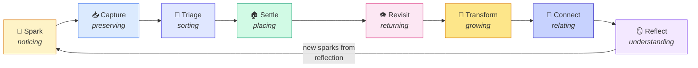
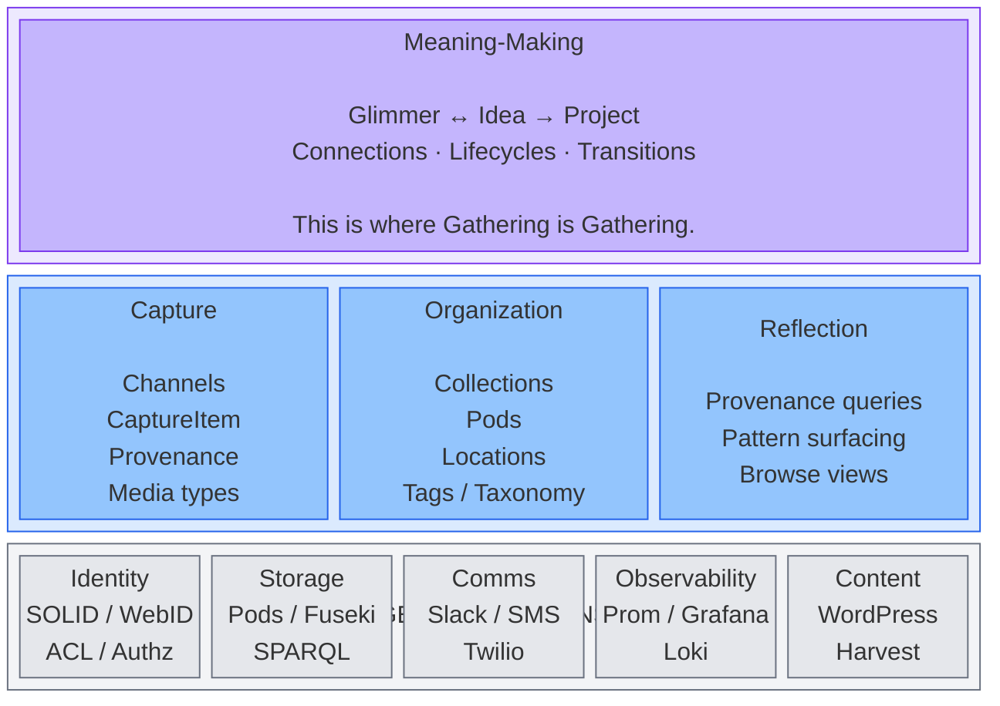
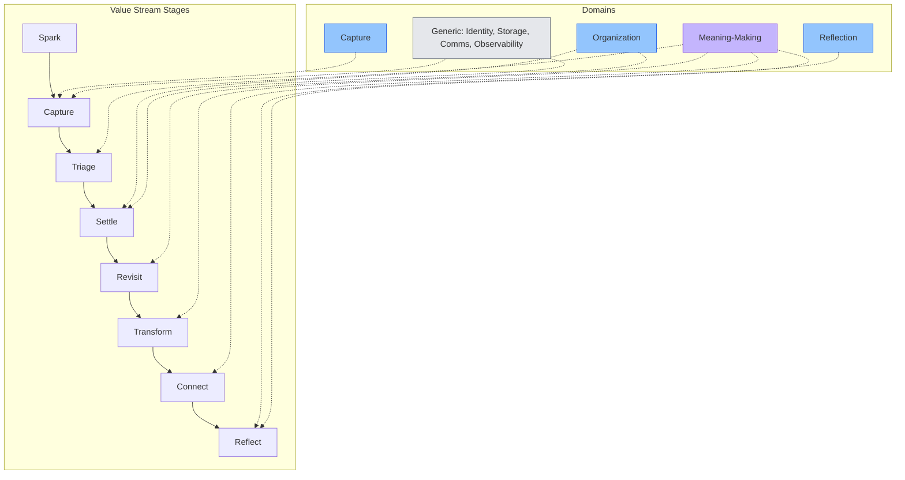
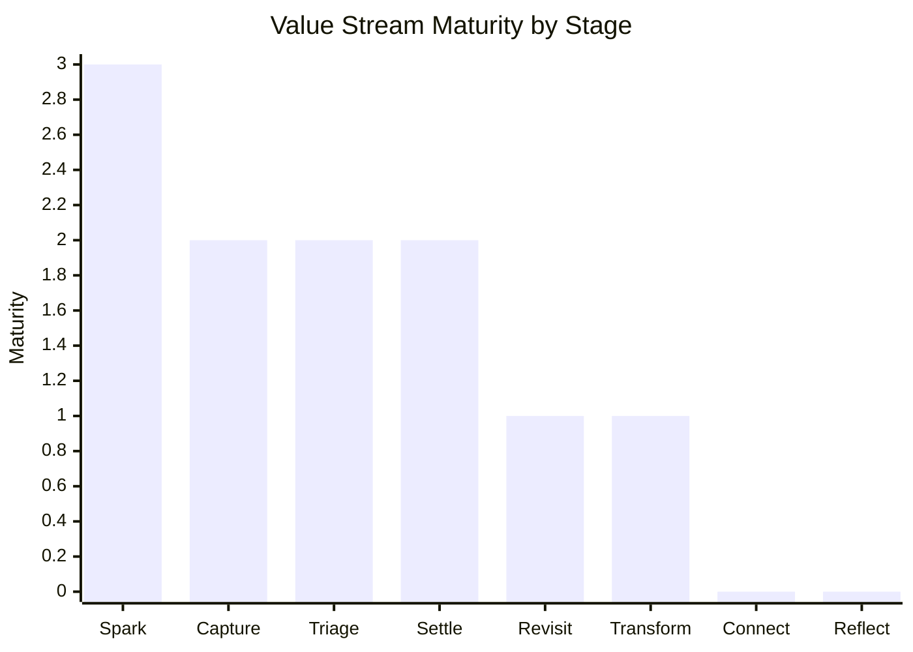
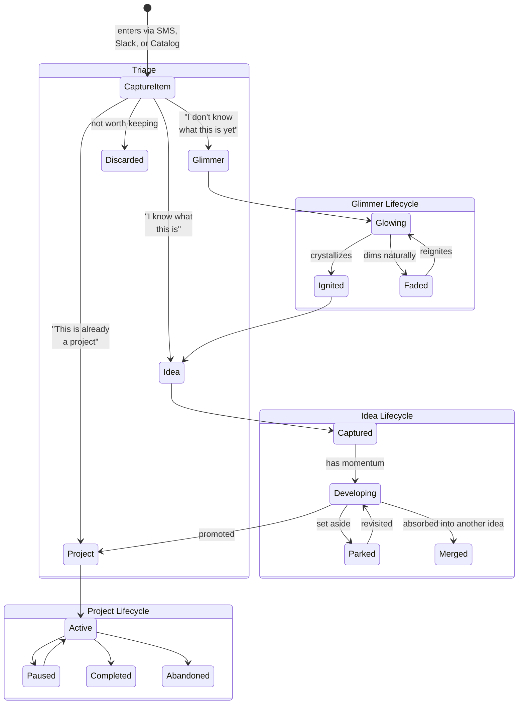

# Gathering Value Stream & Domain Map

**From**: Wren (PM)
**Date**: 2026-02-15
**Status**: Draft — foundational product doc, needs Jeff + Silas review
**Context**: Jeff asked "what is value, and how do we observe it?" This doc answers that by mapping the value stream end-to-end and identifying the domains that support each stage.

---

## The Value Stream

Gathering's value isn't in storing data. It's in the movement from **spark to self-understanding**. The stream is a cycle — reflection generates new sparks.

### Stage Definitions

| # | Stage | What happens | The act | Where value lives |
|---|-------|-------------|---------|-------------------|
| 1 | **Spark** | Something happens in the world worth preserving. A thought on a walk, a photo, a link, a conversation. | Noticing | Outside the system — Gathering can't create sparks, only catch them. |
| 2 | **Capture** | The spark enters the system through a channel: SMS, Slack, or Catalog. | Preserving | Low friction. The tool disappears. If you think about the tool, it's failing. |
| 3 | **Triage** | First act of meaning-making: "What is this?" Glimmer, Idea, bookmark, property item? | Sorting | Intentional routing, not dumping. Jeff decides what something is, and the system respects that decision. |
| 4 | **Settle** | It lands in its collection with initial status. Glimmer → Glowing. Idea → Captured. | Placing | Everything has a home. Nothing floats unrouted. |
| 5 | **Revisit** | Jeff comes back. Browses Glimmers. Reviews Ideas. Checks Projects. | Returning | The system earns its keep by making it easy and rewarding to return. |
| 6 | **Transform** | Things move through lifecycles. Glimmer ignites to Idea. Idea promotes to Project. Faded reignites. | Growing | Transitions are visible evidence of growth. The system tracks what changed and when. |
| 7 | **Connect** | Relationships emerge. A Glimmer links to an Idea. Two Ideas merge. A pattern crosses collections. | Relating | Connections Jeff wouldn't have seen without the system. This is where self-understanding starts. |
| 8 | **Reflect** | Jeff steps back and sees patterns. When am I most generative? What themes recur? What persists? | Understanding | The payoff. Provenance, lifecycle history, connection graphs — all in service of this moment. |

### The Cycle

Reflect feeds Spark. New understanding generates new questions. An Idea throws off Glimmers (`sparkedFrom`). A pattern noticed in the garden leads to a new capture the next morning. The system is a **generative cycle**, not a filing cabinet.

---

## Observing Value at Each Stage

| Stage | Observable Signal | Healthy | Unhealthy |
|-------|-------------------|---------|-----------|
| **Capture** | Captures per week by channel | Steady flow across channels, SMS from walks, Catalog from desk time | Nothing coming in, or only one channel used (others have too much friction) |
| **Triage** | Triage queue depth, routing distribution | Queue stays short, items route to varied destinations | Queue grows unprocessed, or everything routes to the same place (not sorting, dumping) |
| **Settle** | Items per collection | Collections grow organically | Empty collections, or one collection absorbs everything |
| **Revisit** | Browse frequency, time between capture and first revisit | Jeff returns to Glimmers and Ideas regularly | Captured items never visited again |
| **Transform** | Lifecycle transitions per month | Glimmers ignite, Ideas develop, Projects complete | Everything stays in initial status (Glowing forever, Captured forever) |
| **Connect** | Cross-collection links, relationship density | Connections grow over time, especially across domains | Items are islands — captured but unconnected |
| **Reflect** | Qualitative — Jeff's monthly reflection | "I saw something about myself I didn't know" | "I haven't looked at this in weeks" |

**The single most important metric**: Does Jeff return? Capture without revisiting is a box in the attic. The value lives in the return.

---

## The Domain Map

Four layers, from where the unique value lives to what we buy off the shelf.

### Core Domain: Meaning-Making

This is where Gathering is Gathering. Everything else exists to serve this.

| Concept | What it is | Ontology state |
|---------|-----------|----------------|
| **Glimmer** | Pre-idea. Bright, fleeting, worth revisiting. "I don't know what this is yet." | Designed (Silas v0.6.0), not built |
| **Idea** | Formed thought. Has enough shape to describe and develop. | Built (v0.5.1) |
| **Project** | Committed work. Has tasks, timeline, deliverables. | Built (v0.5.1) |
| **Lifecycle transitions** | Glimmer→Ignited→Idea, Idea→Promoted→Project, Faded→Reignited | Partially built (Idea→Project exists, Glimmer transitions designed) |
| **Connections** | ignitedTo, sparkedFrom, mergedInto, relatedTo | Partially built (promotedTo exists, Glimmer relations designed) |

**What makes this the core**: Any app can capture and organize. The meaning-making cycle — triage as an act of understanding, lifecycles as visible growth, connections as emergent self-knowledge — that's what Gathering does that a notes app doesn't.

### Supporting Domain: Capture

| Concept | What it is | State |
|---------|-----------|-------|
| **CaptureItem** | Raw inbound material before triage | Built |
| **Channels** | SMS (Twilio), Slack, Catalog (Upload page) | SMS built, Slack partially, Catalog = book upload |
| **Provenance** | `capturedVia`, `capturedAt` — how and when something entered | Designed (routing refinement doc), not built |
| **Media types** | Book, Record, CD, Magazine, Plant, Tool, Seed | Book built, Record/CD/Magazine in UI, Plant/Tool/Seed proposed |

### Supporting Domain: Organization

| Concept | What it is | State |
|---------|-----------|-------|
| **Collections** | Pod-based groupings: books, ideas, projects, property, glimmers | Built (except glimmers) |
| **Locations** | Physical placement: House→Room→Bookcase→Shelf, Garden→Bed→Section | Built for property |
| **Tags/Taxonomy** | Classification system across collections | Built (jb:Taxonomy) |
| **Visibility** | Public/Private/Selective per resource and collection | Built (ACL + .meta.ttl) |

### Supporting Domain: Reflection

| Concept | What it is | State |
|---------|-----------|-------|
| **Provenance queries** | "When am I most generative? Which channel produces the best ideas?" | Not built — needs provenance data first |
| **Lifecycle queries** | "What's been Glowing longest? What ignited recently?" | Not built — needs Glimmer lifecycle |
| **Connection queries** | "What Glimmers led to this Idea? What Ideas sparked new Glimmers?" | Not built — needs connection relations |
| **Browse views** | Glimmer List, Idea browser, Project dashboard | Partially built (Ideas, Projects). Glimmer List designed. |

---

## Which Domains Support Which Stages

**Key insight**: Meaning-Making touches five of eight stages. It IS the value stream. Capture and Organization are necessary plumbing. Reflection is the payoff.

---

## Current State: Where Are We Strong, Where Are We Weak?

> **3** = Healthy &nbsp; **2** = Partially built &nbsp; **1** = Minimal &nbsp; **0** = Not built

| Stage | Assessment |
|-------|-----------|
| **Spark** | Can't control this — but low-friction capture means fewer sparks are lost. |
| **Capture** | SMS works (v2). Catalog works for books. Slack is one-directional. Two of three channels functional. |
| **Triage** | Page exists, routing works for Ideas/Projects/Property. Missing: Glimmer destination, provenance tracking. |
| **Settle** | Items land in pods correctly. Missing: Glimmer collection. |
| **Revisit** | Ideas list exists. Projects list exists. No Glimmer browse view. No "what's new since I last looked" surface. |
| **Transform** | Idea status changes work. No Glimmer lifecycle. No visible transition history. |
| **Connect** | Very weak. No cross-collection links surfaced in UI. SPARQL can query them but nothing presents connections to Jeff. |
| **Reflect** | Not built. No provenance analysis, no pattern surfacing, no "what does this tell me about myself?" |

**Reading this**: We're strong on the left side of the stream (getting things in) and weak on the right side (getting understanding out). This is natural — you build the pipe before you drink from it. But the right side is where the unique value lives.

---

## What This Means for Prioritization

The foundation sprint built the generic domains (observability, storage, API docs). The style guide and Glimmer work strengthen the supporting domains (organization, capture routing).

**The next horizon should push toward the right side of the stream.**

| Priority | What | Value stream stage | Domain |
|----------|------|-------------------|--------|
| 1 | Glimmer class + routing + browse | Triage, Settle, Revisit | Meaning-Making + Organization |
| 2 | Provenance on all routed items | Capture, Reflect | Capture + Reflection |
| 3 | Lifecycle transition history | Transform | Meaning-Making |
| 4 | Connection UI (show related items) | Connect | Meaning-Making |
| 5 | Reflection dashboard (capture patterns, lifecycle stats) | Reflect | Reflection |
| 6 | Catalog page expansion (Plant/Tool/Seed) | Capture | Capture + Organization |

Items 1-2 are what we're already sequenced for. Items 3-5 are the "right side of the stream" work that turns Gathering from a capture tool into a self-understanding tool. Item 6 expands the left side (more mobility).

---

## The Meaning-Making Lifecycle

The core domain in detail — how things move through Gathering.

---

## Mind Map Nodes ↔ Value Stream (Updated 2026-02-26)

The home page mind map is the primary navigation surface. Node names should mirror the agricultural cycle and map cleanly to the value stream.

| Mind Map Node | Subtitle | Value Stream Stages | The Act |
|---------------|----------|-------------------|---------|
| **Sowing** | capture & seeds | Spark, Capture | Planting — raw material enters the system |
| **Cultivating** | ideas & growth | Triage, Settle | Tending — sorting, placing, giving things a home |
| **Harvesting** | collections | Revisit, Transform | Collecting — returning to what's matured, moving it forward |
| **Gathering** | find & discover | Connect | Pulling together — cross-collection search and discovery |
| **Reflecting** | inner world | Reflect | Understanding — patterns, meaning, self-knowledge |
| **About** | who & what | — | Identity — Jeff's profile and product context |
| **Admin** | tools & settings | — | Operations — system management |

**Why this naming**: "Gathering" as a node name was confusing — same word as the app. Renaming Capture to **Sowing** and Search to **Gathering** makes the metaphor coherent: Sow → Cultivate → Harvest → Gather → Reflect. The app name covers the whole cycle; no single node claims it.

## Navigation Through the Value Stream Lens

Jeff's instinct: rename and reorder the nav to reflect the stream, not the admin structure.

```mermaid
graph LR
    subgraph current["Current Nav"]
        direction TB
        H1[Home]
        P1[Projects]
        C1[Collections<br/>Blog, Books, Property...]
        A1[Admin<br/>Capture Triage, Users, API Docs]
    end

    subgraph proposed["Value-Stream Nav"]
        direction TB
        H2[Home]
        S2["Sowing (Capture)<br/>SMS Triage · Catalog"]
        G2["Cultivating<br/>Glimmers · Ideas · Projects"]
        C2["Harvesting<br/>Collections"]
        D2["Gathering<br/>Search · Discovery"]
        O2["Reflecting<br/>Dashboard · Patterns"]
        A2["Admin<br/>Users · Model & Data"]
    end

    current -- "reorient around<br/>the value stream" --> proposed

    style S2 fill:#FEF3C7,stroke:#D97706
    style G2 fill:#D1FAE5,stroke:#059669
    style C2 fill:#DBEAFE,stroke:#2563EB
    style D2 fill:#C7D2FE,stroke:#4338CA
    style O2 fill:#F3E8FF,stroke:#7C3AED
```

Sowing → Cultivating → Harvesting → Gathering → Reflecting. The nav follows the agricultural cycle. Capture is the entry point, not buried under Admin. Cultivating (Glimmer→Idea→Project) is the core journey. Harvesting is the organized output. Gathering pulls it all together. Reflecting is the payoff.

---

## Open Questions

1. **For Jeff**: Does this stream match your experience of how you actually use (or want to use) the system? Is there a stage missing?
2. **For Silas**: Does the domain map align with the ontology's current shape? Is Meaning-Making the right framing for the core domain, or would you draw the boundary differently?
3. **For the team**: Should Reflection become an explicit part of the ontology (e.g., saved queries, reflection entries), or does it stay as a UI/query concern?

— Wren
