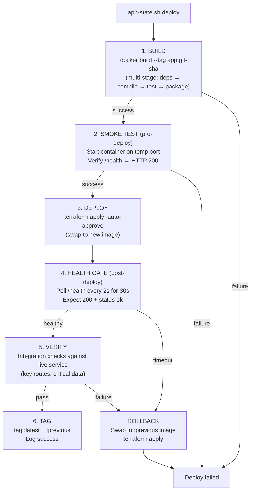

# ADR-011: Production-Like Deployment Pattern

**Date**: 2026-02-18
**Status**: Superseded by ADR-019 (Native Service Architecture) — Docker containers replaced by LaunchAgents 2026-03
**Decider**: Jeff (directive), Silas (architecture)
**References**: ADR-007 (storage topology), ADR-010 (harvest pipeline), infrastructure-constraints.md

## Context

The current deployment model treats containers as mutable environments. App-state.sh scripts run `terraform apply -auto-approve` with no health verification, no smoke tests, and no rollback path. When something breaks, the fix is `docker exec` into the container or manual intervention.

Recent incidents caused by this model:
- Docker metadata DB corruption from disk-full event (2026-02-17) — all containers died, no recovery path
- Dual-start bug: app-state.sh started both Docker container AND local Node on port 3000
- better-sqlite3 compilation failure inside container — required architecture review to unblock
- 882-line app-state.sh mostly dealing with port conflicts and stale state — symptoms, not solutions

Jeff's directive: "Treat deployments like a production environment. A deploy should work all the way or not at all."

## Current State

### Infrastructure Inventory (14 containers)

| Container | Project | Health Check | Image Tag | Rollback |
|-----------|---------|-------------|-----------|----------|
| jeff-bridwell-personal-site-app | personal-site | None | None | None |
| jeff-bridwell-personal-site-webvowl | personal-site | Yes | Static | None |
| jeff-bridwell-personal-site-fuseki | personal-site | None | Static | None |
| wordpress-blog | wordpress | None | `latest` | None |
| wordpress-mysql | wordpress | None | `mysql:8.0` | None |
| wordpress-mailhog | wordpress | None | Static | None |
| ~~slack-bridge~~ | messages | — | **Retired** (2026-03) | Slack deprecated |
| vikunja | messages | None | Static | None |
| prometheus | observability | None | Static | None |
| grafana | observability | None | Static | None |
| loki | observability | None | Static | None |
| promtail | observability | None | Static | None |
| node-exporter | observability | None | Static | None |
| alertmanager | observability | None | Static | None |

**Only 2 of 14 containers have health checks.** No container has rollback capability. No container is tagged beyond `latest`.

### Current Problems

1. **Two Dockerfiles for personal-site**: Root Dockerfile (Node 20, multi-stage) vs terraform/Dockerfile (Node 18, simple). Which one runs?
2. **No health verification after deploy**: `terraform apply` succeeds if the container starts, even if the app crashes immediately.
3. **No smoke tests**: No verification that routes respond, database connects, or data is accessible.
4. **No rollback**: If a deploy breaks, the only option is to fix forward or manually revert code.
5. **Port conflict management is 400+ lines**: Symptoms of containers not being cleanly managed.
6. **`docker exec` as a fix**: Modifying running containers creates drift between what's deployed and what's in code.

## Decision

### Principle: Immutable, Verified, Reversible

Every deploy follows three rules:
1. **Immutable**: Container images are built with everything they need. No runtime modification.
2. **Verified**: Every deploy passes a health check before being declared successful.
3. **Reversible**: Previous image is tagged and available for instant rollback.

### The Deploy Pipeline



**Rollback** at any point after Stage 3:
```
docker tag {app}:previous {app}:latest
terraform apply -auto-approve
```

### Health Check Contract

Every custom-built container exposes a `/health` endpoint:

```json
{
  "status": "ok",
  "version": "abc1234",
  "uptime": 45,
  "checks": {
    "fuseki": "ok",
    "pods": "ok",
    "disk": "ok"
  }
}
```

Docker HEALTHCHECK directive in every Dockerfile:

```dockerfile
HEALTHCHECK --interval=30s --timeout=5s --start-period=10s --retries=3 \
  CMD wget -qO- http://localhost:3000/health || exit 1
```

Third-party containers (MySQL, Prometheus, Grafana) use their native health mechanisms:

```hcl
# MySQL
healthcheck {
  test     = ["CMD", "mysqladmin", "ping", "-h", "localhost"]
  interval = "30s"
  timeout  = "5s"
  retries  = 3
}

# Fuseki
healthcheck {
  test     = ["CMD", "wget", "-qO-", "http://localhost:3030/$/ping"]
  interval = "30s"
  timeout  = "5s"
  retries  = 3
}
```

### Multi-Stage Dockerfile Pattern

One Dockerfile per project. No duplicates. Dependencies compiled at build time.

```dockerfile
# Stage 1: Dependencies
FROM node:20-alpine AS deps
WORKDIR /app
RUN apk add --no-cache build-base python3
COPY package*.json ./
RUN npm ci --ignore-scripts && npm rebuild better-sqlite3

# Stage 2: Build
FROM deps AS build
COPY . .
RUN npm run build:all

# Stage 3: Production
FROM node:20-alpine AS production
WORKDIR /app
RUN apk add --no-cache wget
COPY --from=build /app/dist ./dist
COPY --from=build /app/node_modules ./node_modules
COPY --from=build /app/package.json ./
COPY --from=build /app/public ./public
COPY --from=build /app/views ./views

# Health check
HEALTHCHECK --interval=30s --timeout=5s --start-period=10s --retries=3 \
  CMD wget -qO- http://localhost:3000/health || exit 1

EXPOSE 3000
USER node
CMD ["node", "dist/app.js"]
```

Key differences from today:
- **`npm ci`** instead of `npm install` (deterministic, faster, respects lockfile)
- **Native modules compiled in build stage** (not at container startup)
- **Only production artifacts in final image** (no source, no devDependencies)
- **Non-root user** (`USER node`)
- **HEALTHCHECK built into image**
- **No bind-mounts for source code** (image is self-contained)

### Standardized app-state.sh

All three projects use the same script structure:

```bash
#!/bin/bash
set -euo pipefail

# Commands: deploy | start | stop | restart | status | rollback | logs
# deploy = build + smoke + apply + health + verify + tag
# start  = apply only (uses existing image)
# stop   = terraform destroy containers
# rollback = swap to previous tagged image

APP_NAME="jeff-bridwell-personal-site"
SCRIPT_DIR="$(cd "$(dirname "${BASH_SOURCE[0]}")" && pwd)"
HEALTH_URL="http://localhost:3000/health"
HEALTH_TIMEOUT=30

deploy() {
  local SHA=$(git -C "$SCRIPT_DIR/.." rev-parse --short HEAD)
  local IMAGE="${APP_NAME}:${SHA}"

  log "BUILD" "Building image $IMAGE"
  docker build -t "$IMAGE" "$SCRIPT_DIR/.." || fail "Build failed"

  log "SMOKE" "Running smoke test"
  smoke_test "$IMAGE" || fail "Smoke test failed"

  log "DEPLOY" "Applying Terraform"
  cd "$TERRAFORM_DIR" && terraform apply -auto-approve \
    -var="image_tag=$SHA" || fail "Terraform apply failed"

  log "HEALTH" "Waiting for health check"
  wait_healthy "$HEALTH_URL" "$HEALTH_TIMEOUT" || {
    log "ROLLBACK" "Health check failed, rolling back"
    rollback
    fail "Deploy failed health check — rolled back"
  }

  log "VERIFY" "Running integration checks"
  verify || {
    log "ROLLBACK" "Verification failed, rolling back"
    rollback
    fail "Deploy failed verification — rolled back"
  }

  log "TAG" "Tagging images"
  docker tag "$IMAGE" "${APP_NAME}:previous" 2>/dev/null || true
  docker tag "$IMAGE" "${APP_NAME}:latest"

  log "DONE" "Deploy successful: $IMAGE"
}

smoke_test() {
  local image=$1
  local cid=$(docker run -d --rm -p 13000:3000 "$image")
  sleep 5
  local status=$(curl -s -o /dev/null -w "%{http_code}" http://localhost:13000/health 2>/dev/null)
  docker stop "$cid" >/dev/null 2>&1
  [ "$status" = "200" ]
}

wait_healthy() {
  local url=$1 timeout=$2 elapsed=0
  while [ $elapsed -lt $timeout ]; do
    if curl -sf "$url" >/dev/null 2>&1; then
      return 0
    fi
    sleep 2
    elapsed=$((elapsed + 2))
  done
  return 1
}

rollback() {
  docker tag "${APP_NAME}:previous" "${APP_NAME}:latest"
  cd "$TERRAFORM_DIR" && terraform apply -auto-approve
}
```

### What This Replaces

| Today (882 lines) | Production-Like (~150 lines) |
|---|---|
| Port conflict detection + cleanup | Containers manage their own ports |
| PID file management | Docker manages process lifecycle |
| `pgrep` + `kill` cleanup | `docker stop` + health checks |
| TIME_WAIT socket workarounds | Clean container teardown |
| Dual-start detection | Single runtime path (Docker only) |
| No verification | Health gate + smoke test + integration verify |
| No rollback | Tagged images, instant rollback |

### Bind-Mount Policy

| Mount Type | Allowed | Example |
|-----------|---------|---------|
| **Data volumes** (Docker named volumes) | Yes | MySQL data, Fuseki TDB2, Grafana state |
| **Config files** (read-only bind) | Yes | PHP config, Prometheus rules, TLS certs |
| **Source code** | No | Project directory into container |
| **Apple system databases** (read-only bind) | Yes | Photos SQLite (read-only, specific path) |

Source code goes INTO the image at build time. The running container is self-contained.

Exception: Apple Photos SQLite must be bind-mounted because it's a live database that the OS updates. This is a read-only mount to a specific file path, not a source code mount.

## Implementation Plan

### Phase 1: Health Checks (Kade, 1 day)
1. Add `/health` endpoint to Express app (checks Fuseki, pods, disk)
2. Add `HEALTHCHECK` to Dockerfile
3. Add health checks to Terraform for MySQL, Fuseki
4. Consolidate to one Dockerfile (delete terraform/Dockerfile)

### Phase 2: Deploy Pipeline (Kade, 1 day)
1. Rewrite app-state.sh with deploy command (build → smoke → apply → health → verify → tag)
2. Multi-stage Dockerfile (deps → build → production)
3. Image tagging with git SHA
4. Rollback command

### Phase 3: All Projects (Kade, 1 day)
1. WordPress app-state.sh gets the same pattern
2. Observability stack gets health checks in Terraform
3. Slack bridge already has health check — verify it follows the pattern

### Phase 4: No More Docker Exec (Team discipline)
1. If something breaks, fix the code and redeploy
2. `docker exec` is for debugging only (reading logs, checking state)
3. Never modify files inside a running container

## Consequences

### Positive

- **Deploys are atomic**: works completely or rolls back.
- **Regressions are caught immediately**: health gate fails, rollback triggers.
- **Rollback is instant**: `app-state.sh rollback` swaps to previous image.
- **app-state.sh shrinks from 882 lines to ~150**: complexity was symptoms, not solutions.
- **Container drift eliminated**: image is built once, runs identically every time.
- **Disk crisis recovery is simpler**: `docker system prune` + `app-state.sh deploy` rebuilds everything from code.

### Negative

- **Build time increases**: multi-stage build takes ~60 seconds vs ~10 seconds for bind-mount start. Acceptable for personal infrastructure.
- **Live-reload during development lost**: can't edit source and see changes immediately. Use `npm run dev` locally for development, Docker for "production" testing.
- **Learning curve**: team (Kade) needs to adopt the deploy pattern instead of `terraform apply`.

### Neutral

- **Terraform still manages container lifecycle**: this ADR doesn't replace Terraform. It wraps it with verification.
- **Named volumes persist across deploys**: MySQL data, Fuseki TDB2, pod data survive image swaps.
- **Apple Photos SQLite mount is an exception**: read-only bind-mount to a system database. Documented, justified, bounded.

## Relationship to Other ADRs

- **ADR-007** (Storage): Named volumes for persistent data align with "all I/O local SSD" constraint.
- **ADR-010** (Harvest pipeline): Harvest runs inside the container. If the container is healthy, the pipeline works.
- **Infrastructure constraints** (C1-C7): Health checks on disk usage (C1, C2) can be part of the `/health` endpoint.

---

**Silas, 2026-02-18**
