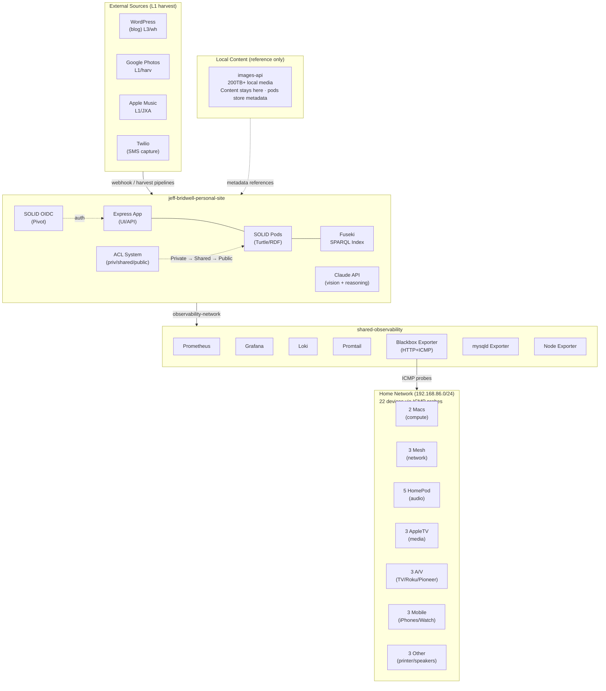

# System Architecture

Last updated: 2026-05-27

## Borg domains (Silas-owned)

Borg now spans thirteen domains. The 13th — **crawler** — lands the first **instance contract** (`source → target → cadence → cost`) and is the template the other twelve will inherit. See [architecture/crawler-as-13th-borg-domain.md](architecture/crawler-as-13th-borg-domain.md) for the synthesis (and the 2-heralds: code-herald + test-herald decomposition proposed for Wren ACK).

Companion design docs (Wren, #3069/#3071):
- [crawler-instance-model.html](../../designing/docs/crawler-instance-model.html) — to-be contract
- [crawler-dependency-map.html](../../designing/docs/crawler-dependency-map.html) — verified writers→outputs→consumers
- [crawler-asis-tobe.md](../../designing/docs/crawler-asis-tobe.md) — the lens (AS-IS storm → TO-BE registry)

---

## Vision

**Semantic memory layer** — a living model of Jeff's world built on semantic web principles. Own the metadata, reference the content. Privacy-first, publish-when-ready. The value is in the connections across sources that no single service can see.

See `../jeff-bridwell-personal-site/docs/product-vision.pdf` for full vision doc.

## System Overview

## Key Boundaries

### Ownership Model
- **shared-observability** owns the Docker network and exporters
- **Each app** owns its own Terraform config to join the network
- Changes to shared-observability trigger downstream review

### Boundary Checking (ADR-013)
Cross-cutting operating model concern: how roles verify their dependencies haven't been broken.
- **Three tiers**: Public / Internal / Private (mirrors SOLID visibility model from ADR-003)
- **Per-role manifest**: `.boundaries.yml` declares dependencies and sensitivity
- **Three enforcement points**: PreToolUse hook (read gating), bridge scrubbing (Slack→API), memory scrubbing (write-time)
- **Two change signals**: `[boundary]` for contract changes, `[infra]` for operational events
- **Session-start check**: Automatic scan for `[boundary]` commits affecting declared dependencies

### Structured Logging Contract
All components emit structured JSON logs to Loki. Required fields:

| Field | Required | Example | Purpose |
|-------|----------|---------|---------|
| `timestamp` | Yes | `2026-02-18T23:50:00.000Z` | When |
| `level` | Yes | `info`, `warn`, `error` | Severity |
| `appName` | Yes | `photos-harvester`, `chorus-audit` | Source system |
| `component` | Yes | `validate`, `store`, `hook` | Pipeline stage or subsystem |
| `domain` | Yes* | `Music`, `Photos`, `Books`, `Blog` | Business domain (*system ops may omit) |
| `action` | Recommended | `harvest`, `validate`, `browse`, `import` | What happened |
| `resourceUri` | Recommended | `gathering:photo/2024-06-15-IMG_4423` | Instance-level traceability |
| `correlationId` | Recommended | `harvest-run-2026-02-18-001` | Ties related events together |
| `message` | Yes | Human-readable description | What went wrong or right |

This enables: domain-scoped queries (`{domain="Music"}`), instance tracing (alert → resourceUri → pod data), pipeline observability (action = ADR-010 stage), and cross-domain correlation.

### Data Flow
- Native content (blog, ideas, property) → Turtle files in pods → Fuseki index
- External sources → harvest pipeline → ICD validation gate → L1 metadata in pods → Fuseki index
- Local media (200TB) → images-api serves content; pods store metadata references
- WordPress → webhook → Express app → SOLID pod sync (L3 — full content)
- All projects → Promtail → Loki (logs)
- All projects → Prometheus (metrics)

### Content Ingestion Tiers
- **L1 — Catalog metadata**: Most external sources. Metadata harvested, content stays in source.
- **L2 — Rich metadata + relationships**: Selective enrichment where personal meaning matters.
- **L3 — Content + metadata**: Authored/owned content (blog posts, ideas, property).
- Tiers are a spectrum — L1 promotes to L2 additively (same URIs, add triples). See `content-ingestion-matrix.md`.

### Auth Boundary
- SOLID OIDC via Pivot for authentication
- Two-layer visibility: Turtle `jb:hasVisibility` = declaration (source of truth), ACL `.acl` = enforcement artifact
- Visibility enforcement via `collectionVisibilityMiddleware` reading Turtle declarations (ADR-003)
- SPARQL access admin-only; collection handlers read filesystem, not Fuseki (audit 2026-02-14). Scoped query helper needed before non-admin SPARQL paths are built.
- Cross-collection ontology relationships filtered by visibility tier
- **Service token auth** (2026-02-20): AI roles (Wren/Silas/Kade) authenticate via `POST /api/auth/service-token` → JWT with WebID claim. Access pods via `/api/service/pods` with ACL enforcement. Agent WebIDs at `/pods/jeff/_agents/{role}/profile/card.ttl#me`.

### Pod-Mediated Coordination (ADR-014)
Team coordination migrating from filesystem to SOLID pods in phases:
- **Phase 1 (active)**: Briefs → `/pods/jeff/coordination/briefs/to-{role}/`. ACL-controlled: senders write, recipient reads. Filesystem fallback mandatory.
- **Phase 2 (planned)**: Role state (next-session.md, current-work.md) → pod resources.
- **Phase 3 (planned)**: Shared logs (decisions.md, activity.md) → shared pod container.
- **Constraint**: Zero-disruption migration. Every pod read/write falls back to filesystem on failure.

## Technical Stack

| Layer | Technology |
|-------|-----------|
| App | TypeScript, Express, Node.js |
| Data | SOLID pods (Turtle/RDF on filesystem) |
| Query | Apache Jena Fuseki (SPARQL) — TDB2 persistent, 1GB heap, ~15M+ triples / 21,184 graphs (as of 2026-02-27). Graph URIs use `http://localhost:3000/pods/jeff/<domain>/` prefix — never `https://jeffbridwell.com/`. |
| Ontology | v1.1.0 — 18 domains, 70 classes, 54 object properties, 117 datatype properties (241 declarations) |
| Auth | SOLID OIDC (Pivot) + WAC ACL system |
| AI | Claude API (vision + reasoning). Local AI for Self domain: MLX (Apple-native inference) + Mistral/Phi models recommended (spike #83). No cloud for Self — concentric trust (DEC-027). |
| Chat | The Clearing — Express + Socket.IO, multi-party AI chat (`chorus/clearing/`) |
| Workflow | /werk execution engine — JSON manifests, auto-handoff, swim lane dashboard (`messages/scripts/workflow.sh`) |
| Search | SQLite FTS5 — pod-local, write-time indexing, collection visibility. Two-tier sexuality: models (22K) on startup, content (1.85M) deferred to manual API (`POST /api/search/rebuild`). (`src/services/search-index.service.ts`) |
| Content | WordPress (MySQL), images-api (200TB local) |
| Infra | Docker, Terraform |
| Observability | Prometheus, Grafana, Loki, Promtail |

## Architectural Decisions

| ADR | Title | Status |
|-----|-------|--------|
| ADR-001 | Observability Network Ownership | Accepted |
| ADR-002 | ACL Graduation Model | Accepted |
| ADR-003 | Visibility Enforcement Architecture | Accepted |
| ADR-004 | Ontology and Data Visualization | Accepted |
| ADR-005 | Observability Evolves with Infrastructure | Accepted |
| ADR-006 | Bridge Scope Guardrail (DEC-017) | Accepted |
| ADR-007 | Two-Machine Storage Topology | Accepted |
| ADR-008 | Cross-Graph SPARQL Query Pattern | Accepted |
| ADR-010 | Generalized Harvest Pipeline + Data Quality Gates | Accepted |
| ADR-011 | Production-Like Deployment Pattern | Accepted |
| ADR-012 | Bind Docker Services to 127.0.0.1 | Implemented |
| ADR-013 | Boundary Checking Operating Model | Proposed |
| ADR-014 | Pod-Mediated Coordination | Accepted |
| ADR-015 | IaC Discipline — docker-compose for single-host | Accepted |
| ADR-016 | Cross-Machine Operations Protocol | Accepted |

## Open Architectural Concerns

### Infrastructure as Platform
The two Mac minis ARE the development cloud. Zero redundancy — if Library crashes, every service stops. Infrastructure health is a first-class product concern:
- **Disk budget (C1-C2)**: Library SSD at 76% (441GB free). Must stay below 95% (C2). At 100%, Docker's metadata DB corrupted (2026-02-17 incident). Before greenlighting work that adds data volume or new services, ask: "what does this cost the Macs?"
- **Single point of failure**: No failover for any service. Off-machine backups (Phase 3) are the only mitigation.
- **Container budget (C3)**: 16 containers on 16GB RAM. New containers must justify their cost.
- See `infrastructure-constraints.md` for full constraint set (C1-C7).

### Foundation (address now)
- ~~**Pod data backup**~~: **SHIPPED** (Kade, 2026-02-13) — Daily cron, 7 daily + 4 weekly rotation, pods + ontology + Fuseki TDB2. Restore verification runs automatically. **Phase 3 (off-machine copy) now has a destination** — Mac mini M2 Pro at `/Volumes/VideosNew/Gathering/backups/`. See ADR-007. Kade brief shipped.
- **Fuseki sync drift**: Fire-and-forget sync can silently diverge from filesystem. No reconciliation.
- ~~**Fuseki TDB2 verification**~~: **CONFIRMED** — TDB2 persistent storage, Docker volume at `/fuseki`, 1GB heap (sufficient for 4-7M triples, bump when harvesters start). No action needed.
- ~~**CI pipeline enforcement**~~: **SHIPPED** (Kade, 2026-02-13) — `|| true` / `|| echo` removed, tests block on failure. Coverage threshold review may still be needed.
- ~~**SPARQL scoping audit**~~: **COMPLETE** (Silas, 2026-02-14) — Collection handlers don't query Fuseki (read filesystem). All SPARQL paths are admin-only. Scoped query helper needed before non-admin SPARQL paths are built. See `sparql-scoping-audit.md`.

### Scaling (know the ceiling)
- ~~**Fuseki at scale**~~: **VALIDATED** (2026-02-25) — 13.3M triples / 4,488 graphs after media harvest. Music query 231ms (no degradation). 1GB heap hits limit during 200K-item bulk writes; chunk at 100K. Volume-sharded collection graphs (26 media + 1 models graph) proven at 1.85M items.
- ~~**Photo metadata (1M+)**~~: **PROVEN** — Collection-graph model (one graph per source volume) handles 1.7M items in a single graph. 121x faster writes vs graph-per-entity. Harvest script: `architect/scripts/harvest-media.sh`.
- **Filesystem at 5k+ items**: Directory scanning for book listing becomes slow. Partitioning or indexed approach needed.

### Shipped / Resolved (recent)
- **ADR-012 network bind security** (2026-02-19): All 14 non-app Docker services bound to 127.0.0.1. Activated via full stack restart. Verified 14/14 correct, 0 exposed. Only app (port 3000) remains LAN-accessible (has SOLID auth).
- **Home Cloud Grafana dashboard** (2026-02-19): Infrastructure overview at `localhost:3100/d/home-cloud`. 14 panels: CPU, memory, disk, network, service probes, constraints (C1/C3/C4/C5). Committed to shared-observability repo.
- **Home Network Grafana dashboard** (2026-02-19): All 22 LAN devices monitored via ICMP probes at `localhost:3100/d/home-network`. 21 panels: device table, room-grouped status, latency time series, availability history. Blackbox exporter upgraded with `icmp` module + `NET_RAW` capability.
- **system-state.sh** (2026-02-19): Unified lifecycle management for all 5 stacks. Commands: status, start, stop, restart, health, verify. Wraps Terraform + Docker Compose stacks in dependency order.
- **cost-report.sh** (2026-02-19): Operational cost visibility. Reads `~/.claude/stats-cache.json` for Claude usage, queries Twilio API for SMS costs. Commands: summary, detail, trend, twilio, log.
- **DEC-023** (2026-02-19): Chorus pipeline as operating model. 6 rules: pipeline stages with gates, priority vs readiness, blast radius rule, push not poll, team converges without Jeff, cost tracking active.
- **Storage topology** (ADR-007, revised 2026-02-17): Original plan was tiered SMB storage. Revised: all I/O stays local. Music library rescue (#311) freed ~1TB. Bedroom Mac = backup + images-api only.
- **Slack-to-Claude bridge**: **SHIPPED** (Kade, 2026-02-15). Docker service, 30s polling, marker-based role-to-role routing (`··bridge`), Claude Sonnet for responses, rate-limited. DEC-017 guardrail: bridge is coordination infrastructure only.
- **Dashboard redesign**: **SHIPPED** (Kade, 2026-02-16). Health tiles, service drill-down, design token theming.
- **Interactive profile mind map**: **SHIPPED** (Kade, 2026-02-16). Hub-and-spoke SVG, drag-to-reposition, localStorage persistence.
- **Ontology visualization**: ADR-004 — Layer 1 (YASGUI) and Layer 2 (WebVOWL) **SHIPPED** (Kade, 2026-02-14).
- **SMS capture channel**: v1 **SHIPPED** (Kade, 2026-02-14). Twilio webhook, phone whitelist, capture pod, triage page. Ontology v0.5.0→v0.5.1.
- **Style guide**: **SHIPPED** (Kade, 2026-02-15). gathering.css, all 19 views migrated.
- **Swagger/OpenAPI docs**: **SHIPPED** (Kade, 2026-02-15). 147 endpoints at /api-docs.
- **Team protocol v1.1**: **SHIPPED** (Silas, 2026-02-16). Versioned interaction contracts (briefs/Slack/terminal), 6 fitness functions, protocol-status.sh audit tool.
- **Secrets audit**: **COMPLETE** (Silas, 2026-02-16). 17 secrets inventoried, Phase 1 hardening done (weak defaults strengthened, WP creds extracted to .env, canonical-source comments added).

### In progress
- **Sexuality collection** (#377, WIP): RDF-backed model gallery with content drill-in. Ontology v1.0.0 (Sexuality domain). 1.85M items in collection-graph model. Mind map integration, search wiring (#363), and model content tiles (#388) in progress.
- **Chorus landing page** (#360, WIP): Mind map of Werk, Loom, Flow, Clearing, Memory. Two front doors — Gathering and Chorus product surfaces.
- **Ontology views** (#336, WIP): Wiring static counts to live SPARQL queries across all 6 domain pages.
- **Capturing vertebra** (#275): Auto-card pipeline from Clearing sessions. `endSession` now runs `chorus-capture.sh` synchronously, auto-routes items with clear role assignments (workflows for decisions, briefs to role directories), marks intake items as `routed`. Ambiguous items stay `pending` for Wren. Shipped 2026-02-25.
- **Boundary checking operating model** (ADR-013): Cross-cutting concern unifying role dependency tracking and data sensitivity classification. Three tiers (Public/Internal/Private), per-role `.boundaries.yml` manifests, three enforcement points. Proposed — needs team review.

### Shipped (recent — moved from In Progress)
- **Boot-order orchestration** (#382, 2026-02-25): LaunchAgent `com.chorus.docker-services` starts all Docker stacks in dependency order on Mac reboot. Bedroom services also managed via LaunchAgents.
- **The Clearing** (C#16, 2026-02-21): Multi-party chat service — Jeff + 3 AI roles in browser. Express + Socket.IO in `chorus/clearing/`. Context injection, transcript archival, Chorus indexing, and now auto-capture+route on session end (2026-02-25). Production.
- **Workflow Execution Engine** (/werk, Werk v1.3.20): Persistent state machine — JSON manifests, auto-handoff briefs, swim lane dashboard. Auto-triggers on card move to Now. `/werk` skill for all roles. Production.
- **Spine event system** (DEC-053, 2026-02-24): Four vertebrae (Capturing/Directing/Building/Proving), typed events, schema contract at `messages/schemas/spine-events.json`. Events flow to chorus.log → Loki → /werk spine view.
- **Cross-Collection Search** (#115): SQLite FTS5 — pod-local, write-time indexing, collection visibility. Shipped.
- **Chorus gate registry** (2026-02-18): 209 rules, 18 enforced. `chorus-audit.sh` at session start. Production.
- **Music harvester** (#47): 5,844 albums / 54,331 tracks / 7,327 artists. All phases complete. 71MB Turtle + Fuseki.
- **Photos harvester** (#68): ~1.7M items harvested via collection-graph model. Ontology v0.9.0.
- **Chorus pipeline ontology** (#60): Unified into `chorus.ttl` v0.2.0. Building.ttl deprecated/merged.
- **Music library rescue** (#311): Freed ~1TB on Library Mac. File copy to Bedroom complete.

### Planned
- **Book import — location optional** (#49, P2): Make physical location optional on import. 30 boxes unshelved. Ontology change at PhysicalItem level.
- **Visibility-aware mind map** (#48, P2): Mind map nodes reflect user access level. Visual security proof.
- **Conversational AI layer**: Architectural necessity for curation at scale. AI surfaces cross-domain connections; Jeff confirms/dismisses.
- **Pre-commit secret scanner** (P3): detect-secrets in pre-commit hook.
- **RDF bridge from GitHub Projects**: Planned, not started.
- **Local AI for Self domain**: MLX + Mistral 7B (Library) / Phi-4 14B (Bedroom). Spike #83 complete — research brief shipped. Build phase pending.

### Quality metric
- **Cross-domain connection ratio**: Percentage of resources with at least one relationship outside their collection. If this drops as sources are added, the graph is accumulating without connecting. See `content-ingestion-matrix.md`.
